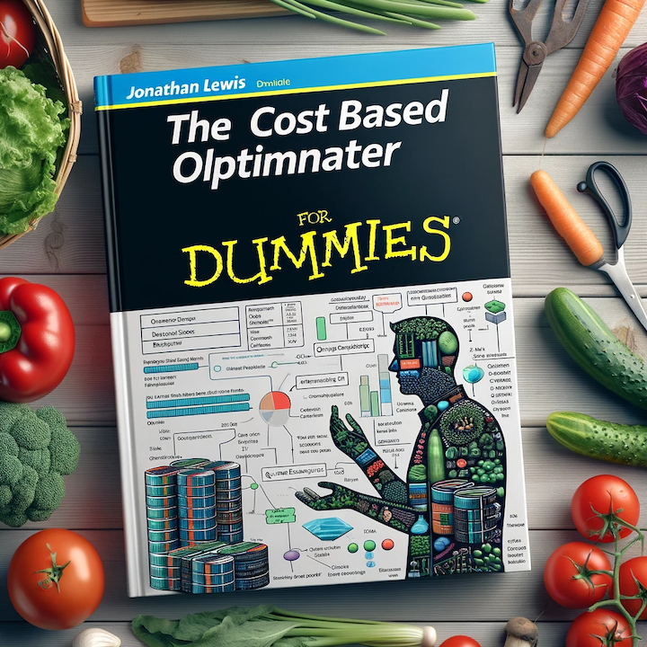
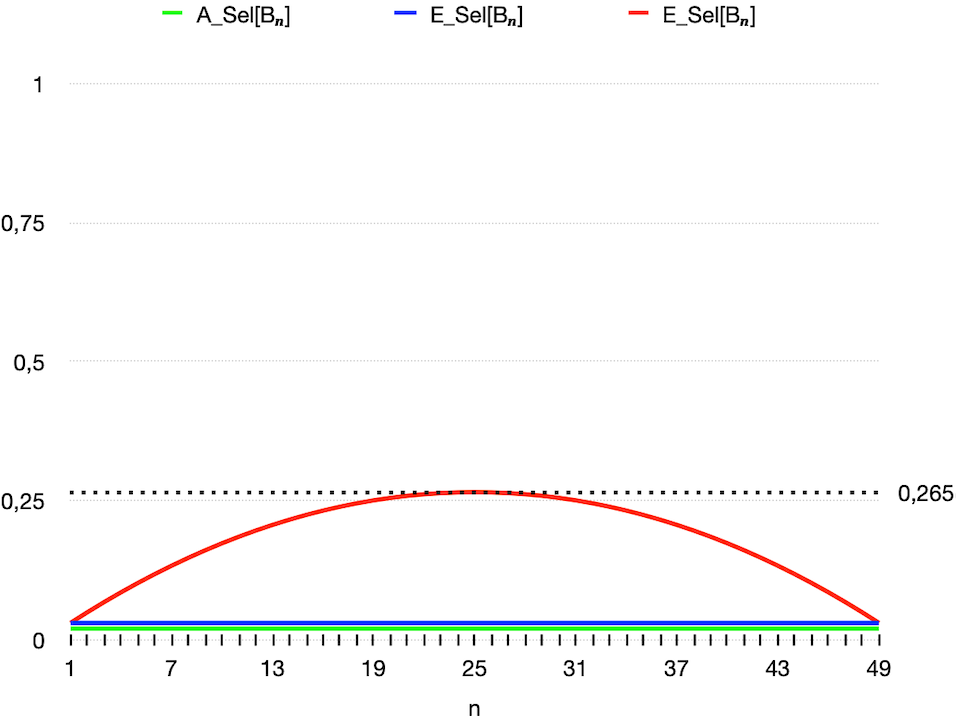
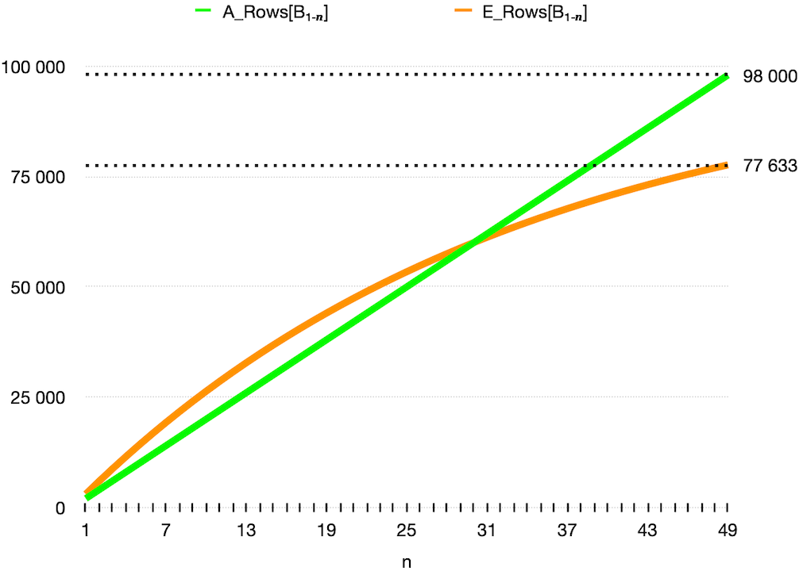

Falling BETWEEN the Cracks
Of Cost-Based OR Expansion


---

# Falling BETWEEN the Cracks
## Of Cost-Based OR Expansion


---

# Dear DBA
- E1 Report runs slow
- Fix the Database


---


---


---

# LNNVL


---


---

# Let's try with "\_optimizer\_cbqt\_or\_expansion"="off"


---

# Wow so fast now!!!
## Thanks


---


---


---

# Guess it will take a week to understand
## but still end up with same "fix"


---

# Cost-Based OR Expansion (CBOE)

---

```sql
SQL> info+ cboe
TABLE: CBOE
INDEX_NAME     COLUMNS
______________ __________
I1             C1
I2             C2
```

---

```sql
-- Without Cost-Based OR Expansion
SQL> ALTER SESSION SET "_optimizer_cbqt_or_expansion"=off;
Session altered.
SQL> SELECT NULL FROM cboe WHERE c1 = 1 OR c2 = 1;
----------------------------------
| Id  | Operation         | Name |
----------------------------------
|   0 | SELECT STATEMENT  |      |
|*  1 |  TABLE ACCESS FULL| CBOE |
----------------------------------
Predicate Information:
----------------------
    1 - filter(("C1"=1 OR "C2"=1))    
```

---

```sql
-- With Cost Based OR Expansion (default)
SQL> ALTER SESSION SET "_optimizer_cbqt_or_expansion"=on; 
Session altered.
SQL> SELECT NULL FROM cboe WHERE c1 = 1 OR c2 = 1;
         ↓↓↓↓↓↓↓↓↓↓↓↓↓↓↓↓↓↓↓↓↓↓↓↓↓↓
         ↓↓         CBOE         ↓↓
         ↓↓↓↓↓↓↓↓↓↓↓↓↓↓↓↓↓↓↓↓↓↓↓↓↓↓
     SELECT NULL FROM cboe WHERE      c1 = 1             
     UNION ALL 
     SELECT NULL FROM cboe WHERE NOT (c1 = 1) AND c2 = 1
```

---

```sql
-------------------------------------------------------------------------
| Id  | Operation                             | Name            | Rows  |
-------------------------------------------------------------------------
|   0 | SELECT STATEMENT                      |                 |     2 |
|   1 |  VIEW                                 | VW_ORE_3D763F05 |     2 |
|   2 |   UNION-ALL                           |                 |     2 |
|*  3 |    INDEX RANGE SCAN                   | I1              |     1 |
|*  4 |    TABLE ACCESS BY INDEX ROWID BATCHED| CBOE            |     1 |
|*  5 |     INDEX RANGE SCAN                  | I2              |     1 |
-------------------------------------------------------------------------
Predicate Information (identified by operation id):
---------------------------------------------------
   3 - access("C1"=1)
   4 - filter(LNNVL("C1"=1))
   5 - access("C2"=1)  
```

---

# We Can Build A Test Case!
## Yes We Can!


---

```sql
SQL> info+ t
TABLE: T
     ROWS         :100 000
Columns
NAME    DATA TYPE            NULL  LOW_VALUE     HIGH_VALUE  NUM_DISTINCT  HISTOGRAM
_______ ____________________ _____ _____________ ___________ _____________ _________
C       NUMBER(2,0)          No    0             99          100           NONE
P       VARCHAR2(4000 BYTE)  Yes   XXXX<->XXXXX  XXXX<->XXXX 1             NONE
Indexes
INDEX_NAME       COLUMNS
_____________ __________
I                      C
```

---

```sql
SQL> ALTER SESSION SET "_optimizer_cbqt_or_expansion"=off;
Session altered.
SQL> SELECT COUNT(*) FROM t WHERE (p IS NOT NULL) AND
       (   (c BETWEEN  1 AND  2) OR (c BETWEEN  3 AND  4) OR (c BETWEEN  5 AND  6) OR (c BETWEEN  7 AND  8) OR
           (c BETWEEN  9 AND 10) OR (c BETWEEN 11 AND 12) OR (c BETWEEN 13 AND 14) OR (c BETWEEN 15 AND 16) OR
           (c BETWEEN 17 AND 18) OR (c BETWEEN 19 AND 20) OR (c BETWEEN 21 AND 22) OR (c BETWEEN 23 AND 24) OR
           (c BETWEEN 25 AND 26) OR (c BETWEEN 27 AND 28) OR (c BETWEEN 29 AND 30) OR (c BETWEEN 31 AND 32) OR 
           (c BETWEEN 33 AND 34) OR (c BETWEEN 35 AND 36) OR (c BETWEEN 37 AND 38) OR (c BETWEEN 39 AND 40) OR 
           (c BETWEEN 41 AND 42) OR (c BETWEEN 43 AND 44) OR (c BETWEEN 45 AND 46) OR (c BETWEEN 47 AND 48) OR 
           (c BETWEEN 49 AND 50) OR (c BETWEEN 51 AND 52) OR (c BETWEEN 53 AND 54) OR (c BETWEEN 55 AND 56) OR 
           (c BETWEEN 57 AND 58) OR (c BETWEEN 59 AND 60) OR (c BETWEEN 61 AND 62) OR (c BETWEEN 63 AND 64) OR
           (c BETWEEN 65 AND 66) OR (c BETWEEN 67 AND 68) OR (c BETWEEN 69 AND 70) OR (c BETWEEN 71 AND 72) OR
           (c BETWEEN 73 AND 74) OR (c BETWEEN 75 AND 76) OR (c BETWEEN 77 AND 78) OR (c BETWEEN 79 AND 80) OR
           (c BETWEEN 81 AND 82) OR (c BETWEEN 83 AND 84) OR (c BETWEEN 85 AND 86) OR (c BETWEEN 87 AND 88) OR
           (c BETWEEN 89 AND 90) OR (c BETWEEN 91 AND 92) OR (c BETWEEN 93 AND 94) OR (c BETWEEN 95 AND 96) OR
           (c BETWEEN 97 AND 98)                                                                              );
   COUNT(*)
___________
      98000
Elapsed: 00:00:00.497                                                                                          
```

---

```
------------------------------------------------------------------------------
| Id  | Operation          | Name | Starts | E-Rows | A-Rows |
------------------------------------------------------------------------------
|   0 | SELECT STATEMENT   |      |      1 |        |      1 |
|   1 |  SORT AGGREGATE    |      |      1 |      1 |      1 |
|   2 |   TABLE ACCESS FULL| T    |      1 |  77633 |  98000 |
------------------------------------------------------------------------------
```

---

```sql
SQL> ALTER SESSION SET "_optimizer_cbqt_or_expansion"="on";
Session altered.
SQL> SELECT COUNT(*) FROM t WHERE (p IS NOT NULL) AND
       (   (c BETWEEN  1 AND  2) OR (c BETWEEN  3 AND  4) OR (c BETWEEN  5 AND  6) OR (c BETWEEN  7 AND  8) OR
           (c BETWEEN  9 AND 10) OR (c BETWEEN 11 AND 12) OR (c BETWEEN 13 AND 14) OR (c BETWEEN 15 AND 16) OR
           (c BETWEEN 17 AND 18) OR (c BETWEEN 19 AND 20) OR (c BETWEEN 21 AND 22) OR (c BETWEEN 23 AND 24) OR
           (c BETWEEN 25 AND 26) OR (c BETWEEN 27 AND 28) OR (c BETWEEN 29 AND 30) OR (c BETWEEN 31 AND 32) OR 
           (c BETWEEN 33 AND 34) OR (c BETWEEN 35 AND 36) OR (c BETWEEN 37 AND 38) OR (c BETWEEN 39 AND 40) OR 
           (c BETWEEN 41 AND 42) OR (c BETWEEN 43 AND 44) OR (c BETWEEN 45 AND 46) OR (c BETWEEN 47 AND 48) OR 
           (c BETWEEN 49 AND 50) OR (c BETWEEN 51 AND 52) OR (c BETWEEN 53 AND 54) OR (c BETWEEN 55 AND 56) OR 
           (c BETWEEN 57 AND 58) OR (c BETWEEN 59 AND 60) OR (c BETWEEN 61 AND 62) OR (c BETWEEN 63 AND 64) OR
           (c BETWEEN 65 AND 66) OR (c BETWEEN 67 AND 68) OR (c BETWEEN 69 AND 70) OR (c BETWEEN 71 AND 72) OR
           (c BETWEEN 73 AND 74) OR (c BETWEEN 75 AND 76) OR (c BETWEEN 77 AND 78) OR (c BETWEEN 79 AND 80) OR
           (c BETWEEN 81 AND 82) OR (c BETWEEN 83 AND 84) OR (c BETWEEN 85 AND 86) OR (c BETWEEN 87 AND 88) OR
           (c BETWEEN 89 AND 90) OR (c BETWEEN 91 AND 92) OR (c BETWEEN 93 AND 94) OR (c BETWEEN 95 AND 96) OR
           (c BETWEEN 97 AND 98)                                                                              );
   COUNT(*)
___________
      98000
Elapsed: 00:00:05.090
```

---

```
-------------------------------------------------------------------------------------
| Id  | Operation                              | Name            | Starts | E-Rows | A-Rows |
-------------------------------------------------------------------------------------
|   0 | SELECT STATEMENT                       |                 |      1 |        |      1 |
|   1 |  SORT AGGREGATE                        |                 |      1 |      1 |      1 |
|   2 |   VIEW                                 | VW_ORE_1B35BA0F |      1 |  26340 |  98000 |
|   3 |    UNION-ALL                           |                 |      1 |        |  98000 |
|   4 |     TABLE ACCESS BY INDEX ROWID BATCHED| T               |      1 |   3010 |   2000 |
|   5 |      INDEX RANGE SCAN                  | I               |      1 |   3010 |   2000 |
|   6 |     TABLE ACCESS BY INDEX ROWID BATCHED| T               |      1 |   2919 |   2000 |
|   7 |      INDEX RANGE SCAN                  | I               |      1 |   2919 |   2000 |
```

---


---

# Do Not Understand
- 26,340 with transform
- 77,633 without transform
- Anything about the optimizer


---

# I'll Explain
- Something about the optimizer
- 77,633 without transform
- 26,340 with transform


---


---


---



---


---

# A_Rows and A_Sel
[c = 42] 1k ÷100k = 0.01
[c < 33] 33k ÷100k = 0.330
[33 < c < 66] 33k ÷100k = 0.330
[c > 66] 33k ÷100k = 0.330


---

# E_Sel and E_Rows
[c = 42] ? * ? = ?
[c < 33] ? * ? = ?
[33 < c < 66] ? * ? = ?
[c > 66] ? * ? = ?

---

# Statistics
Statistic | Value
----------|-------
dist_vals(c) | 100
lo_val(c) | 0
hi_val(c) | 99
num_rows(t) | 100k

---

# Statistic Values
- dist_vals(c) = 100
- lo_val(c) = 0
- hi_val(c) = 99
- num_rows(t) = 100k
[c = 42]

---

# Distribution
- 100 distinct values for c
- 42 is probably 1 of them
- E_Sel = 1/100

---

# Range Analysis
[c < 33] [c > 66]
[33 < c < 66]

```
       0 
       ↑
       |
       |       
(99-0) |
       |
       |
       ↓
      99                       
```

---

# Detailed Ranges
```
       0               0        
       ↑               ↑        
       |   [c < 33]    |  (33-0)
       |               ↓       
       |←------------→33       
       |               ↑        
(99-0) | [33 < c < 66] | (66-33)
       |               ↓        
       |←------------→66        
       |               ↑        
       |   [c > 66]    | (99-66)
       ↓               ↓        
      99              99
```

---

# Calculations
E_Sel * num_rows = E_Rows | A_Rows
---|---|---
c = 42 | 0.01 * 100k = 1,000 | 1,000
c < 33 | 0.333 * 100k = 33,333 | 33,000
33 < c < 66 | 0.333 * 100k = 33,333 | 33,000
c > 66 | 0.333 * 100k = 33,333 | 33,000

---

# Formulas for E_Sel
- c = n: 1/100
- c < m: m/99
- m < c < n: (n-m)/99
- c > n: 1-n/99
Where 0 < m < n < 99

---

# Combining Predicates

---


---

# Jonathan's Border Cauli


---


---

# [c is odd] AND [c < 50]

---

# Selectivity Analysis
Predicate | A_Sel | A_Rows
---|---|---
[c is odd] | 0.5 | 50k
[c < 50] | 0.5 | 50k
[c is odd] AND [c < 50] | 0.25 | 25k

---

# Formula
E_Sel[x AND y] = E_Sel[x] * E_Sel[y]

---

# [c is odd] OR [c < 50]

---

# OR Analysis
Predicate | A_Sel | A_Rows
---|---|---
[c is odd] | 0.5 | 50k
[c < 50] | 0.5 | 50k
[c is odd] OR [c < 50] | 0.75 | 75K

---

# OR Formula
E_Sel[x OR y] = E_Sel[x] + E_Sel[y] - (E_Sel[x] * E_Sel[y])

---

# NOT [c < 10]

---

# Selectivity Values
Predicate | A_Sel | A_Rows
---|---|---
[c < 10] | 0.1 | 10K
NOT [c < 10] | 0.9 | 90K

_Let's pretend NULLs don't exist_


---

# NOT Formula
E_Sel[NOT x] = 1 - E_Sel[x]

---

# [c < 10] AND [c < 50]

---

# Subset Analysis
Predicate | A_Sel | A_Rows
---|---|---
[c < 10] | 0.1 | 10k
[c < 50] | 0.5 | 50k
[c < 10] AND [c < 50] | 0.1 | 10k

---

# Subset Formula
E_Sel[x SAND y] = Sel[y]
_where y is a subset of x_

---

# [c is odd] OR [c is even]

---

# Distinct Sets
Predicate | A_Sel | A_Rows
---|---|---
[c is odd] | 0.5 | 50k
[c is even] | 0.5 | 50k
[c is odd] OR [c is even] | 1.0 | 100K

---

# Distinct OR Formula
E_Sel[x DOR y]dist = E_Sel[x]+E_Sel[y]
_dist x and y are distinct sets_

---

# Distinct OR Rows
E_Rows[x DOR y]dist = E_Rows[x]+E_Rows[y]
_dist x and y are distinct sets_

---

# Half Way!
## We can do this!


---


---

# Annotation
```
B₁  → (c BETWEEN  1 AND  2)
B₂  → (c BETWEEN  3 AND  4)
<><><><><><><><><><><><><><>
B₄₈ → (c BETWEEN 95 AND 96)
B₄₉ → (c BETWEEN 97 AND 98)

Bₙ is [c BETWEEN 2n-1 AND 2n]
Query is [B₁ OR B₂ ... B₄₉]
```

---

# B₁₋₄₉ Structure
```
B₁  → (c BETWEEN  1 AND  2)
↓                     
B₂  → (c BETWEEN  3 AND  4)
↓                     
<><><><><><><><><><><><><><>
↓
B₄₈ → (c BETWEEN 95 AND 96)
↓                             
B₄₉ → (c BETWEEN 97 AND 98)
↓
B₁₋₄₉
```

---

# Complete Formula
```
Bₙ is [c BETWEEN 2n-1 AND 2n]
Query is [B₁ OR B₂ ... B₄₉]
B₁₋ₘ is [B₁ OR B₂ ... OR Bₘ]
Query is [B₁₋₄₉]
```

---


---

# A_Sel Calculation
A_Sel[c BETWEEN 2n-1 AND 2n]
= A_Rows[c BETWEEN 2n-1 AND 2n]/100k
= 2k/100k
= 0.02


---

# E_Sel Breakdown
```
E_Sel[c BETWEEN 2n-1 AND 2n]
= E_Sel[(c = 2n-1) DOR (2n-1 < c < 2n) DOR (c = 2n)]
= E_Sel[c = 2n-1] + E_Sel[2n-1 < c < 2n] + E_Sel[c = 2n]
= 1/100 + (2n - (2n-1))/99 + 1/100
= 1/100 + 1/99 + 1/100
= 0.03010...
```


---
# Complex E_Sel Formula
```
E_Sel[c BETWEEN 2n-1 AND 2n]
= E_Sel[(c >= 2n-1) AND (c <= 2n)]
= E_Sel[c >= 2n-1] * E_Sel[c <= 2n]
= E_Sel[(c = 2n-1) DOR (c > 2n-1)] * E_Sel[(c < 2n) DOR (c = 2n)]
= (1/100 + 1-(2n-1)/99) * (2n/99 + 1/100)
= 200n/9801 - 4n²/9801 + 10099/990000
```


---



---

# Example Calculation
E_Sel[c BETWEEN 49 AND 50]
= E_Sel[(c >= 49) AND (c <= 50)]
= E_Sel[c >= 49] * E_Sel[c <= 50]
= 0.515 * 0.515
= 0.265


---


---

# E_Sel[B₁]
= 0.03010 


---

# E_Rows[B₁]
= E_Sel[B₁]*100k
= 0.03010*100k
= 3010


---

# B₁₋₂ Analysis
B₁₋₂ is [B₁ DOR B₂]
B₁  1↔2                            
B₂  3↔4

---

# E_Sel[B₁₋₂] Calculation
```
E_Sel[B₁₋₂]
= E_Sel[B₁ OR B₂]
= E_Sel[B₁] + E_Sel[B₂] - (E_Sel[B₁] * E_Sel[B₂])
= 0.03010 + 0.03010 - (0.03010 * 0.03010)
= 0.05929
```


---

# E_Rows[B₁₋₂]
= E_Sel[B₁₋₂] * 100k
= 0.05929 * 100k
= 5929


---

# E_Sel[B₁₋₃]
```
E_Sel[B₁₋₃]
= E_Sel[B₁₋₂ OR B₃]
= E_Sel[B₁₋₂] + E_Sel[B₃] - (E_Sel[B₁₋₂]*E_Sel[B₃])
= 0.05929 + 0.03010 - (0.05929 * 0.03010)
= 0.08760
```


---

# E_Sel[B₁₋₄₉]
```
E_Sel[B₁₋₄₉]
= E_Sel[B₁₋₄₈ OR B₄₉]
= E_Sel[B₁₋₄₈] + E_Sel[B₄₉] - (E_Sel[B₁₋₄₈] * E_Sel[B₄₉])
= (0.76939 + 0.03010) - (0.76939 * 0.03010)
= 0.77633
```


---

# E_Rows[B₁₋₄₉]
= E_Sel[B₁₋₄₉] * 100k
= 0.77633 * 100k
= 77633




---


---

# TrAnnotation

---

```
(c BETWEEN  1 AND  2)
   UNION ALL
NOT (c BETWEEN  1 AND  2) AND (c BETWEEN  3 AND  4)
   UNION ALL
<><><><><><><><><><><><><><><><><><><><><><><><>
   UNION ALL
NOT (c BETWEEN  1 AND  2) AND NOT (c BETWEEN  3 AND  4) ... AND (c BETWEEN 95 AND 96) 
   UNION ALL
NOT (c BETWEEN  1 AND  2) AND NOT (c BETWEEN  3 AND  4) ... AND NOT (c BETWEEN 95 AND 96) AND (c BETWEEN 97 AND 98)
```

---

# Final Analysis
```
T₁ =      B₁
           UNION ALL
T₂ = NOT B₁ AND B₂
           UNION ALL
<><><><><><><><><><><><><><>
           UNION ALL
T₄₈ = NOT B₁ ... AND B₄₈
           UNION ALL
T₄₉ = NOT B₁ ... AND NOT B₄₈ AND B₄₉

Tₙ is [NOT B₁ ... AND NOT Bₙ₋₁ AND Bₙ]
Transformed Query is [T₁₋₄₉]
```

---

# In The End
- Bug Opened
- We set "_optimizer_cbqt_or_expansion"=off
- Greater Understanding of Optimizer
- b 34012219 - LNNVL LEADS TO COST UNDERESTIMATE FOR CB OR EXPANSION TRANSFORMATION

_I'm NOT Recommending you do this!!!_

