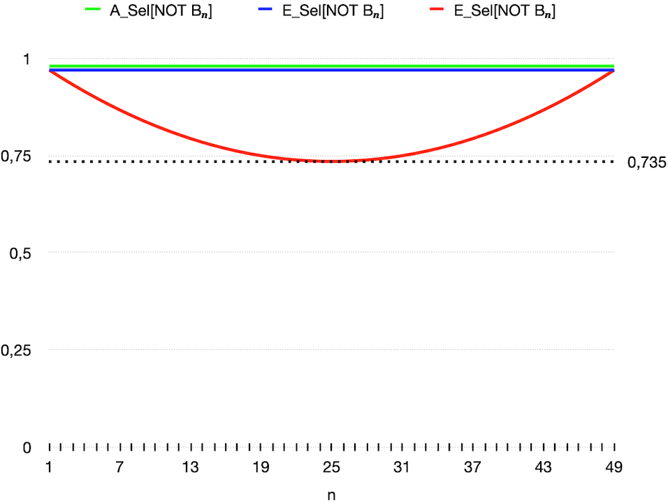
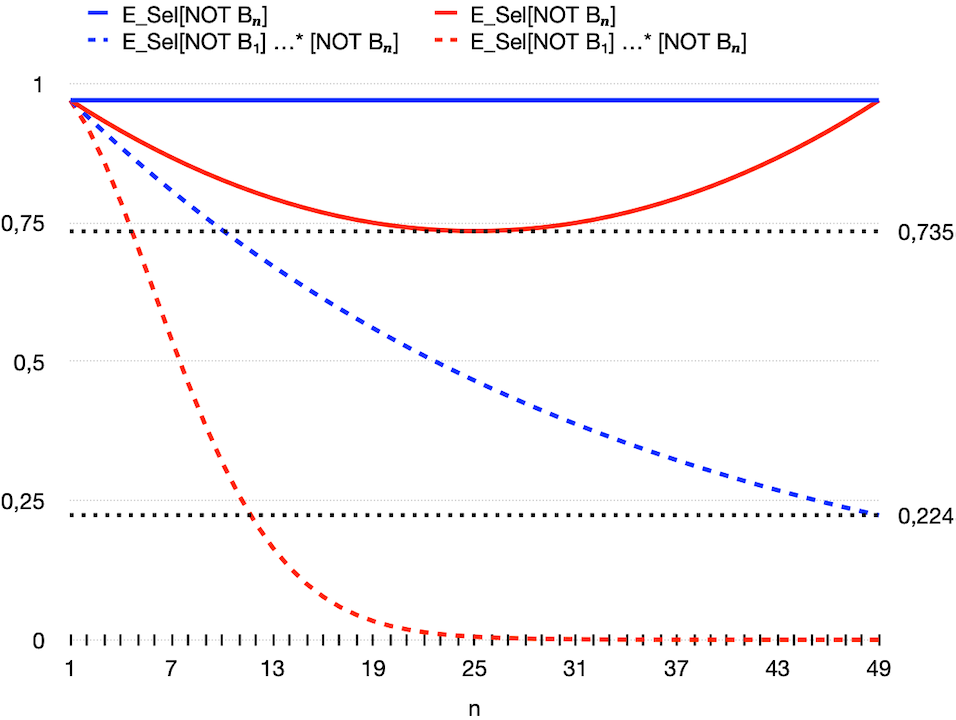
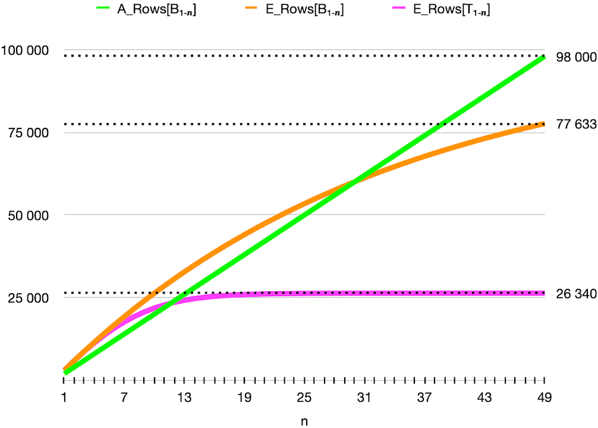
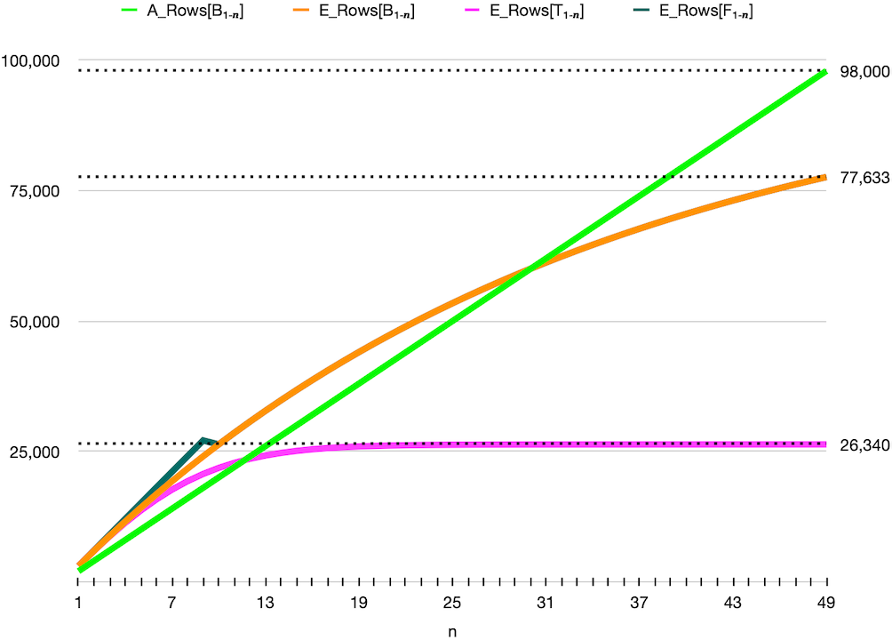

# Slide 1

Falling BETWEEN the Cracks
Of Cost-Based OR Expansion
1

# Slide 2

Falling BETWEEN the Cracks
Of Cost-Based OR Expansion
2

# Slide 3

Dear DBA
E1 Report runs slow
Fix the Database
3

# Slide 4

4

# Slide 5

5

# Slide 6

LNNVL
6

# Slide 7

7

# Slide 8

Let's try with 
"_optimizer_cbqt_or_expansion"="off"
8

# Slide 9

Wow so fast now!!!
Thanks
9

# Slide 10

10

# Slide 11

11

# Slide 12

Guess it will take a week to understand
but still end up with same "fix"
12

# Slide 13

Cost-Based OR Expansion (CBOE)
13

# Slide 14

SQL> info+ cboe
TABLE: CBOE
INDEX_NAME     COLUMNS
______________ __________
I1             C1
I2             C2
14

# Slide 15

-- Without Cost-Based OR Expansion
SQL> ALTER SESSION SET "_optimizer_cbqt_or_expansion"=off;
Session altered.
SQL> SELECT NULL FROM cboe WHERE c1 = 1 OR c2 = 1;
----------------------------------
| Id  | Operation         | Name |
----------------------------------
|   0 | SELECT STATEMENT  |      |
|*  1 |  TABLE ACCESS FULL| CBOE |
----------------------------------
Predicate Information:
----------------------
    1 - filter(("C1"=1 OR "C2"=1))    
15

# Slide 16

-- With Cost Based OR Expansion (default)
SQL> ALTER SESSION SET "_optimizer_cbqt_or_expansion"=on; 
Session altered.
SQL> SELECT NULL FROM cboe WHERE c1 = 1 OR c2 = 1;
         ↓↓↓↓↓↓↓↓↓↓↓↓↓↓↓↓↓↓↓↓↓↓↓↓↓↓
         ↓↓         CBOE         ↓↓
         ↓↓↓↓↓↓↓↓↓↓↓↓↓↓↓↓↓↓↓↓↓↓↓↓↓↓
     SELECT NULL FROM cboe WHERE      c1 = 1             
     UNION ALL 
     SELECT NULL FROM cboe WHERE NOT (c1 = 1) AND c2 = 1
16

# Slide 17

-------------------------------------------------------------------------
| Id  | Operation                             | Name            | Rows  |
-------------------------------------------------------------------------
|   0 | SELECT STATEMENT                      |                 |     2 |
|   1 |  VIEW                                 | VW_ORE_3D763F05 |     2 |
|   2 |   UNION-ALL                           |                 |     2 |
|*  3 |    INDEX RANGE SCAN                   | I1              |     1 |
|*  4 |    TABLE ACCESS BY INDEX ROWID BATCHED| CBOE            |     1 |
|*  5 |     INDEX RANGE SCAN                  | I2              |     1 |
-------------------------------------------------------------------------
Predicate Information (identified by operation id):
---------------------------------------------------
   3 - access("C1"=1)
   4 - filter(LNNVL("C1"=1))
   5 - access("C2"=1)  
17

# Slide 18

We Can Build A Test Case!
Yes We Can!
18

# Slide 19

SQL> info+ t
TABLE: T
     ROWS         :100 000
Columns
NAME    DATA TYPE            NULL  LOW_VALUE     HIGH_VALUE  NUM_DISTINCT  HISTOGRAM
_______ ____________________ _____ _____________ ___________ _____________ _________
C       NUMBER(2,0)          No    0             99          100           NONE
P       VARCHAR2(4000 BYTE)  Yes   XXXX<->XXXXX  XXXX<->XXXX 1             NONE
Indexes
INDEX_NAME       COLUMNS
_____________ __________
I                      C
19

# Slide 20

SQL> ALTER SESSION SET "_optimizer_cbqt_or_expansion"=off;
Session altered.
SQL> SELECT COUNT(*) FROM t WHERE (p IS NOT NULL) AND
       (   (c BETWEEN  1 AND  2) OR (c BETWEEN  3 AND  4) OR (c BETWEEN  5 AND  6) OR (c BETWEEN  7 AND  8) OR
           (c BETWEEN  9 AND 10) OR (c BETWEEN 11 AND 12) OR (c BETWEEN 13 AND 14) OR (c BETWEEN 15 AND 16) OR
           (c BETWEEN 17 AND 18) OR (c BETWEEN 19 AND 20) OR (c BETWEEN 21 AND 22) OR (c BETWEEN 23 AND 24) OR
           (c BETWEEN 25 AND 26) OR (c BETWEEN 27 AND 28) OR (c BETWEEN 29 AND 30) OR (c BETWEEN 31 AND 32) OR 
           (c BETWEEN 33 AND 34) OR (c BETWEEN 35 AND 36) OR (c BETWEEN 37 AND 38) OR (c BETWEEN 39 AND 40) OR 
           (c BETWEEN 41 AND 42) OR (c BETWEEN 43 AND 44) OR (c BETWEEN 45 AND 46) OR (c BETWEEN 47 AND 48) OR 
           (c BETWEEN 49 AND 50) OR (c BETWEEN 51 AND 52) OR (c BETWEEN 53 AND 54) OR (c BETWEEN 55 AND 56) OR 
           (c BETWEEN 57 AND 58) OR (c BETWEEN 59 AND 60) OR (c BETWEEN 61 AND 62) OR (c BETWEEN 63 AND 64) OR
           (c BETWEEN 65 AND 66) OR (c BETWEEN 67 AND 68) OR (c BETWEEN 69 AND 70) OR (c BETWEEN 71 AND 72) OR
           (c BETWEEN 73 AND 74) OR (c BETWEEN 75 AND 76) OR (c BETWEEN 77 AND 78) OR (c BETWEEN 79 AND 80) OR
           (c BETWEEN 81 AND 82) OR (c BETWEEN 83 AND 84) OR (c BETWEEN 85 AND 86) OR (c BETWEEN 87 AND 88) OR
           (c BETWEEN 89 AND 90) OR (c BETWEEN 91 AND 92) OR (c BETWEEN 93 AND 94) OR (c BETWEEN 95 AND 96) OR
           (c BETWEEN 97 AND 98)                                                                              );
   COUNT(*)
___________
      98000
Elapsed: 00:00:00.497                                                                                          
20

# Slide 21

                                --------------------------------------------------------------
                                | Id  | Operation          | Name | Starts | E-Rows | A-Rows |
                                --------------------------------------------------------------
                                |   0 | SELECT STATEMENT   |      |      1 |        |      1 |
                                |   1 |  SORT AGGREGATE    |      |      1 |      1 |      1 |
                                |   2 |   TABLE ACCESS FULL| T    |      1 |  77633 |  98000 |
                                --------------------------------------------------------------
.
21

# Slide 22

SQL> ALTER SESSION SET "_optimizer_cbqt_or_expansion"="on";
Session altered.
SQL> SELECT COUNT(*) FROM t WHERE (p IS NOT NULL) AND
       (   (c BETWEEN  1 AND  2) OR (c BETWEEN  3 AND  4) OR (c BETWEEN  5 AND  6) OR (c BETWEEN  7 AND  8) OR
           (c BETWEEN  9 AND 10) OR (c BETWEEN 11 AND 12) OR (c BETWEEN 13 AND 14) OR (c BETWEEN 15 AND 16) OR
           (c BETWEEN 17 AND 18) OR (c BETWEEN 19 AND 20) OR (c BETWEEN 21 AND 22) OR (c BETWEEN 23 AND 24) OR
           (c BETWEEN 25 AND 26) OR (c BETWEEN 27 AND 28) OR (c BETWEEN 29 AND 30) OR (c BETWEEN 31 AND 32) OR 
           (c BETWEEN 33 AND 34) OR (c BETWEEN 35 AND 36) OR (c BETWEEN 37 AND 38) OR (c BETWEEN 39 AND 40) OR 
           (c BETWEEN 41 AND 42) OR (c BETWEEN 43 AND 44) OR (c BETWEEN 45 AND 46) OR (c BETWEEN 47 AND 48) OR 
           (c BETWEEN 49 AND 50) OR (c BETWEEN 51 AND 52) OR (c BETWEEN 53 AND 54) OR (c BETWEEN 55 AND 56) OR 
           (c BETWEEN 57 AND 58) OR (c BETWEEN 59 AND 60) OR (c BETWEEN 61 AND 62) OR (c BETWEEN 63 AND 64) OR
           (c BETWEEN 65 AND 66) OR (c BETWEEN 67 AND 68) OR (c BETWEEN 69 AND 70) OR (c BETWEEN 71 AND 72) OR
           (c BETWEEN 73 AND 74) OR (c BETWEEN 75 AND 76) OR (c BETWEEN 77 AND 78) OR (c BETWEEN 79 AND 80) OR
           (c BETWEEN 81 AND 82) OR (c BETWEEN 83 AND 84) OR (c BETWEEN 85 AND 86) OR (c BETWEEN 87 AND 88) OR
           (c BETWEEN 89 AND 90) OR (c BETWEEN 91 AND 92) OR (c BETWEEN 93 AND 94) OR (c BETWEEN 95 AND 96) OR
           (c BETWEEN 97 AND 98)                                                                              );
   COUNT(*)
___________
      98000
Elapsed: 00:00:05.090
22

# Slide 23

          ---------------------------------------------------------------------------------------------
          | Id  | Operation                              | Name            | Starts | E-Rows | A-Rows |
          ---------------------------------------------------------------------------------------------
          |   0 | SELECT STATEMENT                       |                 |      1 |        |      1 |
          |   1 |  SORT AGGREGATE                        |                 |      1 |      1 |      1 |
          |   2 |   VIEW                                 | VW_ORE_1B35BA0F |      1 |  26340 |  98000 |
          |   3 |    UNION-ALL                           |                 |      1 |        |  98000 |
          |   4 |     TABLE ACCESS BY INDEX ROWID BATCHED| T               |      1 |   3010 |   2000 |
          |   5 |      INDEX RANGE SCAN                  | I               |      1 |   3010 |   2000 | <-- 1↔2
          |   6 |     TABLE ACCESS BY INDEX ROWID BATCHED| T               |      1 |   2919 |   2000 |
          |   7 |      INDEX RANGE SCAN                  | I               |      1 |   2919 |   2000 | <-- 3↔4
          |   8 |     TABLE ACCESS BY INDEX ROWID BATCHED| T               |      1 |   2775 |   2000 |
          |   9 |      INDEX RANGE SCAN                  | I               |      1 |   2775 |   2000 | <-- 5↔6
         < >   < >                                      < >               < >      < >      < >      < >
          |  70 |     TABLE ACCESS BY INDEX ROWID BATCHED| T               |      1 |      2 |   2000 |
          |  71 |      INDEX RANGE SCAN                  | I               |      1 |      2 |   2000 | <-- 66↔67
          |  72 |     TABLE ACCESS BY INDEX ROWID BATCHED| T               |      1 |      1 |   2000 |                 
          |  73 |      INDEX RANGE SCAN                  | I               |      1 |      1 |   2000 | <-- 68↔69
         < >   < >                                      < >               < >      < >      < >      < >
          | 100 |     TABLE ACCESS BY INDEX ROWID BATCHED| T               |      1 |      1 |   2000 |                
          | 101 |      INDEX RANGE SCAN                  | I               |      1 |      1 |   2000 | <-- 97↔98
          ---------------------------------------------------------------------------------------------
23

# Slide 24

24

# Slide 25

⠀⠀⠀⠀⠀⠀⠀Do Not⠀⠀⠀⠀⠀⠀⠀⠀⠀Understand
• 26,340 with transform
• 77,633 without transform
• Anything about the optimizer
25

# Slide 26

⠀⠀⠀⠀⠀I'll⠀⠀⠀⠀⠀⠀⠀⠀Explain⠀⠀⠀
• Something about the optimizer
• 77,633 without transform
• 26,340 with transform
26

# Slide 27

27

# Slide 28

28

# Slide 29

29

# Slide 30

30

# Slide 31

!A_Rows
!A_Sel
[c = 42]
1k
÷100k =
0.01
[c < 33]
33k
÷100k =
0.330
[33 < c < 66]
33k
÷100k =
0.330
[c > 66]
33k
÷100k =
0.330
31

# Slide 32

E_Sel
E_Rows
[c = 42]
?
* ? =
?
[c < 33]
?
* ? =
?
[33 < c < 66]
?
* ? =
?
[c > 66]
?
* ? =
?
32

# Slide 33

Statistic
Value
dist_vals(c) 100
lo_val(c)
0
hi_val(c)
99
num_rows(t)
100k
⠀
33

# Slide 34

Statistic
Value
dist_vals(c) 100
lo_val(c)
0
hi_val(c)
99
num_rows(t)
100k
[c = 42]
34

# Slide 35

Statistic
Value
dist_vals(c) 100
lo_val(c)
0
hi_val(c)
99
num_rows(t)
100k
[c = 42]
100 distinct values for c
42 is probably 1 of them
35

# Slide 36

Statistic
Value
dist_vals(c) 100
lo_val(c)
0
hi_val(c)
99
num_rows(t)
100k
[c = 42]
100 distinct values for c
42 is probably 1 of them
E_Sel = 1/100
36

# Slide 37

Statistic
Value
dist_vals(c) 100
lo_val(c)
0
hi_val(c)
99
num_rows(t)
100k
[c < 33] [c > 66]
[33 < c < 66]
37

# Slide 38

Statistic
Value
dist_vals(c) 100
lo_val(c)
0
hi_val(c)
99
num_rows(t)
100k
[c < 33] [c > 66]
[33 < c < 66]
       0 
       ↑
       |
       |       
(99-0) |
       |
       |
       ↓
      99                       
38

# Slide 39

Statistic
Value
dist_vals(c)
100
lo_val(c)
0
hi_val(c)
99
num_rows(t)
100k
[c < 33] [c > 66]
[33 < c < 66]
       0               0        
       ↑               ↑        
       |   [c < 33]    |
       |               ↓       
       |←------------→33       
       |               ↑        
(99-0) | [33 < c < 66] |
       |               ↓        
       |←------------→66        
       |               ↑        
       |   [c > 66]    |
       ↓               ↓        
      99              99       ⠀
39

# Slide 40

Statistic
Value
dist_vals(c)
100
lo_val(c)
0
hi_val(c)
99
num_rows(t)
100k
[c < 33] [c > 66]
[33 < c < 66]
       0               0        
       ↑               ↑        
       |   [c < 33]    |  (33-0)
       |               ↓       
       |←------------→33       
       |               ↑        
(99-0) | [33 < c < 66] | (66-33)
       |               ↓        
       |←------------→66        
       |               ↑        
       |   [c > 66]    | (99-66)
       ↓               ↓        
      99              99       ⠀
40

# Slide 41

Statistic
Value
dist_vals(c)
100
lo_val(c)
0
hi_val(c)
99
num_rows(t)
100k
[c < 33] [c > 66]
[33 < c < 66]
       0               0        
       ↑               ↑        
       |   [c < 33]    |  (33-0)/99
       |               ↓       
       |←------------→33  
       |               ↑        
(99-0) | [33 < c < 66] | (66-33)/99
       |               ↓        
       |←------------→66        
       |               ↑        
       |   [c > 66]    | (99-66)/99
       ↓               ↓        
      99              99       ⠀
41

# Slide 42

E_Sel
* num_rows = E_Rows
A_Rows
c = 42
0.01⠀
* 100k
= ⠀1,000
1,000
c < 33
0.333
* 100k
=⠀33,333
33,000
33 < c < 66
0.333
* 100k
= 33,333
33,000
c > 66
0.333
* 100k
= 33,333
33,000
42

# Slide 43

⠀⠀
E_Sel
c = n
1/100
c < m
m/99
m < c < n
(n-m)/99
c > n
1-n/99
⠀⠀ 0 < m < n < 99
43

# Slide 44

Combining Predicates
44

# Slide 45

45

# Slide 46

Jonathan's Border Cauli
46

# Slide 47

47

# Slide 48

[c is odd]   AND   [c < 50]
48

# Slide 49

⠀
A_Sel
A_Rows
[c is odd]
0.5
50k
[c < 50]
0.5
50k
[c is odd] AND [c < 50]
0.25
25k
⠀
49

# Slide 50

E_Sel[x AND y]
= E_Sel[x] * E_Sel[y]
50

# Slide 51

[c is odd]   OR   [c < 50]
51

# Slide 52

⠀
Predicate
A_Sel
A_Rows
[c is odd]
0.5
50k
[c < 50]
0.5
50k
[c is odd] OR [c < 50]
0.75
75K
⠀
52

# Slide 53

E_Sel[x OR y]
= E_Sel[x] + E_Sel[y] - (E_Sel[x] * E_Sel[y])
53

# Slide 54

NOT [c < 10]
54

# Slide 55

⠀
A_Sel
A_Rows
[c < 10]
0.1
10K
NOT [c < 10]
0.9
90K
⠀ Let's pretend NULLs don't exist 
!"
55

# Slide 56

E_Sel[NOT x]
= 1 - E_Sel[x]
56

# Slide 57

[c < 10]   AND    [c < 50]
57

# Slide 58

⠀
A_Sel
A_Rows
[c < 10]
0.1
10k
[c < 50]
0.5
50k
[c < 10] AND [c < 50]
0.1
10k
⠀
58

# Slide 59

E_Sel[x SAND y]ss
= Sel[y]
ss y is a subset of x
59

# Slide 60

[c is odd]   OR   [c is even]
60

# Slide 61

⠀
A_Sel
A_Rows
[c is odd]
0.5
50k
[c is even]
0.5
50k
[c is odd] OR [c is even]
1.0
100K
⠀
⠀
61

# Slide 62

E_Sel[x DOR y]dist
= E_Sel[x]+E_Sel[y]
dist x and y are distinct sets
62

# Slide 63

E_Rows[x DOR y]dist
= E_Rows[x]+E_Rows[y]
dist x and y are distinct sets
63

# Slide 64

.⠀⠀⠀
⠀⠀⠀ 
!!!
Half Way!
!!!
We can do this!
!!!
64

# Slide 65

65

# Slide 66

Annotation
      (c BETWEEN  1 AND  2)
      (c BETWEEN  3 AND  4)
<><><><><><><><><><><><><><>
      (c BETWEEN 95 AND 96)
      (c BETWEEN 97 AND 98)
⠀
⠀
⠀
66

# Slide 67

Annotation
B₁  → (c BETWEEN  1 AND  2)
B₂  → (c BETWEEN  3 AND  4)
<><><><><><><><><><><><><><>
B₄₈ → (c BETWEEN 95 AND 96)
B₄₉ → (c BETWEEN 97 AND 98)
⠀
⠀
⠀
67

# Slide 68

Annotation
B₁  → (c BETWEEN  1 AND  2)
B₂  → (c BETWEEN  3 AND  4)
<><><><><><><><><><><><><><>
B₄₈ → (c BETWEEN 95 AND 96)
B₄₉ → (c BETWEEN 97 AND 98)
⠀
⠀
Bₙ is [c BETWEEN 2n-1 AND 2n]
Query is [B₁ OR B₂ ... B₄₉]
68

# Slide 69

Annotation
B₁  → (c BETWEEN  1 AND  2)
↓                     
B₂  → (c BETWEEN  3 AND  4)
↓                     
<><><><><><><><><><><><><><>
↓
B₄₈ → (c BETWEEN 95 AND 96)
↓                             
B₄₉ → (c BETWEEN 97 AND 98)
↓
B₁₋₄₉
Bₙ is [c BETWEEN 2n-1 AND 2n]
Query is [B₁ OR B₂ ... B₄₉]
69

# Slide 70

Annotation
B₁  → (c BETWEEN  1 AND  2)
↓                     
B₂  → (c BETWEEN  3 AND  4)
↓                     
<><><><><><><><><><><><><><>
↓
B₄₈ → (c BETWEEN 95 AND 96)
↓                             
B₄₉ → (c BETWEEN 97 AND 98)
↓
B₁₋₄₉
Bₙ is [c BETWEEN 2n-1 AND 2n]
Query is [B₁ OR B₂ ... B₄₉]
B₁₋ₘ is [B₁ OR B₂ ... OR Bₘ]
Query is [B₁₋₄₉]
70

# Slide 71

                           
!
A_Sel[Bₙ]            
                 
"
E_Sel[Bₙ]   vs    
E_Sel[Bₙ]
71

# Slide 72

!
A_Sel[c BETWEEN 2n-1 AND 2n]
= A_Rows[c BETWEEN 2n-1 AND 2n]/100k
= 2k/100k
= 0.02
72

# Slide 73

!
E_Sel[c BETWEEN 2n-1 AND 2n]
= E_Sel[(c = 2n-1) DOR (2n-1 < c < 2n) DOR (c = 2n)]
= E_Sel[c = 2n-1] + E_Sel[2n-1 < c < 2n] + E_Sel[c = 2n]
= 1/100           + (2n - (2n-1))/99     + 1/100
= 1/100           + 1/99                 + 1/100
= 0.03010...
73

# Slide 74

!
E_Sel[c BETWEEN 2n-1 AND 2n]
= E_Sel[(c >= 2n-1) AND (c <= 2n)]
= E_Sel[c >= 2n-1] *  E_Sel[c <= 2n]
= E_Sel[(c = 2n-1) DOR (c > 2n-1)] *                     
E_Sel[(c < 2n) DOR (c = 2n)]
= (E_Sel[c = 2n-1] + E_Sel[c > 2n-1]) *                     
(E_Sel[c < 2n] + E_Sel[c = 2n])
= (1/100 + 1-(2n-1)/99) * (2n/99 + 1/100)
= 200n/9801 - 4n²/9801  + 10099/990000
74

# Slide 76

!
E_Sel[c BETWEEN 49 AND 50]
= E_Sel[(c >= 49) AND (c <= 50)]
= E_Sel[c >= 49] * E_Sel[c <= 50]
= 0.515 * 0.515
= 0.265

# Slide 78

78

# Slide 79

!
E_Sel[B₁]
= 0.03010 
79

# Slide 80

!
E_Rows[B₁]
=
!
E_Sel[B₁]*100k
= 0.03010    *100k
= 3010
80

# Slide 81

B₁₋₂ is [B₁ DOR B₂]
B₁  1↔2                            
B₂     3↔4
81

# Slide 82

E_Sel[B₁₋₂]
= E_Sel[B₁ OR B₂]
=
!
E_Sel[B₁] + 
!
E_Sel[B₂] - (
E_Sel[B₁] * 
E_Sel[B₂])
= 0.03010      + 0.03010    - (0.03010     * 0.03010)
= 0.05929
82

# Slide 83

!
E_Rows[B₁₋₂]
=
!
E_Sel[B₁₋₂] * 100k
= 0.05929       * 100k
= 5929
83

# Slide 84

E_Sel[B₁₋₃]
= E_Sel[B₁₋₂ OR B₃]
= E_Sel[B₁₋₂] + 
!
E_Sel[B₃] - (E_Sel[B₁₋₂]*
E_Sel[B₃])
= 0.05929     + 0.03010     - (0.05929     * 0.03010)
= 0.08760
84

# Slide 86

E_Sel[B₁₋₄₉]
= E_Sel[B₁₋₄₈ OR B₄₉]
= E_Sel[B₁₋₄₈] + 
!
E_Sel[B₄₉] -                  
(E_Sel[B₁₋₄₈] * 
!
E_Sel[B₄₉])
= (0.76939     + 0.03010)   -                          
(0.76939      * 0.03010)
= 0.77633
86

# Slide 87

!
E_Rows[B₁₋₄₉]
= E_Sel[B₁₋₄₉] * 100k
= 0.77633      * 100k
= 77633
87

# Slide 89

89

# Slide 90

TrAnnotation
90

# Slide 91

          (c BETWEEN  1 AND  2)
             UNION ALL
      NOT (c BETWEEN  1 AND  2) AND     (c BETWEEN  3 AND  4)
             UNION ALL
<><><><><><><><><><><><><><><><><><><><><><><><><><><><><><><><><><><><><><><><><><><><><><><><><><><><><><><><><><><><>
             UNION ALL
      NOT (c BETWEEN  1 AND  2) AND NOT (c BETWEEN  3 AND  4) ... AND     (c BETWEEN 95 AND 96) 
             UNION ALL
      NOT (c BETWEEN  1 AND  2) AND NOT (c BETWEEN  3 AND  4) ... AND NOT (c BETWEEN 95 AND 96) AND (c BETWEEN 97 AND 98) 
⠀
⠀
⠀
⠀
⠀
⠀
91

# Slide 92

T₁ =      (c BETWEEN  1 AND  2)
             UNION ALL
T₂ =  NOT (c BETWEEN  1 AND  2) AND     (c BETWEEN  3 AND  4)
             UNION ALL
<><><><><><><><><><><><><><><><><><><><><><><><><><><><><><><><><><><><><><><><><><><><><><><><><><><><><><><><><><><><>
             UNION ALL
T₄₈ = NOT (c BETWEEN  1 AND  2) AND NOT (c BETWEEN  3 AND  4) ... AND NOT (c BETWEEN 95 AND 96) 
             UNION ALL
T₄₉ = NOT (c BETWEEN  1 AND  2) AND NOT (c BETWEEN  3 AND  4) ... AND NOT (c BETWEEN 95 AND 96) AND (c BETWEEN 97 AND 98) 
⠀
⠀
⠀
⠀
⠀
⠀
92

# Slide 93

T₁ =      B₁
             UNION ALL
T₂ =  NOT B₁                    AND     B₂
             UNION ALL
<><><><><><><><><><><><><><><><><><><><><><><><><><><><><><><><><><><><><><><><><><><><><><><><><><><><><><><><><><><><>
             UNION ALL
T₄₈ = NOT B₁                    AND NOT B₂                        ... AND    B₄₈
             UNION ALL
T₄₉ = NOT B₁                    AND NOT B₂                       ... AND NOT B₄₈                   AND B₄₉                   
⠀
⠀
⠀
⠀
⠀
⠀
93

# Slide 94

T₁ =      B₁
             UNION ALL
T₂ =  NOT B₁                    AND     B₂
             UNION ALL
<><><><><><><><><><><><><><><><><><><><><><><><><><><><><><><><><><><><><><><><><><><><><><><><><><><><><><><><><><><><>
             UNION ALL
T₄₈ = NOT B₁                    AND NOT B₂                        ... AND    B₄₈
             UNION ALL
T₄₉ = NOT B₁                    AND NOT B₂                       ... AND NOT B₄₈                   AND B₄₉                   
⠀
⠀
Tₙ is [NOT B₁ ... AND NOT Bₙ₋₁ AND Bₙ]
Transformed Query is [T₁ ... UNION ALL T₄₉]
⠀
⠀
94

# Slide 95

T₁ =      B₁
|            UNION ALL
T₂ =  NOT B₁                    AND     B₂
|            UNION ALL
<><><><><><><><><><><><><><><><><><><><><><><><><><><><><><><><><><><><><><><><><><><><><><><><><><><><><><><><><><><><><><>
|            UNION ALL
T₄₈ = NOT B₁                    AND NOT B₂                        ... AND    B₄₈
|            UNION ALL
T₄₉ = NOT B₁                    AND NOT B₂                       ... AND NOT B₄₈                   AND B₄₉                   
↓
T₁₋₄₉
Tₙ is [NOT B₁ ... AND NOT Bₙ₋₁ AND Bₙ]
Transformed Query is [T₁ ... UNION ALL T₄₉]
⠀
⠀
95

# Slide 96

T₁ =      B₁
|            UNION ALL
T₂ =  NOT B₁                    AND     B₂
|            UNION ALL
<><><><><><><><><><><><><><><><><><><><><><><><><><><><><><><><><><><><><><><><><><><><><><><><><><><><><><><><><><><><><><>
|            UNION ALL
T₄₈ = NOT B₁                    AND NOT B₂                        ... AND    B₄₈
|            UNION ALL
T₄₉ = NOT B₁                    AND NOT B₂                       ... AND NOT B₄₈                   AND B₄₉                   
↓
T₁₋₄₉
Tₙ is [NOT B₁ ... AND NOT Bₙ₋₁ AND Bₙ]
Transformed Query is [T₁ ... UNION ALL T₄₉]
T₁₋ₘ is [T₁ UNION ALL T₂ UNION ALL ... Tₘ]
Transformed Query is [T₁₋₄₉]
96

# Slide 97

E_Sel[Tₙ]
= E_Sel[NOT B₁ ... AND NOT Bₙ₋₁ AND Bₙ]
= E_Sel[NOT B₁]  ... * E_Sel[NOT Bₙ₋₁] * E_Sel[Bₙ]
97

# Slide 98

                           
!
A_Sel[NOT Bₙ]            
                 
"
E_Sel[NOT Bₙ]   vs    
E_Sel[NOT Bₙ]
98

# Slide 99

!
A_Sel[c NOT BETWEEN 2n-1 AND 2n]
= 98k/100k
= 0.98
99

# Slide 100

!
E_Sel[NOT Bₙ]
= 1 - 
!
E_Sel[Bₙ]
= 1 - 0.03010
= 0.96990
100

# Slide 101

!
E_Sel[NOT Bₙ]
= 1 - 
!
E_Sel[Bₙ]
= 1 - (200n/9801 - 4n²/9801  + 10099/990000)
= 4n²/9801−200n/9801+979901/990000
101

# Slide 105

E_Sel[Tₙ]
=
!
E_Sel[NOT B₁]  ... * 
!
E_Sel[NOT Bₙ₋₁] * 
E_Sel[Bₙ]
105

# Slide 106

!
E_Rows[T₁₋ₙ]
= E_Rows[T₁ DOR T₂ DOR ... DOR Tₙ]
= E_Rows[T₁]           ...+ E_Rows[Tₙ]
= (E_Sel[T₁] * 100k) ...+ (E_Sel[Tₙ] * 100k)
106

# Slide 107

E_Sel[T₁]
= E_Sel[B₁]
!
= 0.03010
107

# Slide 108

!
E_Rows[T₁]
= E_Sel[T₁] * 100k
= 0.03010   * 100k
= 3010
108

# Slide 109

T₂ is [NOT B₁ SAND B₂]
NOT B₁    0  3←-----------------------------------------------→99
B₂           3↔4                            
109

# Slide 110

E_Sel[T₂]
=
!
E_Sel[NOT B₁] * 
"
E_Sel[B₂]
= 0.96980         * 0.03010
= 0.02919
110

# Slide 111

!
E_Rows[T₁₋₂]
= E_Rows[T₁] + (E_Sel[T₂] * 100000)
= 3010       + (0.02919   * 100000)
= 3010       + 2919
= 5929
111

# Slide 112

E_Sel[T₃]
= E_Sel[NOT B₁ AND NOT B₂ AND B₃]
=
!
E_Sel[NOT B₁] * 
!
E_Sel[NOT B₂] * 
E_Sel[B₃]
= 0.96980         * 0.95062         * 0.03010
= 0.02775
112

# Slide 113

!
E_Rows[T₁₋₃]
= E_Rows[T₁₋₂] + (E_Sel[T₃] * 100k)
= 5929         + (0.02775   * 100k)
= 5929         + 2775
= 8704
113

# Slide 114

114

# Slide 115

E_Sel[T₃₅]
=
!
E_Sel[NOT B₁] ... * 
!
E_Sel[NOT B₃₄] * 
E_Sel[B₃₅]
= 0.96*0.95*0.93*0.91*0.89*0.88*0.86*0.85*0.83*0.82* 
0.81*0.80*0.79*0.78*0.77*0.76*0.76*0.75*0.74*0.74* 
0.74*0.73*0.73*0.73*0.73*0.73*0.73*0.73*0.74*0.74* 
0.74*0.75*0.76*0.76 * 0.03010
= 0.00001
115

# Slide 116

!
E_Rows[T₁₋₃₅]
= E_Rows[T₁₋₃₄] + (E_Sel[T₃₅] * 100k)
= 26325         + (0.00001    * 100k)
= 26325         + 1
= 26326
116

# Slide 117

117

# Slide 118

It may take ⠀a week⠀ to understand
and ⠀end up with same "fix"⠀
118

# Slide 119

It may take ⠀a week⠀ to understand
and 
✅
end up with same "fix"
119

# Slide 120

It may take 
❌
a week
 to understand
and ⠀end up with same "fix"⠀
120

# Slide 121

In The End
• Bug Opened b 
• We set "_optimizer_cbqt_or_expansion"=off
I'm NOT Recommending you do this!!!
• Greater Understanding of Optimizer
b 34012219 - LNNVL LEADS TO COST UNDERESTIMATE FOR CB OR EXPANSION TRANSFORMATION
121

# Slide 122

---------------------------------------------------------------------------------------------
| Id  | Operation                              | Name            | Starts | E-Rows | A-Rows |
---------------------------------------------------------------------------------------------
|   0 | SELECT STATEMENT                       |                 |      1 |        |      1 |
|   1 |  SORT AGGREGATE                        |                 |      1 |      1 |      1 |
|   2 |   VIEW                                 | VW_ORE_1B35BA0F |      1 |  12040 |   8000 |
|   3 |    UNION-ALL                           |                 |      1 |  12040 |   8000 |
|*  4 |     TABLE ACCESS BY INDEX ROWID BATCHED| T               |      1 |   3010 |   2000 |
|*  5 |      INDEX RANGE SCAN                  | I               |      1 |   3010 |   2000 |
|*  6 |     TABLE ACCESS BY INDEX ROWID BATCHED| T               |      1 |   3010 |   2000 |
|*  7 |      INDEX RANGE SCAN                  | I               |      1 |   3010 |   2000 |
|*  8 |     TABLE ACCESS BY INDEX ROWID BATCHED| T               |      1 |   3010 |   2000 |
|*  9 |      INDEX RANGE SCAN                  | I               |      1 |   3010 |   2000 |
|* 10 |     TABLE ACCESS BY INDEX ROWID BATCHED| T               |      1 |   3010 |   2000 |
|* 11 |      INDEX RANGE SCAN                  | I               |      1 |   3010 |   2000 |
---------------------------------------------------------------------------------------------
Predicate Information (identified by operation id):                                                                              
---------------------------------------------------                                                                              
   4 - filter("P" IS NOT NULL)                                                                                                   
   5 - access("C">=1 AND "C"<=2)                                                                                                 
   6 - filter("P" IS NOT NULL)                                                                                                   
   7 - access("C">=3 AND "C"<=4)                                                                                                 
   8 - filter("P" IS NOT NULL)                                                                                                   
   9 - access("C">=5 AND "C"<=6)                                                                                                 
  10 - filter("P" IS NOT NULL)                                                                                                   
  11 - access("C">=7 AND "C"<=8)                      
122

# Slide 123

123

# Slide 124

 select count(*) from t where (p is not null) and 
                              ((c between 0 and 2) or c (between 1 and 3));
------------------------------------------------------------------
|   0 | SELECT STATEMENT                       |                 |
|   1 |  SORT AGGREGATE                        |                 |
|   2 |   VIEW                                 | VW_ORE_1B35BA0F |
|   3 |    UNION-ALL                           |                 |
|*  4 |     INDEX RANGE SCAN                   | I               |
|*  5 |     TABLE ACCESS BY INDEX ROWID BATCHED| T               |
|*  6 |      INDEX RANGE SCAN                  | I               |
------------------------------------------------------------------
Predicate Information (identified by operation id):
---------------------------------------------------
   4 - access("C">=1 AND "C"<=3)
   5 - filter("P" IS NOT NULL)
   6 - access("C">=0 AND "C"<1)
124

# Slide 125

Thanks for Listening!
125

