slidenumbers: true
 slidecount: true 


---
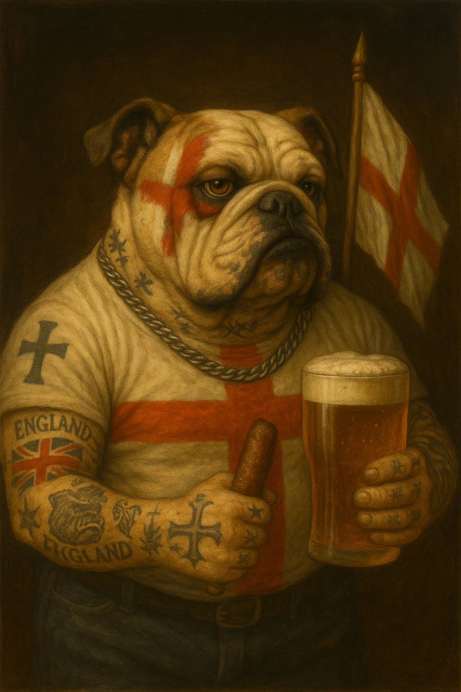

---

#`dog`
###`⠀`
###`⠀`
###`⠀`

---


#`dog`
###`↓`
###`⠀`
###`━••  ━━━  ━━•`

---

#`dog`
###`↓`  
###`⠀`
###`⠙⠕⠛`

---

#`dog`
###`↓`
###`⠀` 
###`[64 6f 67]`

---
###`🐈 80dogs.txt` 
[.column]
```
Hund
Ha'DIbaH
abwo
alabai
anjing
ashun
aso
cane
cão
câin
câine
câini
chien
chó
cyn
dog
emba
ghaddu
gom
hond
```


[.column]
```
hondur
hualp
huan
hund
imba
imbua
imbwe
inu
it
jindo
kelb
khuy
klèb
koer
koira
kotta
køter
kutya
kutta
köpek
```
[.column]
```
köpeği
mbula
mbwa
mbwagh
mbwá
mbwene
mbʉ
njau
njoka
pa
perro
pes
pies
qen
qeni
sag
sagol
sobaka
suns
szczeniak
```
[.column]
```
tz’i’
ukudla
welpe
xolo
zwin
āso
āšun
šuo
אבו
כּלב
كلب
कुत्ता
ฆ่า
犬
狗
ⴽⵍⴱ
łééchąą’í
𐀠
𓃥
🐶
```

---
* Before Unicode
* Unicode Unleashed
* Oracle Through The Ages
* Oracle CharacterSet


---
```
➜ encode.py ascii < 80dogs.txt
✅ ascii: 53 good dogs
  Hund  Ha'DIbaH  abwo  alabai  anjing  ashun  aso  cane  chien  cyn  dog  emba
  ghaddu  gom  hond  hondur  hualp  huan  hund  imba  imbua  imbwe  inu  it
  jindo  kelb  khuy  koer  koira  kotta  kutya  kutta  mbula  mbwa  mbwagh  mbwene
  njau  njoka  pa  perro  pes  pies  qen  qeni  sag  sagol  sobaka  suns
  szczeniak  ukudla  welpe  xolo  zwin
❌ ascii: 27 bad dogs
  cão  câin  câine  câini  chó  klèb  køter  köpek  köpeği  mbwá  mbʉ  tz’i’
  āso  āšun  šuo  אבו  כּלב  كلب  कुत्ता  ฆ่า  犬  狗  ⴽⵍⴱ  łééchąą’í
  𐀠  𓃥  🐶
✅ ascii: 240 chars encoded in 240 bytes, 1.00 bytes per char
```

^
1968
53
1 byte per char

---

#`Huan`
###`➜[48 75 61 6e] (ascii)`


---
|`ascii`| `0` | `1` | `2` | `3` | `4` | `5` | `6` | `7` | `8` | `9` | `a` | `b` | `c` | `d` | `e` | `f` |
|:--     |:---:|:---:|:---:|:---:|:---:|:---:|:---:|:---:|:---:|:---:|:---:|:---:|:---:|:---:|:---:|:---:|
|**`0x`**|`<nul>`| `<soh>` | `<stx>` | `<etx>` | `<eot>` | `<enq>` | `<ack>` | `<bel>` | `<bs>` | `<tab>`|`<lf>`|`<vt>`|`<ff>`| `<cr>` | `<so>` | `<si>` |
|**`1x`**| `<dle>` | `<dc1>` | `<dc2>` | `<dc3>` | `<dc4>` | `<nak>` | `<syn>` | `<etb>` | `<can>` | `<em>` | `<sub>` | `<esc>` | `<fs>` | `<gs>` | `<rs>` | `<us>` |
|**`2x`**|  | `!` | `"` | `#` | `$` | `%` | `&` | `'` | `(` | `)` | `*` | `+` | `,` | `-` | `.` | `/` |
|**`3x`**| `0` | `1` | `2` | `3` | `4` | `5` | `6` | `7` | `8` | `9` | `:` | `;` | `<` | `=` | `>` | `?` |
|**`4x`**| `@` | `A` | `B` | `C` | `D` | `E` | `F` | `G` | `H` | `I` | `J` | `K` | `L` | `M` | `N` | `O` |
|**`5x`**| `P` | `Q` | `R` | `S` | `T` | `U` | `V` | `W` | `X` | `Y` | `Z` | `[` | `\` | `]` | `^` | `_` |
|**`6x`**| `` ` `` | `a` | `b` | `c` | `d` | `e` | `f` | `g` | `h` | `i` | `j` | `k` | `l` | `m` | `n` | `o` |
|**`7x`**| `p` | `q` | `r` | `s` | `t` | `u` | `v` | `w` | `x` | `y` | `z` | `{` | `\|` | `}` | `~` | `<del>` |


^
7 bit
8th bit checksum

---
```
"WOOF"➜[01010111 01001111 01001111 01000110]
"woof"➜[01110111 01101111 01101111 01100110]

"HAU"➜[1001000 1000001 1010101]
"hau"➜[1101000 1100001 1110101]
```

---
#iso-8859

^
set of standards
1987➜2001

---
| Standard      | Alias       | Region                   | Year |
|:--            |:--         | :--                       | --:  |
| **`iso-8859-1`**  | **`latin1`**   | **Western Europe**            | 1987 |
| **`iso-8859-2`**  | **`latin2`**   | **Central & Eastern Europe**  | 1987 |
| `iso-8859-3`  | `latin3`   | South Europe              | 1988 |
| `iso-8859-4`  | `latin4`   | North Europe              | 1988 |
| `iso-8859-5`  | `cyrillic` |                           | 1988 |
| `iso-8859-6`  | `arabic`   |                           | 1987 |
| `iso-8859-7`  | `greek`    |                           | 1987 |
| `iso-8859-8`  | `hebrew`   |                           | 1988 |
| `iso-8859-9`  | `latin5`   | Turkish                   | 1989 |
| `iso-8859-10` | `latin6`   | Nordic                    | 1992 |
| `iso-8859-11` | `thai`     |                           | 2001 |
| `iso-8859-13` | `latin7`   | Baltics                   | 1998 |
| `iso-8859-14` | `latin8`   | Celtic                    | 1998 |
| **`iso-8859-15`** | **`latin9`**   | **Western Europe (Improved)** | 1999 |
| `iso-8859-16` | `latin10`  | South-Eastern Europe      | 2001 |

^
latin2 poland
latin9 improved latin1 €


---
```
➜ encode.py ascii latin1 < 80dogs.txt
✅ ascii ✅ latin1: 53 good dogs
  Ha'DIbaH  Hund  abwo  alabai  anjing  ashun  aso  cane  chien  cyn  dog  emba
  ghaddu  gom  hond  hondur  hualp  huan  hund  imba  imbua  imbwe  inu  it
  jindo  kelb  khuy  koer  koira  kotta  kutta  kutya  mbula  mbwa  mbwagh  mbwene
  njau  njoka  pa  perro  pes  pies  qen  qeni  sag  sagol  sobaka  suns
  szczeniak  ukudla  welpe  xolo  zwin
❌ ascii ✅ latin1: 9 bad dogs turned good
  chó  câin  câine  câini  cão  klèb  köpek  køter  mbwá
❌ ascii ❌ latin1: 18 bad dogs
  köpeği  mbʉ  tz’i’  āso  āšun  łééchąą’í  šuo  אבו  כּלב  كلب  कुत्ता  ฆ่า
  ⴽⵍⴱ  犬  狗  𐀠  𓃥  🐶

✅ ascii→latin1: 53→62 good dogs
✅ ascii: 240 chars encoded in 240 bytes, 1.00 bytes per char
✅ latin1: 278 chars encoded in 278 bytes, 1.00 bytes per char
```

---

#`cão`
###`➜[63 e3 6f] (latin1)` 

---
|`ascii`| `0` | `1` | `2` | `3` | `4` | `5` | `6` | `7` | `8` | `9` | `a` | `b` | `c` | `d` | `e` | `f` |
| :-- | :--: | :--: |:--:|:--:|:--:|:--:|:--:|:--:|:--:|:--:|:--:|:--:|:--:|:--:|:--:|:--:|
| `0x` | `<nul>` | `<soh>` | `<stx>` | `<etx>` | `<eot>` | `<enq>` | `<ack>` | `<bel>` | `<bs>` | `<tab>` | `<lf>` | `<vt>` | `<ff>` | `<cr>` | `<so>` | `<si>` |
| `1x` | `<dle>` | `<dc1>` | `<dc2>` | `<dc3>` | `<dc4>` | `<nak>` | `<syn>` | `<etb>` | `<can>` | `<em>` | `<sub>` | `<esc>` | `<fs>` | `<gs>` | `<rs>` | `<us>` |
| `2x` |  | `!` | `"` | `#` | `$` | `%` | `&` | `'` | `(` | `)` | `*` | `+` | `,` | `-` | `.` | `/` |
| `3x` | `0` | `1` | `2` | `3` | `4` | `5` | `6` | `7` | `8` | `9` | `:` | `;` | `<` | `=` | `>` | `?` |
| `4x` | `@` | `A` | `B` | `C` | `D` | `E` | `F` | `G` | `H` | `I` | `J` | `K` | `L` | `M` | `N` | `O` |
| `5x` | `P` | `Q` | `R` | `S` | `T` | `U` | `V` | `W` | `X` | `Y` | `Z` | `[` | `\` | `]` | `^` | `_` |
| `6x` | `` ` `` | `a` | `b` | `c` | `d` | `e` | `f` | `g` | `h` | `i` | `j` | `k` | `l` | `m` | `n` | `o` |
| `7x` | `p` | `q` | `r` | `s` | `t` | `u` | `v` | `w` | `x` | `y` | `z` | `{` | `\|` | `}` | `~` | `<del>` |
| `8x` |     |     |     |     |     |     |     |     |     |     |     |     |   |   |   |`⠀`   |
| `9x` |     |     |     |     |     |     |     |     |     |     |     |     |   |   |   |`⠀`   |
| `ax` |     |     |     |     |     |     |     |     |     |     |     |     |   |   |   |`⠀`   |
| `bx` |     |     |     |     |     |     |     |     |     |     |     |     |   |   |   |`⠀`   |
| `cx` |     |     |     |     |     |     |     |     |     |     |     |     |   |   |   |`⠀`   |
| `dx` |     |     |     |     |     |     |     |     |     |     |     |     |   |   |   |`⠀`   |
| `ex` |     |     |     |     |     |     |     |     |     |     |     |     |   |   |   |`⠀`   |
| `fx` |     |     |     |     |     |     |     |     |     |     |     |     |   |   |   |`⠀`|


---

|`latin1`| ` 0`   | `1`   | `2`   | `3`   | `4`   | `5`   | `6`   | `7`   | `8`   | `9`   | `a`   | `b`   | `c`   | `d`   | `e`   | `f`   |
| :-- | :--: | :--: |:--:|:--:|:--:|:--:|:--:|:--:|:--:|:--:|:--:|:--:|:--:|:--:|:--:|:--:|
| `0x` | `<nul>` | `<soh>` | `<stx>` | `<etx>` | `<eot>` | `<enq>` | `<ack>` | `<bel>` | `<bs>`  | `<tab>` | `<lf>`  | `<vt>`  | `<ff>`  | `<cr>`  | `<so>`  | `<si>`  |
| `1x` | `<dle>` | `<dc1>` | `<dc2>` | `<dc3>` | `<dc4>` | `<nak>` | `<syn>` | `<etb>` | `<can>` | `<em>`  | `<sub>` | `<esc>` | `<fs>`  | `<gs>`  | `<rs>`  | `<us>`  |
| `2x` | ` `     | `!`     | `"`     | `#`     | `$`     | `%`     | `&`     | `'`     | `(`     | `)`     | `*`     | `+`     | `,`     | `-`     | `.`     | `/`     |
| `3x` | `0`     | `1`     | `2`     | `3`     | `4`     | `5`     | `6`     | `7`     | `8`     | `9`     | `:`     | `;`     | `<`     | `=`     | `>`     | `?`     |
| `4x` | `@`     | `A`     | `B`     | `C`     | `D`     | `E`     | `F`     | `G`     | `H`     | `I`     | `J`     | `K`     | `L`     | `M`     | `N`     | `O`     |
| `5x` | `P`     | `Q`     | `R`     | `S`     | `T`     | `U`     | `V`     | `W`     | `X`     | `Y`     | `Z`     | `[`     | `\`     | `]`     | `^`     | `_`     |
| `6x` | `` ` `` | `a`     | `b`     | `c`     | `d`     | `e`     | `f`     | `g`     | `h`     | `i`     | `j`     | `k`     | `l`     | `m`     | `n`     | `o`     |
| `7x` | `p`     | `q`     | `r`     | `s`     | `t`     | `u`     | `v`     | `w`     | `x`     | `y`     | `z`     | `{`     | `|`     | `}`     | `~`     | `<del>` |
| `8x` |        |        |        |        |        |        |        |        |        |        |        |        |        |        |        |        |
| `9x` |        |        |        |        |        |        |        |        |        |        |        |        |        |        |        |        |
| `ax` | `¡`     | `¢`     | `£`     | `¤`     | `¥`     | `¦`     | `§`     | `¨`     | `©`     | `ª`     | `«`     | `¬`     | `­`     | `®`     | `¯`     | `°`     |
| `bx` | `±`     | `²`     | `³`     | `´`     | `µ`     | `¶`     | `·`     | `¸`     | `¹`     | `º`     | `»`     | `¼`     | `½`     | `¾`     | `¿`     |        |
| `cx` | `À`     | `Á`     | `Â`     | `Ã`     | `Ä`     | `Å`     | `Æ`     | `Ç`     | `È`     | `É`     | `Ê`     | `Ë`     | `Ì`     | `Í`     | `Î`     | `Ï`     |
| `dx` | `Ð`     | `Ñ`     | `Ò`     | `Ó`     | `Ô`     | `Õ`     | `Ö`     | `×`     | `Ø`     | `Ù`     | `Ú`     | `Û`     | `Ü`     | `Ý`     | `Þ`     | `ß`     |
| `ex` | `à`     | `á`     | `â`     | `ã`     | `ä`     | `å`     | `æ`     | `ç`     | `è`     | `é`     | `ê`     | `ë`     | `ì`     | `í`     | `î`     | `ï`     |
| `fx` | `ð`     | `ñ`     | `ò`     | `ó`     | `ô`     | `õ`     | `ö`     | `÷`     | `ø`     | `ù`     | `ú`     | `û`     | `ü`     | `ý`     | `þ`     | `ÿ`     |

^
latin2 filled others

---
```
➜ encode.py ascii latin2 < 80dogs.txt
✅ ascii ✅ latin2: 53 good dogs
  Ha'DIbaH  Hund  abwo  alabai  anjing  ashun  aso  cane  chien  cyn  dog  emba
  ghaddu  gom  hond  hondur  hualp  huan  hund  imba  imbua  imbwe  inu  it
  jindo  kelb  khuy  koer  koira  kotta  kutta  kutya  mbula  mbwa  mbwagh  mbwene
  njau  njoka  pa  perro  pes  pies  qen  qeni  sag  sagol  sobaka  suns
  szczeniak  ukudla  welpe  xolo  zwin
❌ ascii ✅ latin2: 7 bad dogs turned good
  chó  câin  câine  câini  köpek  mbwá  šuo
❌ ascii ❌ latin2: 20 bad dogs
  cão  klèb  köpeği  køter  mbʉ  tz’i’  āso  āšun  łééchąą’í  אבו  כּלב  كلب
  कुत्ता  ฆ่า  ⴽⵍⴱ  犬  狗  𐀠  𓃥  🐶

✅ ascii→latin2: 53→60 good dogs
✅ ascii: 240 chars encoded in 240 bytes, 1.00 bytes per char
✅ latin2: 269 chars encoded in 269 bytes, 1.00 bytes per char
```

---

#`köpek`
###`➜[6b f6 70 65 6b] (latin2)`

---
```
➜ encode.py latin1 cp1252 < 80dogs.txt
✅ latin1 ✅ cp1252: 62 good dogs
  Ha'DIbaH  Hund  abwo  alabai  anjing  ashun  aso  cane  chien  chó  cyn  câin
  câine  câini  cão  dog  emba  ghaddu  gom  hond  hondur  hualp  huan  hund
  imba  imbua  imbwe  inu  it  jindo  kelb  khuy  klèb  koer  koira  kotta
  kutta  kutya  köpek  køter  mbula  mbwa  mbwagh  mbwene  mbwá  njau  njoka  pa
  perro  pes  pies  qen  qeni  sag  sagol  sobaka  suns  szczeniak  ukudla  welpe
  xolo  zwin
❌ latin1 ✅ cp1252: 2 bad dogs turned good
  tz’i’  šuo
❌ latin1 ❌ cp1252: 16 bad dogs
  köpeği  mbʉ  āso  āšun  łééchąą’í  אבו  כּלב  كلب  कुत्ता  ฆ่า  ⴽⵍⴱ  犬
  狗  𐀠  𓃥  🐶

✅ latin1→cp1252: 62→64 good dogs
✅ latin1: 278 chars encoded in 278 bytes, 1.00 bytes per char
✅ cp1252: 286 chars encoded in 286 bytes, 1.00 bytes per char
```

---
|`latin1`| ` 0`   | `1`   | `2`   | `3`   | `4`   | `5`   | `6`   | `7`   | `8`   | `9`   | `A`   | `B`   | `C`   | `D`   | `E`   | `F`   |
| :-- | :--: | :--: |:--:|:--:|:--:|:--:|:--:|:--:|:--:|:--:|:--:|:--:|:--:|:--:|:--:|:--:|
| `0x` | `<nul>` | `<soh>` | `<stx>` | `<etx>` | `<eot>` | `<enq>` | `<ack>` | `<bel>` | `<bs>`  | `<tab>` | `<lf>`  | `<vt>`  | `<ff>`  | `<cr>`  | `<so>`  | `<si>`  |
| `1x` | `<dle>` | `<dc1>` | `<dc2>` | `<dc3>` | `<dc4>` | `<nak>` | `<syn>` | `<etb>` | `<can>` | `<em>`  | `<sub>` | `<esc>` | `<fs>`  | `<gs>`  | `<rs>`  | `<us>`  |
| `2x` | ` `     | `!`     | `"`     | `#`     | `$`     | `%`     | `&`     | `'`     | `(`     | `)`     | `*`     | `+`     | `,`     | `-`     | `.`     | `/`     |
| `3x` | `0`     | `1`     | `2`     | `3`     | `4`     | `5`     | `6`     | `7`     | `8`     | `9`     | `:`     | `;`     | `<`     | `=`     | `>`     | `?`     |
| `4x` | `@`     | `A`     | `B`     | `C`     | `D`     | `E`     | `F`     | `G`     | `H`     | `I`     | `J`     | `K`     | `L`     | `M`     | `N`     | `O`     |
| `5x` | `P`     | `Q`     | `R`     | `S`     | `T`     | `U`     | `V`     | `W`     | `X`     | `Y`     | `Z`     | `[`     | `\`     | `]`     | `^`     | `_`     |
| `6x` | `` ` `` | `a`     | `b`     | `c`     | `d`     | `e`     | `f`     | `g`     | `h`     | `i`     | `j`     | `k`     | `l`     | `m`     | `n`     | `o`     |
| `7x` | `p`     | `q`     | `r`     | `s`     | `t`     | `u`     | `v`     | `w`     | `x`     | `y`     | `z`     | `{`     | `|`     | `}`     | `~`     | `<del>` |
| `8x` |        |        |        |        |        |        |        |        |        |        |        |        |        |        |        |        |
| `9x` |        |        |        |        |        |        |        |        |        |        |        |        |        |        |        |        |
| `Ax` | `¡`     | `¢`     | `£`     | `¤`     | `¥`     | `¦`     | `§`     | `¨`     | `©`     | `ª`     | `«`     | `¬`     | `­`     | `®`     | `¯`     | `°`     |
| `Bx` | `±`     | `²`     | `³`     | `´`     | `µ`     | `¶`     | `·`     | `¸`     | `¹`     | `º`     | `»`     | `¼`     | `½`     | `¾`     | `¿`     |        |
| `Cx` | `À`     | `Á`     | `Â`     | `Ã`     | `Ä`     | `Å`     | `Æ`     | `Ç`     | `È`     | `É`     | `Ê`     | `Ë`     | `Ì`     | `Í`     | `Î`     | `Ï`     |
| `Dx` | `Ð`     | `Ñ`     | `Ò`     | `Ó`     | `Ô`     | `Õ`     | `Ö`     | `×`     | `Ø`     | `Ù`     | `Ú`     | `Û`     | `Ü`     | `Ý`     | `Þ`     | `ß`     |
| `Ex` | `à`     | `á`     | `â`     | `ã`     | `ä`     | `å`     | `æ`     | `ç`     | `è`     | `é`     | `ê`     | `ë`     | `ì`     | `í`     | `î`     | `ï`     |
| `Fx` | `ð`     | `ñ`     | `ò`     | `ó`     | `ô`     | `õ`     | `ö`     | `÷`     | `ø`     | `ù`     | `ú`     | `û`     | `ü`     | `ý`     | `þ`     | `ÿ`     |

---


|`win-1252`| `0`   | `1`   | `2`   | `3`   | `4`   | `5`   | `6`   | `7`   | `8`   | `9`   | `a`   | `b`   | `c`   | `d`   | `e`   | `f`   |
| :-- | :--: | :--: |:--:|:--:|:--:|:--:|:--:|:--:|:--:|:--:|:--:|:--:|:--:|:--:|:--:|:--:|
| `0x` | `<nul>` | `<soh>` | `<stx>` | `<etx>` | `<eot>` | `<enq>` | `<ack>` | `<bel>` | `<bs>`  | `<tab>` | `<lf>`  | `<vt>`  | `<ff>`  | `<cr>`  | `<so>`  | `<si>`  |
| `1x` | `<dle>` | `<dc1>` | `<dc2>` | `<dc3>` | `<dc4>` | `<nak>` | `<syn>` | `<etb>` | `<can>` | `<em>`  | `<sub>` | `<esc>` | `<fs>`  | `<gs>`  | `<rs>`  | `<us>`  |
| `2x` | ` `     | `!`     | `"`     | `#`     | `$`     | `%`     | `&`     | `'`     | `(`     | `)`     | `*`     | `+`     | `,`     | `-`     | `.`     | `/`     |
| `3x` | `0`     | `1`     | `2`     | `3`     | `4`     | `5`     | `6`     | `7`     | `8`     | `9`     | `:`     | `;`     | `<`     | `=`     | `>`     | `?`     |
| `4x` | `@`     | `A`     | `B`     | `C`     | `D`     | `E`     | `F`     | `G`     | `H`     | `I`     | `J`     | `K`     | `L`     | `M`     | `N`     | `O`     |
| `5x` | `P`     | `Q`     | `R`     | `S`     | `T`     | `U`     | `V`     | `W`     | `X`     | `Y`     | `Z`     | `[`     | `\`     | `]`     | `^`     | `_`     |
| `6x` | `` ` `` | `a`     | `b`     | `c`     | `d`     | `e`     | `f`     | `g`     | `h`     | `i`     | `j`     | `k`     | `l`     | `m`     | `n`     | `o`     |
| `7x` | `p`     | `q`     | `r`     | `s`     | `t`     | `u`     | `v`     | `w`     | `x`     | `y`     | `z`     | `{`     | `|`     | `}`     | `~`     | `<del>` |
| `8x` | `€`     |        | `‚`     | `ƒ`     | `„`     | `…`     | `†`     | `‡`     | `ˆ`     | `‰`     | `Š`     | `‹`     | `Œ`     |        | `Ž`     |        |
| `9x` |        | `‘`     | `’`     | `“`     | `”`     | `•`     | `–`     | `—`     | `˜`     | `™`     | `š`     | `›`     | `œ`     |        | `ž`     | `Ÿ`     |
| `ax` | `¡`     | `¢`     | `£`     | `¤`     | `¥`     | `¦`     | `§`     | `¨`     | `©`     | `ª`     | `«`     | `¬`     | `­`     | `®`     | `¯`     | `°`     |
| `bx` | `±`     | `²`     | `³`     | `´`     | `µ`     | `¶`     | `·`     | `¸`     | `¹`     | `º`     | `»`     | `¼`     | `½`     | `¾`     | `¿`     |
| `cx` | `À`     | `Á`     | `Â`     | `Ã`     | `Ä`     | `Å`     | `Æ`     | `Ç`     | `È`     | `É`     | `Ê`     | `Ë`     | `Ì`     | `Í`     | `Î`     | `Ï`     |
| `dx` | `Ð`     | `Ñ`     | `Ò`     | `Ó`     | `Ô`     | `Õ`     | `Ö`     | `×`     | `Ø`     | `Ù`     | `Ú`     | `Û`     | `Ü`     | `Ý`     | `Þ`     | `ß`     |
| `ex` | `à`     | `á`     | `â`     | `ã`     | `ä`     | `å`     | `æ`     | `ç`     | `è`     | `é`     | `ê`     | `ë`     | `ì`     | `í`     | `î`     | `ï`     |
| `fx` | `ð`     | `ñ`     | `ò`     | `ó`     | `ô`     | `õ`     | `ö`     | `÷`     | `ø`     | `ù`     | `ú`     | `û`     | `ü`     | `ý`     | `þ`     | `ÿ`     |

---
```
➜ encode.py latin2 cp1250 < 80dogs.txt
✅ latin2 ✅ cp1250: 60 good dogs
  Ha'DIbaH  Hund  abwo  alabai  anjing  ashun  aso  cane
  chien  chó  cyn  câin  câine  câini  dog  emba
  ghaddu  gom  hond  hondur  hualp  huan  hund  imba
  imbua  imbwe  inu  it  jindo  kelb  khuy  koer
  koira  kotta  kutta  kutya  köpek  mbula  mbwa  mbwagh
  mbwene  mbwá  njau  njoka  pa  perro  pes  pies
  qen  qeni  sag  sagol  sobaka  suns  szczeniak  ukudla
  welpe  xolo  zwin  šuo
❌ latin2 ✅ cp1250: 2 bad dogs turned good
  tz’i’  łééchąą’í
❌ latin2 ❌ cp1250: 18 bad dogs
  cão  klèb  köpeği  køter  mbʉ  āso  āšun  אבו
  כּלב  كلب  कुत्ता  ฆ่า  ⴽⵍⴱ  犬  狗  𐀠
  𓃥  🐶

✅ latin2→cp1250: 60→62 good dogs
✅ latin2: 269 chars encoded in 269 bytes, 1.00 bytes per char
✅ cp1250: 283 chars encoded in 283 bytes, 1.00 bytes per char
```

---
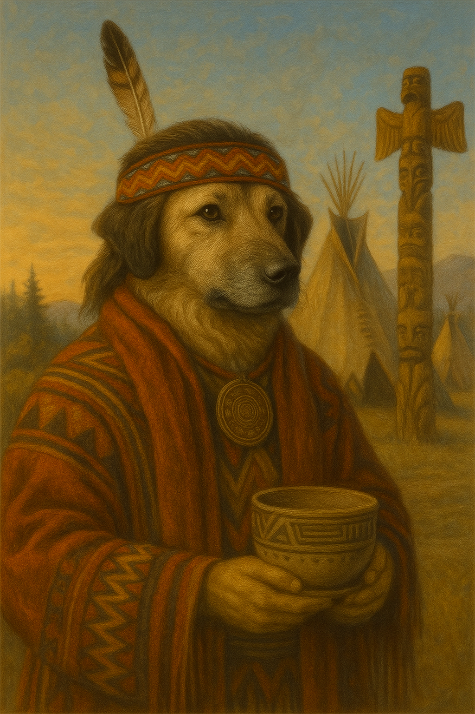
#`łééchąą’í`
###`➜[b3 e9 e9 63 68 b9 b9 92 ed] (cp1250)`

---
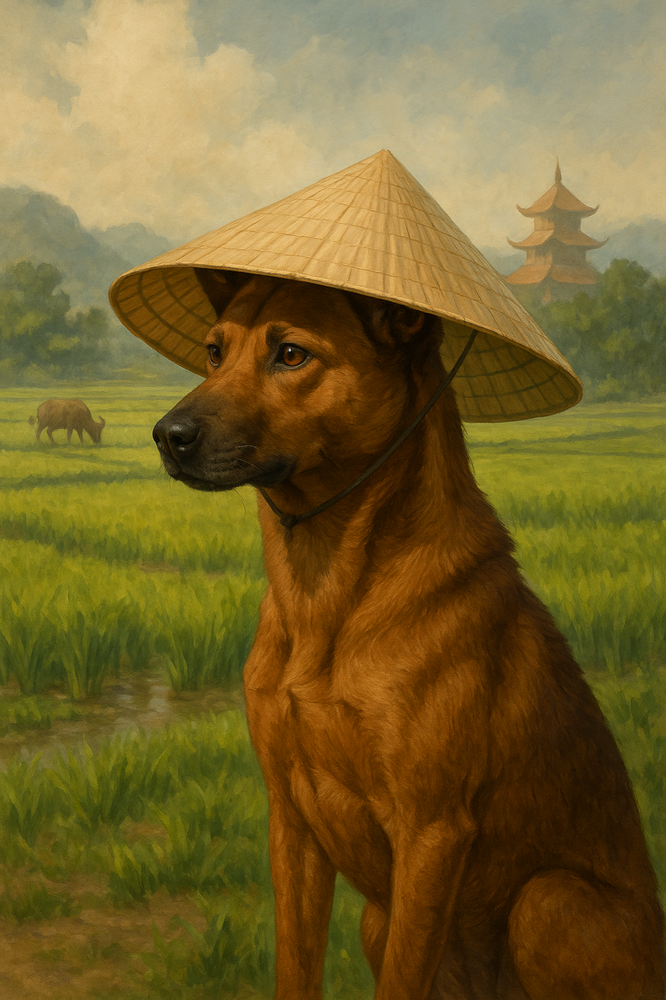
#`chó`
###`➜[63 68 f3] (latin2)`
###`➜[63 68 f3] (cp1250)`

---
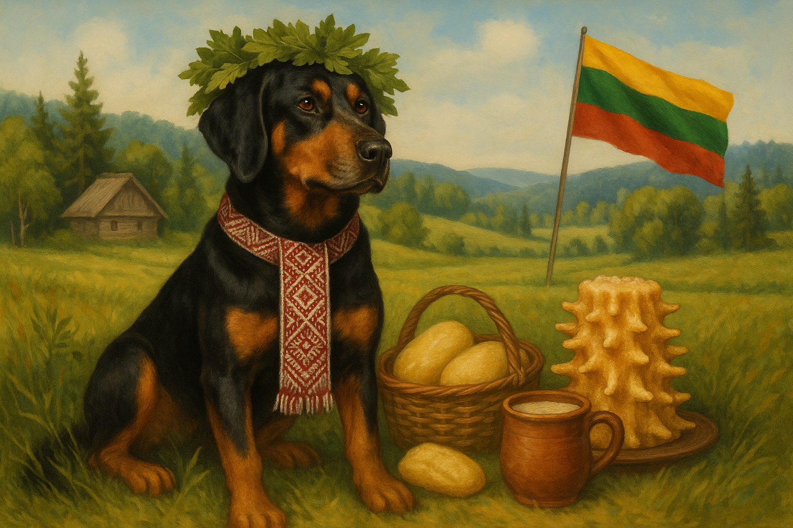
#`šuo`
###`➜[b9 75 6f] (latin2)`
###`➜[9a 75 6f] (cp1250)`

---

| Standard         | Alias        | Windows Equivalent     |
|----------------  |-------------|--------------|
| `iso-8859-1`     | `latin1`    | windows-1252 |
| `iso-8859-2`     | `latin2`    | windows-1250 |
| `iso-8859-5`     | `cyrillic`  | windows-1251 |
| `iso-8859-6`     | `arabic`    | windows-1256 |
| `iso-8859-7`     | `greek`     | windows-1253 |
| `iso-8859-8`     | `hebrew`    | windows-1255 |
| `iso-8859-9`     | `latin5`    | windows-1254 |
| `iso-8859-11`    | `thai`      | windows-874  |
| `iso-8859-13`    | `latin7`    | windows-1257 |
| `iso-8859-15`    | `latin9`    | windows-1252 |


---
#gb2312 

^
Meanwhile in China
1980
Character Set
Encoding is EUC-CN

---
```
➜ encode.py ascii gb2312 < 80dogs.txt
✅ ascii ✅ gb2312: 53 good dogs
  Ha'DIbaH  Hund  abwo  alabai  anjing  ashun  aso  cane
  chien  cyn  dog  emba  ghaddu  gom  hond  hondur
  hualp  huan  hund  imba  imbua  imbwe  inu  it
  jindo  kelb  khuy  koer  koira  kotta  kutta  kutya
  mbula  mbwa  mbwagh  mbwene  njau  njoka  pa  perro
  pes  pies  qen  qeni  sag  sagol  sobaka  suns
  szczeniak  ukudla  welpe  xolo  zwin
❌ ascii ✅ gb2312: 7 bad dogs turned good
  chó  klèb  mbwá  tz’i’  āso  犬  狗
❌ ascii ❌ gb2312: 20 bad dogs
  câin  câine  câini  cão  köpek  köpeği  køter  mbʉ
  āšun  łééchąą’í  šuo  אבו  כּלב  كلب  कुत्ता  ฆ่า
  ⴽⵍⴱ  𐀠  𓃥  🐶

✅ ascii→gb2312: 53→60 good dogs
✅ ascii: 240 chars encoded in 240 bytes, 1.00 bytes per char
✅ gb2312: 261 chars encoded in 269 bytes, 1.03 bytes per char
```

---

#`犬`
###`➜ [b9 b7]`

---

#`犬`
###`➜ [c8 ae]`

---
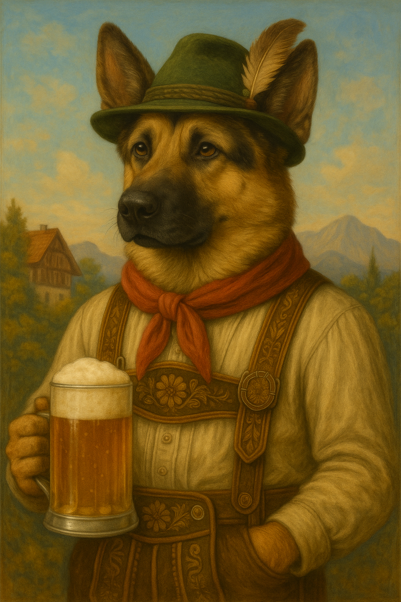
#`Hund`
###`➜ [48 75 6e 64] (gb2312)`
###`➜ [48 75 6e 64] (ascii)⠀`

---
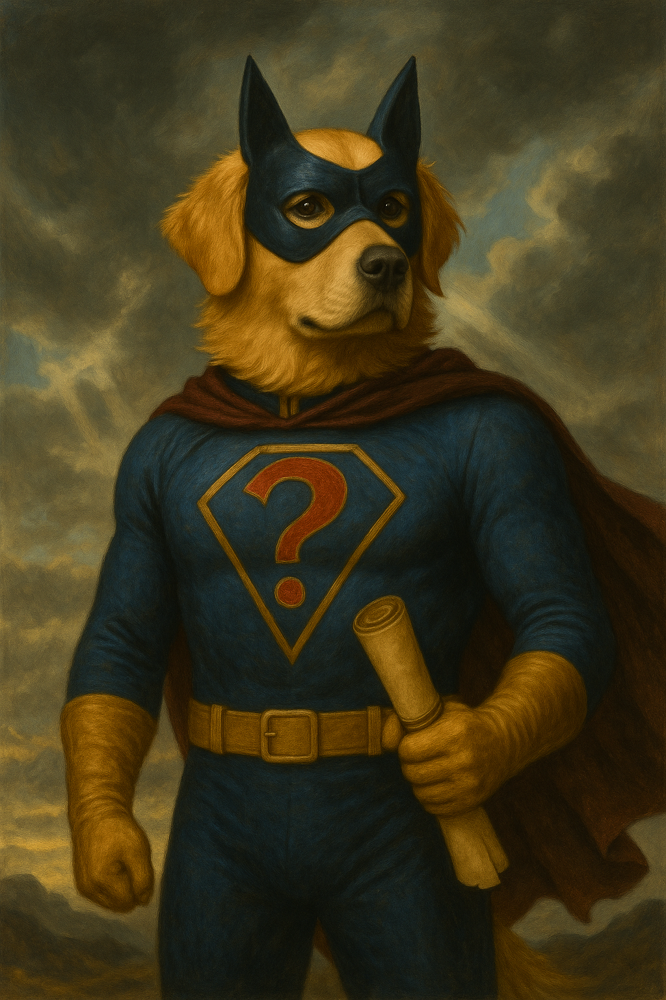
#`?`
###`➜[?? ?? ?? ??] (gb2312)`


---
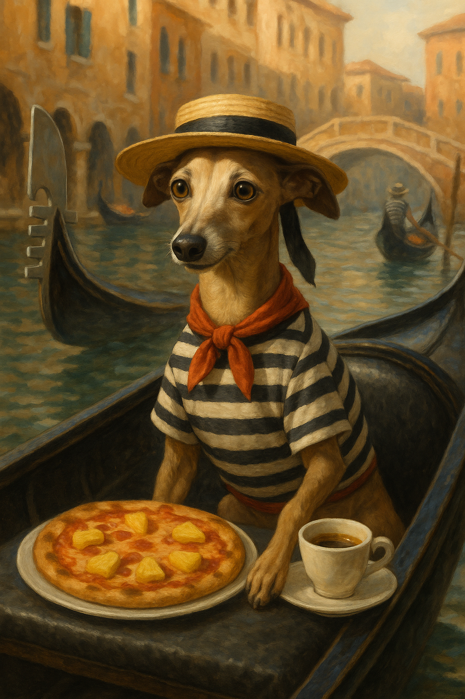
#`cane`
###`➜[63 61 6e 65] (gb2312)`

---
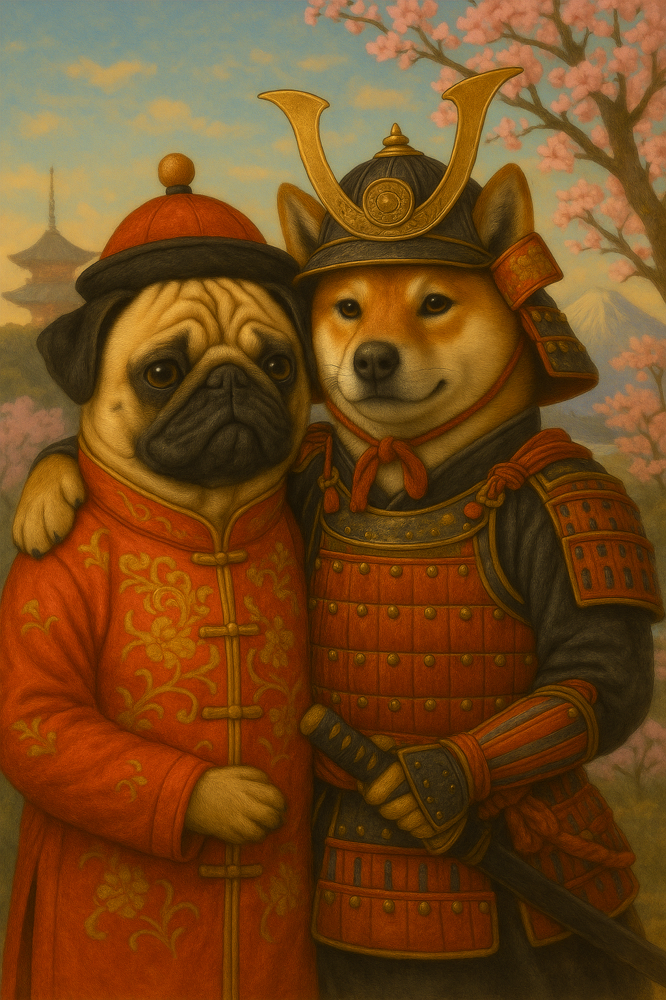
#`狗犬`
###`➜[b9 b7 c8 ae] (gb2312)`

---
#`?`
###`➜[.. b9 b7 ..] (gb2312)`

---

#`狗`
###`➜[.. b9 b7 ..] (gb2312)`

---
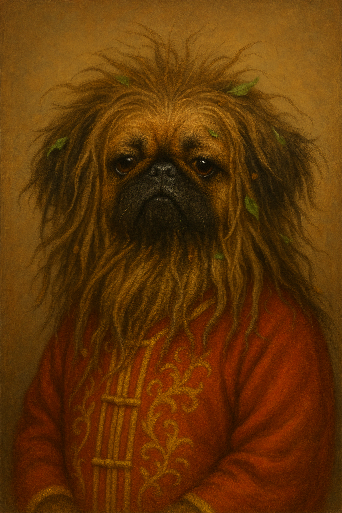
#`肮发`
###`➜ [b0 b9 b7 a2] (gb2312)`


---
#Unicode

^
1991
set of standards including encodings
not an encoding


---
#Codepoint

---
# `U+0000➜U+10ffff`


---

| Plane    |                       | Name                                      |
|:---      |:---                   | :--                                       |
| `0`      | `U+0000   ➜ U+ffff⠀⠀` | Basic Multilingual Plane             |
| `1`      | `U+10000 ⠀➜ U+1ffff⠀` | Supplementary Multilingual Plane     |
| `2`      | `U+20000 ⠀➜ U+2ffff⠀` | Supplementary Ideographic Plane      |
| `3`      | `U+30000⠀ ➜ U+3ffff⠀` | Tertiary Ideographic Plane          | 
| `4 ➜ 13` | `U+40000 ⠀➜ U+dffff⠀` | Reserved                                  |
| `14`     | `U+e0000 ⠀➜ U+effff⠀` | Suppl.  Special-Purpose Plane  |
| `15`     | `U+f0000⠀ ➜ U+fffff⠀` | Private Use Area A                        |
| `16`     | `U+100000 ➜ U+10ffff` | Private Use Area B                        |


^
BMP most chars used modern languages (Unicode 1.0)
SMP ancient,emoji,music,special symbols
SIP rare chinese
TIP very rare chinese
Reserved - custom characters used in fonts, software, or private systems
Future use
SSP - Special-purpose codes for language tagging and fine-tuning character display


--- 

|   | ` 0`   | `1`   | `2`   | `3`   | `4`   | `5`   | `6`   | `7`   | `8`   | `9`   | `A`   | `B`   | `C`   | `D`   | `E`   | `F`   |
| :-- | :--: | :--: |:--:|:--:|:--:|:--:|:--:|:--:|:--:|:--:|:--:|:--:|:--:|:--:|:--:|:--:|
| `U+000x` | `<nul>` | `<soh>` | `<stx>` | `<etx>` | `<eot>` | `<enq>` | `<ack>` | `<bel>` | `<bs>`  | `<tab>` | `<lf>`  | `<vt>`  | `<ff>`  | `<cr>`  | `<so>`  | `<si>`  |
| `U+001x` | `<dle>` | `<dc1>` | `<dc2>` | `<dc3>` | `<dc4>` | `<nak>` | `<syn>` | `<etb>` | `<can>` | `<em>`  | `<sub>` | `<esc>` | `<fs>`  | `<gs>`  | `<rs>`  | `<us>`  |
| `U+002x` | ` `     | `!`     | `"`     | `#`     | `$`     | `%`     | `&`     | `'`     | `(`     | `)`     | `*`     | `+`     | `,`     | `-`     | `.`     | `/`     |
| `U+003x` | `0`     | `1`     | `2`     | `3`     | `4`     | `5`     | `6`     | `7`     | `8`     | `9`     | `:`     | `;`     | `<`     | `=`     | `>`     | `?`     |
| `U+004x` | `@`     | `A`     | `B`     | `C`     | `D`     | `E`     | `F`     | `G`     | `H`     | `I`     | `J`     | `K`     | `L`     | `M`     | `N`     | `O`     |
| `U+005x` | `P`     | `Q`     | `R`     | `S`     | `T`     | `U`     | `V`     | `W`     | `X`     | `Y`     | `Z`     | `[`     | `\`     | `]`     | `^`     | `_`     |
| `U+006x` | `` ` `` | `a`     | `b`     | `c`     | `d`     | `e`     | `f`     | `g`     | `h`     | `i`     | `j`     | `k`     | `l`     | `m`     | `n`     | `o`     |
| `U+007x` | `p`     | `q`     | `r`     | `s`     | `t`     | `u`     | `v`     | `w`     | `x`     | `y`     | `z`     | `{`     | `|`     | `}`     | `~`     | `<del>` |
| `U+008x` |        |        |        |        |        |        |        |        |        |        |        |        |        |        |        |        |
| `U+009x` |        |        |        |        |        |        |        |        |        |        |        |        |        |        |        |        |
| `U+00ax` | `¡`     | `¢`     | `£`     | `¤`     | `¥`     | `¦`     | `§`     | `¨`     | `©`     | `ª`     | `«`     | `¬`     | `­`     | `®`     | `¯`     | `°`     |
| `U+00bx` | `±`     | `²`     | `³`     | `´`     | `µ`     | `¶`     | `·`     | `¸`     | `¹`     | `º`     | `»`     | `¼`     | `½`     | `¾`     | `¿`     |        |
| `U+00cx` | `À`     | `Á`     | `Â`     | `Ã`     | `Ä`     | `Å`     | `Æ`     | `Ç`     | `È`     | `É`     | `Ê`     | `Ë`     | `Ì`     | `Í`     | `Î`     | `Ï`     |
| `U+00dx` | `Ð`     | `Ñ`     | `Ò`     | `Ó`     | `Ô`     | `Õ`     | `Ö`     | `×`     | `Ø`     | `Ù`     | `Ú`     | `Û`     | `Ü`     | `Ý`     | `Þ`     | `ß`     |
| `U+00ex` | `à`     | `á`     | `â`     | `ã`     | `ä`     | `å`     | `æ`     | `ç`     | `è`     | `é`     | `ê`     | `ë`     | `ì`     | `í`     | `î`     | `ï`     |
| `U+00fx` | `ð`     | `ñ`     | `ò`     | `ó`     | `ô`     | `õ`     | `ö`     | `÷`     | `ø`     | `ù`     | `ú`     | `û`     | `ü`     | `ý`     | `þ`     | `ÿ`     |

^
###Unicode U+0000 to U+007f


--- 
| Range           | Block                   |
| :---            | :---                    | 
| `U+0000➜U+007f` | ASCII                   |
| `U+0080➜U+00ff` | Latin-1 Supplement        |
| `U+0100➜U+024f` | Latin Extended          |
| `U+0250➜U+02ff` | Phonetic Symbols        |
| `U+0300➜U+05ff` | Greek, Cyrillic, Hebrew |
| `U+0600➜U+0fff` | Arabic & Indian         |
| `U+1000➜U+17ff` | S & SE Asian            |
| `U+1800➜U+24ff` | E Asian                 |
| `U+2000➜U+27ff` | Symbols, Punctuation    |
| `U+2800➜U+28ff` | Braille, Shapes         |
| `U+2e80➜U+9fff` | Chinese                 |
| `U+ac00➜U+d7af` | Korean                  |
| `U+d800➜U+dbff` | High Surrogates         |
| `U+dc00➜U+dfff` | Low Surrogates          |

^
basic latin
latin suppl: latin1, western europe
latin extend: rest of europe, africa
note surrogates 


---
#Unicode Encodings

* `UTF-32`
* `UTF-16`
* `UTF-8`

---
#Unicode Encodings

* **`UTF-32`**
* `UTF-16`
* `UTF-8`


---
```
➜ encode.py utf-32be < 80dogs.txt
✅ utf-32be: 80 good dogs
✅ utf-32be: 338 chars encoded in 1352 bytes, 4.00 bytes per char
```

---

#`犬 = U+72ac`
###`➜ [00 00 72 ac]             (utf-32be)⠀⠀⠀⠀⠀`
###`➜ [ac 72 00 00]             (utf-32le)⠀⠀⠀⠀⠀`
###`➜ [00 00 fe ff 00 00 72 ac] (utf-32be + BOM)`
###`➜ [ff fe 00 00 ac 72 00 00] (utf-32le + BOM)`

---
#Unicode Encodings

* `UTF-32`
* **`UTF-16`**
* `UTF-8`

^
universal character set
first unicode encodings
fixed-length, 2 bytes per char
allowing direct encoding of all code 
remember ucs-2 for utf-16

---
```
➜ encode.py utf-16be < 80dogs.txt
✅ utf-16be: 80 good dogs
utf-16be: 338 chars encoded in 682 bytes, 2.02 bytes per char
```

---

#`犬 = U+72ac`
###`➜ [72 ac]             (utf-16be)`
###`➜ [ac 72]             (utf-16le)`
###`➜ [fe ff 72 ac] (utf-16be + BOM)`
###`➜ [ff fe ac 72] (utf-16le + BOM)`


---


---

#`🐶 =  U+1f436`
###`➜ [?? ??] (utf-16)`


---

| Range               | Block                   |
| :---                | :---                    |
| `U+0000➜U+007f`     | Latin Basic             |
| `U+0080➜U+00ff`     | Latin Supplement        |
| `U+0100➜U+024f`     | Latin Extended          |
| `U+0250➜U+02ff`     | Phonetics               |
| `U+0300➜U+05ff`     | Greek, Cyrillic, Hebrew |
| `U+0600➜U+0Fff`     | Arabic, Indian          |
| `U+1000➜U+17ff`     | S & SE Asian            |
| `U+1800➜U+24ff`     | E Asian                 |
| `U+2000➜U+27ff`     | Symbols                 |
| `U+2800➜U+28ff`     | Braille, Shapes         |
| `U+2e80➜U+9fff`     | Chinese                 |
| `U+ac00➜U+d7af`     | Korean                  |
| **`U+d800➜U+dbff`** | **High Surrogates**     |
| **`U+dc00➜U+dfff`** | **Low Surrogates**      |
| `U+e000➜U+f8ff`     | Private Use             |

---


```
🐶 = U+1f436 - 0x10000 = 0x0f436                       
                       = 0b00001111010000110110
                       = [0b0000111101][0b0000110110]
                       = [0x003d]     [0x0036]
                        +[0xd800]    +[0xdc00]
	                   = [0xd83d]     [0xdc36]
   ➜ U+d83d U+dc36 
```

---

#`🐶 = U+1f436`
###`➜  U+d83d  U+dc36⠀⠀⠀⠀⠀⠀⠀⠀`
###`➜ [d8 3d] [dc 36 ] (utf-16)`

---
#Unicode Encoding
#UTF-8

---

```
➜ encode.py utf-8 < 80dogs.txt
✅ utf-8: 80 good dogs
✅ utf-8: 338 chars encoded in 413 bytes, 1.22 bytes per char
```

^
encodes all
very efficient


---
[.code-highlight: 1-2]
[.code-highlight: 1-5]
[.code-highlight: 1-8]
[.code-highlight: all]
[.code-highlight: 4-5]
```
U+0000→U+007F              
➜[0xxxxxxx]

U+0080→U+07FF                       
➜[110xxxxx 10xxxxxx]

U+0800→U+FFFF                      
➜[1110xxxx 10xxxxxx 10xxxxxx]

U+10000→U+10FFFF
➜[11110xxx 10xxxxxx 10xxxxxx 10xxxxxx]
```

^
ascii: 7 bits->1 byte
eur & mid east:11 bits->2 bytes
bmp: 16 bits->3 bytes
others: 21 bits->4 bytes
Same on big-little endian

---
[.code-highlight: 1,4]
[.code-highlight: 1-2,4]
[.code-highlight: 1-4]
[.code-highlight: 1-5]
[.code-highlight: all]
```
U+0141 ('Ł') 
 =  00101000001
 =     00101   000001
    110xxxxx 10xxxxxx
 ➜ [11000101 10000001]
    =    [c5       81] 
```


---
[.code-highlight: 1-4]
[.code-highlight: 1-6]
[.code-highlight: 1-7]
[.code-highlight: 1-10]
[.code-highlight: all]
```
[0xxxxxxx]                            
[110xxxxx 10xxxxxx]                   
[1110xxxx 10xxxxxx 10xxxxxx]
[11110xxx 10xxxxxx 10xxxxxx 10xxxxxx]

[0xxxxxxx] ASCII
[10xxxxxx] Continuation
[110xxxxx] Lead of 2 byte sequence
[1110xxxx] Lead of 3 byte sequence
[11110xxx] Lead of 4 byte sequence

[...10100011 10100011 11000011 10100011 01010101...]
```

^
possible encoded sequences
self-synchonizing

---
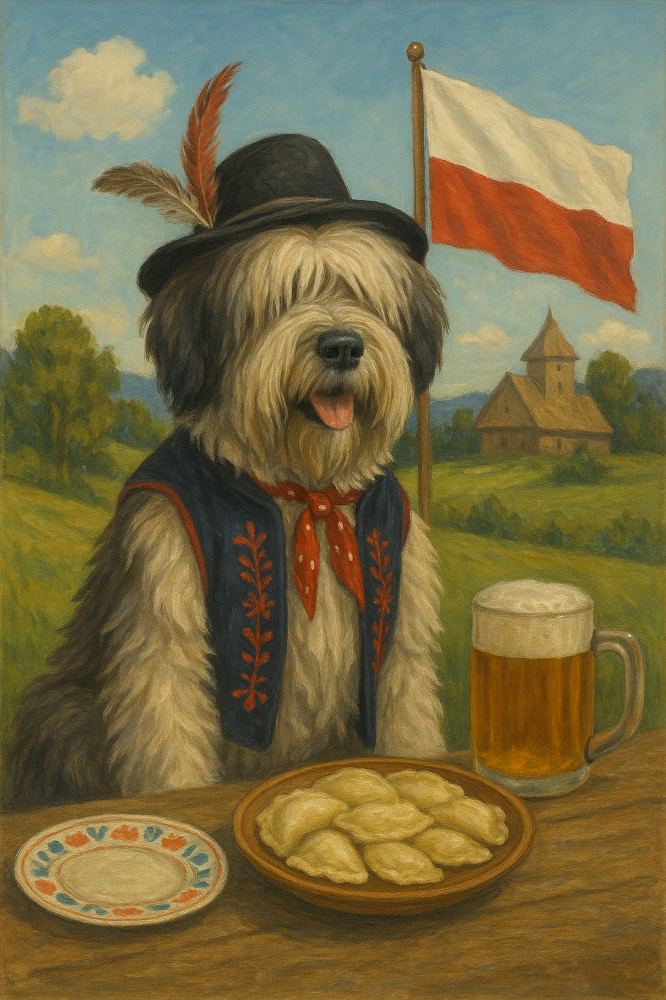
#`pies`
###`➜[70 69 65 73] (ascii)` 
###`➜[70 69 65 73] (utf-8)` 

---
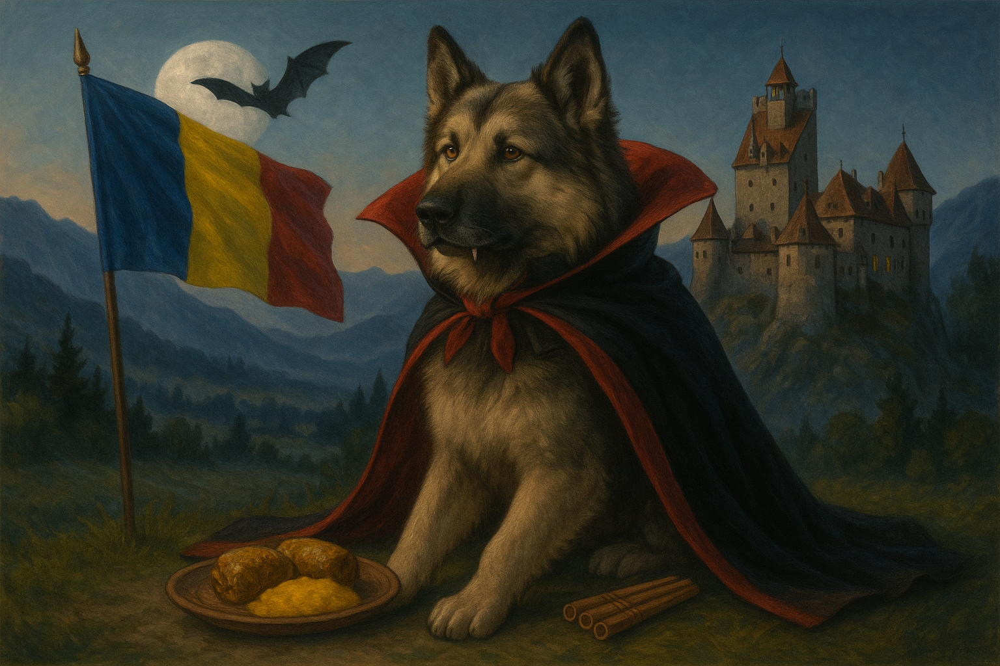
#`câine`
###`➜[63 c3 a2 69 6e 65] (utf-8)` 


---

#`狗`
###`➜[e7 8b 97]`

---

#`🐶`
###`➜[f0 9f 90 b6]`


---
|Encoding   |Good Dogs  | Bytes per Char |
|:--        |:--:        |--:             |
|`ascii`    |`53`       | `1.00`         |
|`latin2`   |`60`       | `1.00`         |
|`win-1250` |`62`       | `1.00`         |
|`gb2312`   |`60`       | `1.03`         |
|`utf-8`    |`80`       | `1.22`         |
|`utf-16`   |`80`       | `2.02`         |
|`utf-32`   |`80`       | `4.00`         |

---
```
⠀US7ASCII⠀

 WE8ISO8859P1
 WE8ISO8859P2

 WE8MSWIN1252
 EE8MSWIN1250

 ZHS16CGB231280

 AL16UTF16
 AL32UTF8
```

---
```
US   7 ASCII

WE   8 ISO8859P1
WE   8 ISO8859P2

WE   8 MSWIN1252
EE   8 MSWIN1250

ZHS 16 CGB231280

AL  16 UTF16
AL  32 UTF8
```

^
Character Set-Bits-Encoding
WE Western European 
ZHS Simplified Chinese
AL All Languages

---

|Database Version|Character Set            |
| :--      | :--                           |
|Oracle 6  |`WE8ISO8859P1`                 | 
|Oracle 7  |`WE8ISO8859P2,ZHS16CGB231280`  |
|Oracle 8  |`EE8MSWIN1250`                 |
|Oracle 8i |`UTF8`                         |
|Oracle 9i |`AL32UTF8`                     |


^
11g AL32UTF8 Recommended
12c AL32UTF8 Default

---
#`UTF8` (≠ `UTF-8`) 
```
U+0000→U+007F              
[0xxxxxxx]

U+0080→U+07FF                       
[110xxxxx 10xxxxxx]

U+0800→U+FFFF                      
[1110xxxx 10xxxxxx 10xxxxxx]

U̶+̶1̶0̶0̶0̶0̶→̶U̶+̶1̶0̶F̶F̶F̶F̶
[̶1̶1̶1̶1̶0̶x̶x̶x̶ ̶1̶0̶x̶x̶x̶x̶x̶x̶ ̶1̶0̶x̶x̶x̶x̶x̶x̶ ̶1̶0̶x̶x̶x̶x̶x̶x̶]̶
```

---
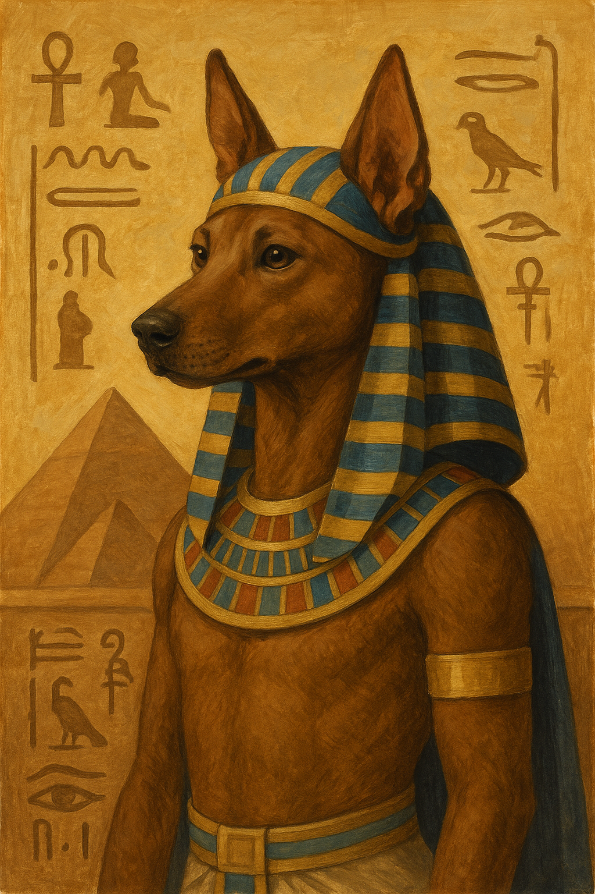

---

#`𓃥 = U+130e5`
###`⠀`
###`⠀`

---

#`𓃥 = U+130e5`
###`➜ U+d83c U+dce5`
###`➜ [ed a0 bc ed b3 a5]`

---
```
create database piesek
   characterset we8iso8859p1
   national character set al16utf16
   ...
```
^
 historically any
 now utf8 & al16utf16

---
```
create table dogs ( name  nchar (10),
                    breed char(10) );

insert into dogs (name,  breed)
          values (n'犬', 'Shiba Inu');
```

---
#Byte/Char Semantics

`NLS_LENGTH_SEMANTICS = BYTE (default)| CHAR`

^
Oracle says don't set NLS_LENGTH_SEMANTICS parameter to CHAR
Causes problems when existing installation scripts create columns with character length semantics

---
```
SQL> create table doggie(name nvarchar2(1 char));

ORA-00907: missing right parenthesis

SQL> create table doggie(name nvarchar2(1))

SQL> Table DOGGIE created.

SQL> insert into doggie values ('🐶');

SQL Error: ORA-12899: value too large for column "PDBADMIN"."DOGGIE"."NAME" (actual: 2, maximum: 1)
```

---
```
SQL> select length(n'🐶'), rawtohex(n'🐶');

   LENGTH(U'\D83D\DC36') RAWTOHEX(U'\D83D\DC36')
________________________ __________________________
                       2 D83DDC36
```

---
```
SQL> create table longdog (name varchar2(4001 byte));

ORA-00910: specified length too long for its datatype

SQL> create table longdog (name varchar2(4000 char));

Table LONGDOG created.

SQL> insert into longdog values (rpad('🐶', 4000, '🐶'));

1 row inserted.

SQL> select length(name), lengthb(name) from longdog;

   LENGTH(NAME)    LENGTHB(NAME)
_______________ ________________
           1000             4000
```

---

* Database Migration Assistant for Unicode (DMU)