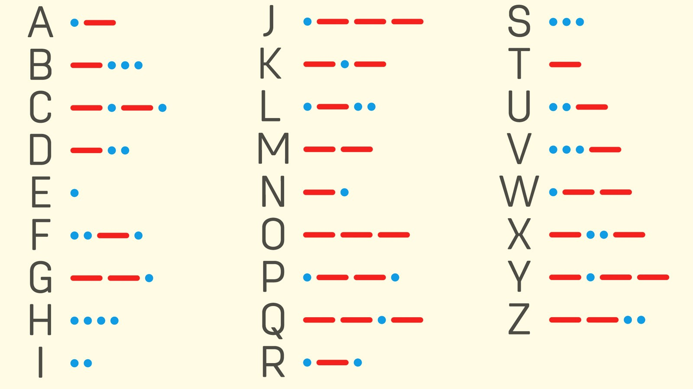
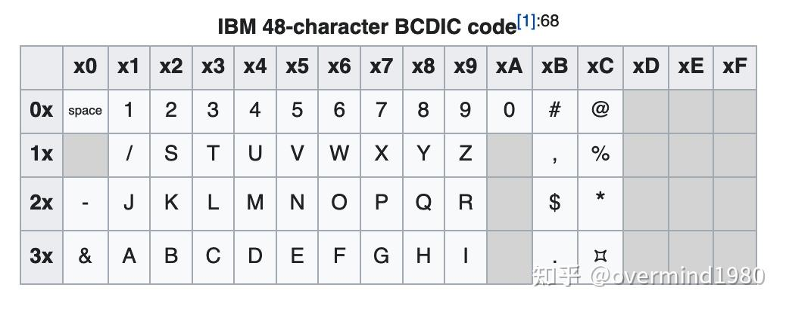
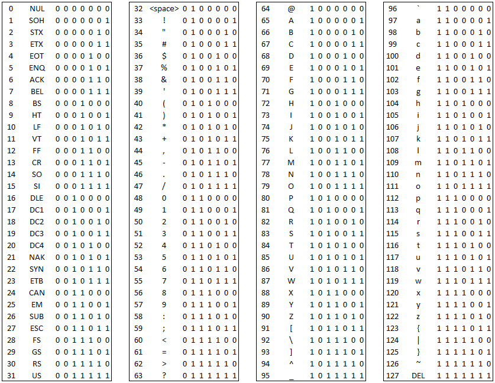

---


---


---


#`dog`

---


#`-··` 
#`---` 
#`--·`

---


#`-··` 
#`---` 
#`--·`


---

#`. ....`
#`... ....`  
#`.. ..`

---

#`. ....`
#`... ....`  
#`.. ..`


---
[.column]
```
eng,dog
por,cão
spa,perro
fra,chien
deu,Hund
zho,狗
jpn,犬
ara,كلب
heb,כלב
rus,собака
hin,कुत्ता
kor,개
swa,mbwa
tur,köpek
ell,σκύλος
pol,pies
nld,hond
ron,câine
hun,kutya
vie,chó
```

[.column]
```
tha,หมา
ind,anjing
fin,koira
est,koer
lav,suns
lit,šuo
bel,сабака
ukr,собака
srp,куче
ces,pes
slk,pes
isl,hundur
nor,hund
swe,hund
cym,ci
mlt,kelb
sqi,qen
zul,inja
xho,ukudla
sna,imbwa
```

[.column]
```
lug,mbwa
kik,njau
bod,ཁྱི
aze,it
kaz,ит
tat,эт
nah,xolo
quc,tzʼiʼ
tgl,aso
hat,chen
uzb,it
nya,galu
fij,koli
kur,se
kat,ძაღლი
ber,ayt
scn,gaddu
nya,njoka
cja,chó
ton,mbwene
xog,mbuli
```

[.column]
```
dua,mbʉ
bem,imbwe
amh,ashun
pan,ਕੁੱਤਾ
luo,mbwá
uig,it
ain,inu
hyr,𓃥
emo,🐶
san,शुनकः
tam,நாய்
ben,কুকুর
sin,බල්ලා
ori,କୁକୁର
kan,ನಾಯಿ
tel,కుక్క
mar,कुत्रा
guj,કૂતરો
tlh,targh
```


---
####US7ASCII

|     | `0` | `1` | `2` | `3` | `4` | `5` | `6` | `7` | `8` | `9` | `A` | `B` | `C` | `D` | `E` | `F` |
|-----|------|------|------|------|------|------|------|------|------|------|------|------|------|------|------|------|
| `0x` | `<nul>` | `<soh>` | `<stx>` | `<etx>` | `<eot>` | `<enq>` | `<ack>` | `<bel>` | `<bs>` | `<tab>` | `<lf>` | `<vt>` | `<ff>` | `<cr>` | `<so>` | `<si>` |
| `1x` | `<dle>` | `<dc1>` | `<dc2>` | `<dc3>` | `<dc4>` | `<nak>` | `<syn>` | `<etb>` | `<can>` | `<em>` | `<sub>` | `<esc>` | `<fs>` | `<gs>` | `<rs>` | `<us>` |
| `2x` |  | `!` | `"` | `#` | `$` | `%` | `&` | `'` | `(` | `)` | `*` | `+` | `,` | `-` | `.` | `/` |
| `3x` | `0` | `1` | `2` | `3` | `4` | `5` | `6` | `7` | `8` | `9` | `:` | `;` | `<` | `=` | `>` | `?` |
| `4x` | `@` | `A` | `B` | `C` | `D` | `E` | `F` | `G` | `H` | `I` | `J` | `K` | `L` | `M` | `N` | `O` |
| `5x` | `P` | `Q` | `R` | `S` | `T` | `U` | `V` | `W` | `X` | `Y` | `Z` | `[` | `\` | `]` | `^` | `_` |
| `6x` | `` ` `` | `a` | `b` | `c` | `d` | `e` | `f` | `g` | `h` | `i` | `j` | `k` | `l` | `m` | `n` | `o` |
| `7x` | `p` | `q` | `r` | `s` | `t` | `u` | `v` | `w` | `x` | `y` | `z` | `{` | `\|` | `}` | `~` | `<del>` |


---

```
> encode.py -t dog ascii
"dog" encoded in ascii is [64 6F 67]
```

---
####ASCII

|     | `0` | `1` | `2` | `3` | `4` | `5` | `6` | `7` | `8` | `9` | `A` | `B` | `C` | `D` | `E` | `F` |
|-----|------|------|------|------|------|------|------|------|------|------|------|------|------|------|------|------|
| `0x` | `<nul>` | `<soh>` | `<stx>` | `<etx>` | `<eot>` | `<enq>` | `<ack>` | `<bel>` | `<bs>` | `<tab>` | `<lf>` | `<vt>` | `<ff>` | `<cr>` | `<so>` | `<si>` |
| `1x` | `<dle>` | `<dc1>` | `<dc2>` | `<dc3>` | `<dc4>` | `<nak>` | `<syn>` | `<etb>` | `<can>` | `<em>` | `<sub>` | `<esc>` | `<fs>` | `<gs>` | `<rs>` | `<us>` |
| `2x` |  | `!` | `"` | **`#`** | `$` | `%` | `&` | `'` | `(` | `)` | `*` | `+` | `,` | `-` | `.` | `/` |
| `3x` | `0` | `1` | `2` | `3` | `4` | `5` | `6` | `7` | `8` | `9` | `:` | `;` | `<` | `=` | `>` | `?` |
| `4x` | `@` | `A` | `B` | `C` | `D` | `E` | `F` | `G` | `H` | `I` | `J` | `K` | `L` | `M` | `N` | `O` |
| `5x` | `P` | `Q` | `R` | `S` | `T` | `U` | `V` | `W` | `X` | `Y` | `Z` | **`[`** | **`\`** | **`]`** | **`^`** | **`_`** |
| `6x` | **`` ` ``** | `a` | `b` | `c` | `d` | `e` | `f` | `g` | `h` | `i` | `j` | `k` | `l` | `m` | `n` | `o` |
| `7x` | `p` | `q` | `r` | `s` | `t` | `u` | `v` | `w` | `x` | `y` | `z` | **`{`** | **`¦`** | | **`}`** | **`~`** | `<del>` |

---
#### Code Page 353 (BCDIC-A)

|     | `0`   | `1`   | `2`   | `3`   | `4`   | `5`   | `6`   | `7`   | `8`   | `9`   | `A`   | `B`   | `C`   | `D`   | `E`   | `F`   |
|----- |--------|--------|--------|--------|--------|--------|--------|--------|--------|--------|--------|--------|--------|--------|--------|--------|
| `0x` |        | `1`    | `2`    | `3`    | `4`    | `5`    | `6`    | `7`    | `8`    | `9`    | `0`    | `#`    | `@`    | `:`    | `>`    | `√`    |
| `1x` | `␢`    | `/`    | `S`    | `T`    | `U`    | `V`    | `W`    | `X`    | `Y`    | `Z`    | `⧧`    | `,`    | `%`    | `γ`    | `\`    | `⧻`    |
| `2x` | `-`    | `J`    | `K`    | `L`    | `M`    | `N`    | `O`    | `P`    | `Q`    | `R`    | `!`    | `#`    | `*`    | `]`    | `;`    | `Δ`    |
| `3x` | `&`    | `A`    | `B`    | `C`    | `D`    | `E`    | `F`    | `G`    | `H`    | `I`    | `?`    | `.`    | `⌑`    | `[`    | `<`    | `⯒`    |
|      |        |   |   |  |  |  | |  | |  |  | | | ||| |
|      |        |   |   |  |  |  | |  | |  |  | | | ||| |
|      |        |   |   |  |  |  | |  | |  |  | | | ||| |
|      |        |   |   |  |  |  | |  | |  |  | | | ||| |

---
####ASCII

|     | `0` | `1` | `2` | `3` | `4` | `5` | `6` | `7` | `8` | `9` | `A` | `B` | `C` | `D` | `E` | `F` |
|-----|------|------|------|------|------|------|------|------|------|------|------|------|------|------|------|------|
| `0x` | `<nul>` | `<soh>` | `<stx>` | `<etx>` | `<eot>` | `<enq>` | `<ack>` | `<bel>` | `<bs>` | `<tab>` | `<lf>` | `<vt>` | `<ff>` | `<cr>` | `<so>` | `<si>` |
| `1x` | `<dle>` | `<dc1>` | `<dc2>` | `<dc3>` | `<dc4>` | `<nak>` | `<syn>` | `<etb>` | `<can>` | `<em>` | `<sub>` | `<esc>` | `<fs>` | `<gs>` | `<rs>` | `<us>` |
| `2x` |  | `!` | `"` | **`#`** | `$` | `%` | `&` | `'` | `(` | `)` | `*` | `+` | `,` | `-` | `.` | `/` |
| `3x` | `0` | `1` | `2` | `3` | `4` | `5` | `6` | `7` | `8` | `9` | `:` | `;` | `<` | `=` | `>` | `?` |
| `4x` | `@` | `A` | `B` | `C` | `D` | `E` | `F` | `G` | `H` | `I` | `J` | `K` | `L` | `M` | `N` | `O` |
| `5x` | `P` | `Q` | `R` | `S` | `T` | `U` | `V` | `W` | `X` | `Y` | `Z` | **`[`** | **`\`** | **`]`** | **`^`** | **`_`** |
| `6x` | **`` ` ``** | `a` | `b` | `c` | `d` | `e` | `f` | `g` | `h` | `i` | `j` | `k` | `l` | `m` | `n` | `o` |
| `7x` | `p` | `q` | `r` | `s` | `t` | `u` | `v` | `w` | `x` | `y` | `z` | **`{`** | `¦` | | **`}`** | **`~`** | `<del>` |
| `8x`     |        |   |   |  |  |  | |  | |  |  | | | ||| |
| `9x` |        |   |   |  |  |  | |  | |  |  | | | ||| |
| `Ax`     |        |   |   |  |  |  | |  | |  |  | | | ||| |
| `Bx`     |        |   |   |  |  |  | |  | |  |  | | | ||| |
| `Cx`     |        |   |   |  |  |  | |  | |  |  | | | ||| |
| `Dx`     |        |   |   |  |  |  | |  | |  |  | | | ||| |
| `Ex`     |        |   |   |  |  |  | |  | |  |  | | | ||| |
| `Fx`     |        |   |   |  |  |  | |  | |  |  | | | ||| |

---
#Oracle 6

First support for user-selectable character sets

* US7ASCII
* WE8DEC
* WE8ISO8859P1
* WE8MSWIN1252


---

<language_prefix><width><standard>
<US><7><ASCII>


---
#### ISO 8859-1 (Latin-1) Character Set

|     | `0`   | `1`   | `2`   | `3`   | `4`   | `5`   | `6`   | `7`   | `8`   | `9`   | `A`   | `B`   | `C`   | `D`   | `E`   | `F`   |
|-----|--------|--------|--------|--------|--------|--------|--------|--------|--------|--------|--------|--------|--------|--------|--------|--------|
| `0x` | `<nul>` | `<soh>` | `<stx>` | `<etx>` | `<eot>` | `<enq>` | `<ack>` | `<bel>` | `<bs>`  | `<tab>` | `<lf>`  | `<vt>`  | `<ff>`  | `<cr>`  | `<so>`  | `<si>`  |
| `1x` | `<dle>` | `<dc1>` | `<dc2>` | `<dc3>` | `<dc4>` | `<nak>` | `<syn>` | `<etb>` | `<can>` | `<em>`  | `<sub>` | `<esc>` | `<fs>`  | `<gs>`  | `<rs>`  | `<us>`  |
| `2x` | ` `     | `!`     | `"`     | `#`     | `$`     | `%`     | `&`     | `'`     | `(`     | `)`     | `*`     | `+`     | `,`     | `-`     | `.`     | `/`     |
| `3x` | `0`     | `1`     | `2`     | `3`     | `4`     | `5`     | `6`     | `7`     | `8`     | `9`     | `:`     | `;`     | `<`     | `=`     | `>`     | `?`     |
| `4x` | `@`     | `A`     | `B`     | `C`     | `D`     | `E`     | `F`     | `G`     | `H`     | `I`     | `J`     | `K`     | `L`     | `M`     | `N`     | `O`     |
| `5x` | `P`     | `Q`     | `R`     | `S`     | `T`     | `U`     | `V`     | `W`     | `X`     | `Y`     | `Z`     | `[`     | `\`     | `]`     | `^`     | `_`     |
| `6x` | `` ` `` | `a`     | `b`     | `c`     | `d`     | `e`     | `f`     | `g`     | `h`     | `i`     | `j`     | `k`     | `l`     | `m`     | `n`     | `o`     |
| `7x` | `p`     | `q`     | `r`     | `s`     | `t`     | `u`     | `v`     | `w`     | `x`     | `y`     | `z`     | `{`     | `¦`     | `}`     | `~`     | `<del>` |
| `8x` | ` `     | `¡`     | `¢`     | `£`     | `¤`     | `¥`     | `¦`     | `§`     | `¨`     | `©`     | `ª`     | `«`     | `¬`     | `­`     | `®`     | `¯`     |
| `9x` | `°`     | `±`     | `²`     | `³`     | `´`     | `µ`     | `¶`     | `·`     | `¸`     | `¹`     | `º`     | `»`     | `¼`     | `½`     | `¾`     | `¿`     |
| `Ax` | `À`     | `Á`     | `Â`     | `Ã`     | `Ä`     | `Å`     | `Æ`     | `Ç`     | `È`     | `É`     | `Ê`     | `Ë`     | `Ì`     | `Í`     | `Î`     | `Ï`     |
| `Bx` | `Ð`     | `Ñ`     | `Ò`     | `Ó`     | `Ô`     | `Õ`     | `Ö`     | `×`     | `Ø`     | `Ù`     | `Ú`     | `Û`     | `Ü`     | `Ý`     | `Þ`     | `ß`     |
| `Cx` | `à`     | `á`     | `â`     | `ã`     | `ä`     | `å`     | `æ`     | `ç`     | `è`     | `é`     | `ê`     | `ë`     | `ì`     | `í`     | `î`     | `ï`     |
| `Dx` | `ð`     | `ñ`     | `ò`     | `ó`     | `ô`     | `õ`     | `ö`     | `÷`     | `ø`     | `ù`     | `ú`     | `û`     | `ü`     | `ý`     | `þ`     | `ÿ`     |
| `Ex` |        |        |        |        |        |        |        |        |        |        |        |        |        |        |        |        |
| `Fx` |        |        |        |        |        |        |        |        |        |        |        |        |        |        |        |        |

---

#### Windows-1252 (CP1252) Character Set

|     | `0`   | `1`   | `2`   | `3`   | `4`   | `5`   | `6`   | `7`   | `8`   | `9`   | `A`   | `B`   | `C`   | `D`   | `E`   | `F`   |
|-----|--------|--------|--------|--------|--------|--------|--------|--------|--------|--------|--------|--------|--------|--------|--------|--------|
| `0x` | `<nul>` | `<soh>` | `<stx>` | `<etx>` | `<eot>` | `<enq>` | `<ack>` | `<bel>` | `<bs>`  | `<tab>` | `<lf>`  | `<vt>`  | `<ff>`  | `<cr>`  | `<so>`  | `<si>`  |
| `1x` | `<dle>` | `<dc1>` | `<dc2>` | `<dc3>` | `<dc4>` | `<nak>` | `<syn>` | `<etb>` | `<can>` | `<em>`  | `<sub>` | `<esc>` | `<fs>`  | `<gs>`  | `<rs>`  | `<us>`  |
| `2x` | ` `     | `!`     | `"`     | `#`     | `$`     | `%`     | `&`     | `'`     | `(`     | `)`     | `*`     | `+`     | `,`     | `-`     | `.`     | `/`     |
| `3x` | `0`     | `1`     | `2`     | `3`     | `4`     | `5`     | `6`     | `7`     | `8`     | `9`     | `:`     | `;`     | `<`     | `=`     | `>`     | `?`     |
| `4x` | `@`     | `A`     | `B`     | `C`     | `D`     | `E`     | `F`     | `G`     | `H`     | `I`     | `J`     | `K`     | `L`     | `M`     | `N`     | `O`     |
| `5x` | `P`     | `Q`     | `R`     | `S`     | `T`     | `U`     | `V`     | `W`     | `X`     | `Y`     | `Z`     | `[`     | `\`     | `]`     | `^`     | `_`     |
| `6x` | `` ` `` | `a`     | `b`     | `c`     | `d`     | `e`     | `f`     | `g`     | `h`     | `i`     | `j`     | `k`     | `l`     | `m`     | `n`     | `o`     |
| `7x` | `p`     | `q`     | `r`     | `s`     | `t`     | `u`     | `v`     | `w`     | `x`     | `y`     | `z`     | `{`     | `|`     | `}`     | `~`     | `<del>` |
| `8x` | `€`     |        | `‚`     | `ƒ`     | `„`     | `…`     | `†`     | `‡`     | `ˆ`     | `‰`     | `Š`     | `‹`     | `Œ`     |        | `Ž`     |        |
| `9x` |        | `‘`     | `’`     | `“`     | `”`     | `•`     | `–`     | `—`     | `˜`     | `™`     | `š`     | `›`     | `œ`     |        | `ž`     | `Ÿ`     |
| `Ax` | `¡`     | `¢`     | `£`     | `¤`     | `¥`     | `¦`     | `§`     | `¨`     | `©`     | `ª`     | `«`     | `¬`     | `­`     | `®`     | `¯`     | `°`     |
| `Bx` | `±`     | `²`     | `³`     | `´`     | `µ`     | `¶`     | `·`     | `¸`     | `¹`     | `º`     | `»`     | `¼`     | `½`     | `¾`     | `¿`     |
| `Cx` | `À`     | `Á`     | `Â`     | `Ã`     | `Ä`     | `Å`     | `Æ`     | `Ç`     | `È`     | `É`     | `Ê`     | `Ë`     | `Ì`     | `Í`     | `Î`     | `Ï`     |
| `Dx` | `Ð`     | `Ñ`     | `Ò`     | `Ó`     | `Ô`     | `Õ`     | `Ö`     | `×`     | `Ø`     | `Ù`     | `Ú`     | `Û`     | `Ü`     | `Ý`     | `Þ`     | `ß`     |
| `Ex` | `à`     | `á`     | `â`     | `ã`     | `ä`     | `å`     | `æ`     | `ç`     | `è`     | `é`     | `ê`     | `ë`     | `ì`     | `í`     | `î`     | `ï`     |
| `Fx` | `ð`     | `ñ`     | `ò`     | `ó`     | `ô`     | `õ`     | `ö`     | `÷`     | `ø`     | `ù`     | `ú`     | `û`     | `ü`     | `ý`     | `þ`     | `ÿ`     |

---


#GB2312


CP1252




---


---

```
~ encode.py --language English dogs.csv ascii
English(ascii): Good dog [64 6F 67] (3 bytes)
~ encode.py --language Portuguese dogs.csv ascii
Portuguese(ascii): Bad cão
```

---

#Oracle 7 
##New CharacterSet Encodings

* JA16SJIS,JA16EUC,ZHT16BIG5, ZHS16CGB231280, KO16KSC5601

##NLS framework introduced

---
```
 charset git:(master) ✗ python3 encode.py -t dog,狗,cão gbk
"dog" encoded in gbk is [64 6F 67]
"狗" encoded in gbk is [B9 B7]
gbk: Unable to encode "cão"
```
---

---
```
 ... ... 41 B8 41 ...

 
 ```

 *0x 


---
Character Repertoire: The complete set of distinct characters that a character set can represent
A character repertoire is the set of characters that can be represented by a particular coded character set. 
The repertoire may be closed, meaning that no additions are allowed without creating a new standard (as is the case with ASCII and most of the ISO-8859 series); or it may beopen, allowing additions (as is the case with Unicode and to a limited extent Windows code pages).


Code Point:           The unique numeric value assigned to each character
Encoding Scheme:      How each character is converted to bytes for storage

---
#Oracle 8.0

New Characterset UTF8 (CESU-8)


---
#Unicode

Unicode, formally The Unicode Standard, is a character encoding standard maintained by the Unicode Consortium designed to support the use of text in all of the world's writing systems that can be digitized.

---
#
At the most abstract level, Unicode assigns a unique number called a code point to each character. 
`U+0000–U+10FFFF`

---
###Unicode U+0000 to U+007F 

|     | `0` | `1` | `2` | `3` | `4` | `5` | `6` | `7` | `8` | `9` | `A` | `B` | `C` | `D` | `E` | `F` |
|-----|------|------|------|------|------|------|------|------|------|------|------|------|------|------|------|------|
| `0x` | `<nul>` | `<soh>` | `<stx>` | `<etx>` | `<eot>` | `<enq>` | `<ack>` | `<bel>` | `<bs>` | `<tab>` | `<lf>` | `<vt>` | `<ff>` | `<cr>` | `<so>` | `<si>` |
| `1x` | `<dle>` | `<dc1>` | `<dc2>` | `<dc3>` | `<dc4>` | `<nak>` | `<syn>` | `<etb>` | `<can>` | `<em>` | `<sub>` | `<esc>` | `<fs>` | `<gs>` | `<rs>` | `<us>` |
| `2x` |  | `!` | `"` | **`#`** | `$` | `%` | `&` | `'` | `(` | `)` | `*` | `+` | `,` | `-` | `.` | `/` |
| `3x` | `0` | `1` | `2` | `3` | `4` | `5` | `6` | `7` | `8` | `9` | `:` | `;` | `<` | `=` | `>` | `?` |
| `4x` | `@` | `A` | `B` | `C` | `D` | `E` | `F` | `G` | `H` | `I` | `J` | `K` | `L` | `M` | `N` | `O` |
| `5x` | `P` | `Q` | `R` | `S` | `T` | `U` | `V` | `W` | `X` | `Y` | `Z` | **`[`** | **`\`** | **`]`** | **`^`** | **`_`** |
| `6x` | **`` ` ``** | `a` | `b` | `c` | `d` | `e` | `f` | `g` | `h` | `i` | `j` | `k` | `l` | `m` | `n` | `o` |
| `7x` | `p` | `q` | `r` | `s` | `t` | `u` | `v` | `w` | `x` | `y` | `z` | **`{`** | `¦` | | **`}`** | **`~`** | `<del>` |

---

| Plane   |  Range            | Name                                 |Abbr.| 
|:---     |:---       | :---                                  |--   |
| `0`     | `U+0000–U+FFFF`     | Basic Multilingual Plane            |BMP|
| `1`     | `U+10000–U+1FFFF`   | Supplementary Multilingual Plane    |SMP|
| `2`     | `U+20000–U+2FFFF`   | Supplementary Ideographic Plane     |SIP|
| `3`     | `U+30000–U+3FFFF`   | Tertiary Ideographic Plane          |TIP| 
| `4–13`  | `U+40000–U+DFFFF`   | Reserved                            |   |
| `14`    | `U+E0000–U+EFFFF`   | Supplementary Special-purpose Plane |SSP|
| `15`    | `U+F0000–U+FFFFF`   | Private Use Area A                  |   |
| `16`    | `U+100000–U+10FFFF` | Private Use Area B                  |   |


^
BMP - Almost all characters used in modern languages throughout the world
SMP - Ancient languages, emoji, music notation, and special symbols.
SIP - Rare and historic Chinese characters
TIP - Extremely rare Chinese characters
Reserved for future use
SSP Special-purpose codes for language tagging and fine-tuning character display
Reserved space  custom characters used in fonts, software, or private systems”
 
---
#Basic Multilingual Plane (BMP)

| Range           | Block Group                 |
| :---            | :---                        |
| `U+0000–U+007F` | Basic Latin                 |
| `U+0080–U+00FF` | Latin Supplement            |
| `U+0100–U+024F` | Latin Extended (A & B)      |
| `U+0250–U+02FF` | Phonetic Symbols            |
| `U+0300–U+05FF` | Greek, Cyrillic, Hebrew     |
| `U+0600–U+0FFF` | Arabic & Indian             |
| `U+1000–U+17FF` | S & SE Asian                |
| `U+1800–U+24FF` | E Asian                     |
| `U+2000–U+27FF` | Symbols & Punctuation       |
| `U+2800–U+28FF` | Braille & Basic Shapes      |
| `U+2E80–U+9FFF` | Chinese                     |
| `U+AC00–U+D7AF` | Korean                      |
| `U+D800–U+DBFF` | High Surrogates             |
| `U+DC00–U+DFFF` | Low Surrogates              |
| `U+E000–U+F8FF` | Private Use                 |

^
Latin1 - Western European
Latin Ext. A & B - Rest of European and African

---

#Encodings

---
#UCS-2

UCS-2 was one of the first Unicode encoding forms. It uses a fixed-length of 2 bytes (16 bits) per character, allowing direct encoding of all code points in the Basic Multilingual Plane (BMP), which includes U+0000 to U+FFFF.


^


---
#Oracle 8i

New Characterset UTF8 (CESU-8)

---
```

➜ encode.py  -t dog  ucs-2
"dog" encoded in ucs-2 is [64 00 6F 00 67 00]

➜ encode.py -f dogs.txt ucs-2

Summary of encoding with ucs-2
✅  77 good dogs (332 chars) in 664 bytes
Average: 8.6 bytes per dog, 2.0 bytes per char
❌  3 bad dogs:
  𐀠  𓃥  🐶


```

---
#UTF-8


U+0000 – U+007F
BMP (Basic Multilingual Plane)
0xxxxxxx
ASCII letters, digits

U+0080 – U+07FF
BMP
110xxxxx 10xxxxxx
Latin-1, Greek, Hebrew
U+0800 – U+FFFF
BMP
1110xxxx 10xxxxxx 10xxxxxx
Arabic, CJK, basic emoji
U+10000 – U+10FFFF
SMP, SIP, TIP, SSP, PUA-A/B
11110xxx 10xxxxxx 10xxxxxx 10xxxxxx


---
#U+0000–U+007F -> 0xxxxxxx

`d        o        g`
`U+0064   U+006F   U+0067`
`01100100 01101111 01100111`
`64       6F       67`


---
#`U+0080–>U+07FF 110xxxxx 10xxxxxx`


`cão`
`ã`
`U+00E3 = 0000 0000 1110 0011`
`00011   100011`
`110xxxxx 10xxxxxx`
`11000011 10100011`
`C3 A3`

---
#犬 (U+72AC)
`U+72AC = 0111 0010 1010 1100`
1110xxxx 10xxxxxx 10xxxxxx
11100111 10001010 10101100

`E7 8A AC`

`"犬" encoded in utf-8 is [E7 8A AC]`

---

#🐶

U+1F436 = 0001 1111 0100 0011 0110

---


| Code Point Range    | UTF-8 Pattern                         |
|---------------------|----------------------------------------|
| `U+0000 – U+007F`     | `0xxxxxxx`                            |
| `U+0080 – U+07FF`     | `110xxxxx 10xxxxxx`                   |
| `U+0800 – U+FFFF`     | `1110xxxx 10xxxxxx 10xxxxxx`          |
| `U+10000 – U+10FFFF`    | `11110xxx 10xxxxxx 10xxxxxx 10xxxxxx` |

`... 10001011 10100110 11000011 10100011 01100001 ...`

---
#UTF-16 (1996)

---

BMP U+0000–U+FFFF 2 bytes (1 unit) for BMP characters (U+0000–U+FFFF)
4 bytes (2 units) for supplementary characters (U+10000–U+10FFFF

---
`
d o g = U+0064 U+006F U+0067

➜  charset git:(master) ✗ python3 encode.py -t dog utf-16
"dog" encoded in utf-16 is [FF FE 64 00 6F 00 67 00]
`

---
`

🐶 = U+1F436

subtract x10000
 = 0xF436
 = 0000111101  0000110110
 = 0000111101  0000110110
          x3D           x36
   0xD800    + 0xDC00
   D8 3D       DC 36

➜  charset git:(master) ✗ python3 encode.py -t 🐶 utf-16
"🐶" encoded in utf-16 is [FF FE 3D D8 36 DC]
`

---
```
➜  charset git:(master) ✗ python3 encode.py -f dogs.txt utf-16

Summary of encoding with utf-16
✅  80 good dogs (335 chars) in 836 bytes
Average: 10.4 bytes per dog, 2.5 bytes per char
✅  0 bad dogs
```

---
#UTF-32

#4 bytes per Character
#Direct mapping codepoint to encoding

---

```
➜  charset git:(master) ✗ python3 encode.py -f dogs.txt utf-32

Summary of encoding with utf-32
✅  80 good dogs (335 chars) in 1660 bytes
Average: 20.8 bytes per dog, 5.0 bytes per char
✅  0 bad dogs
```


---

|Encod. |Good|Bad|bytes(b)|b/dog|b/char|
|:---     |:---     |:---    |:--- |:---         |:---          | 
|ascii    |53       |27      |237  |4.5          |1             | 
|latin1   |62       |18      |275  |4.4          |1             | 
|gbk      |60       |20      |258  |4.4          |1             | 
|utf-8    |80       |0       |410  |5.1          |1.2           | 
|utf-16   |80       |0       |836  |10.4         |2.5           | 
|utf-32   |80       |0       |1660 |20.8         |5             | 


---

#UCS-2 

Encodes Basic Multilingual Plane (`U+0000–U+FFFF`)
Fixed Length Encoding 


---

AL24UTFFSS (Unicode Version 1.1)
UTF8
UTFE
AL32UTF8
AL16UTF16

https://docs.oracle.com/en/database/oracle/oracle-database/21/nlspg/supporting-multilingual-databases-with-unicode.html


---
Basic Multilingual Plane

---


#Character Set In Oracle


---

Oracle 11g WE8MSWIN1252 
Oracle 12c+ AL32UTF8


Unicode
---
UTF8 (Not to be confused with UTF-8) actually UTFE
CESU-8 (Compatibility Encoding Scheme for UTF-16).

CESU-8 is a Unicode Technical Report #26 encoding form that:

Encodes Basic Multilingual Plane (BMP) characters the same way as UTF-8
Differs in how it handles supplementary characters
Uses 6 bytes for supplementary characters by encoding them as pairs of 3-byte sequences
Was designed primarily for compatibility with UTF-16
https://en.wikipedia.org/wiki/CESU-8

AL16UTF16 (almost fixed width)


---


Oracle's proprietary implementation
Can use up to 6 bytes per character
Created before Unicode standard was finalized
Non-standard implementation that doesn't match the Unicode UTF-8 specification
Still supported for backwards compatibility


Byte Semantics vs. Character Semantics: How Oracle measures string lengths

https://docs.oracle.com/en/database/oracle/oracle-database/23/nlspg/choosing-character-set.html
Encoded Character Set

A group of characters (for example, alphabetic characters, ideographs, symbols, punctuation marks, and control characters) can be encoded as a character set.
An encoded character set assigns a unique numeric code to each character in the character set. 
The characters that are available to be used in the set (also known as the character repertoire) 
The code points or values assigned to each character
The encoding scheme used to represent a specific character

---
#Character Repetoire

The characters that are available to be used in the set 

---
#
The code points or values assigned to each character


----
Naming Convention for Oracle Database Character Sets

Oracle Database uses the following naming convention for its character set names:

<region><number of bits used to represent a character><standard character set name>[S|C]

---

Oracle implements two deprecated Unicode compatibility encoding forms: CESU-8 through the UTF8 character set and UTF-EBCDIC through the UTFE character set. The UTF8 and UTFE character sets are not guaranteed to include updates to the Unicode standard beyond version 3.0. UTF8 is valid as the client and database character set on ASCII-based platforms and as the national (NCHAR) character set on all platforms. UTFE is valid as the database character set on EBCDIC-based platforms. 

---

#National Character Set

* Introduced in 8i (1999)

Choose AL16UTF16 as the national character set


alternative .. unicode character data ... database that does not have a Unicode database character set.

 Another reason for choosing a national character set is that the properties of a different character encoding scheme may be more desirable for extensive character processing operations. 


* AL16UTF16 Recommended
* UTF-8 (Deprecated)

* NCHAR
* NVARCHAR2
* NCLOB

^
An alternative character set that enables you to store Unicode character data in a database that does not have a Unicode database character set. Another reason for choosing a national character set is that the properties of a different character encoding scheme may be more desirable for extensive character processing operations. 

 Another reason for choosing a national character set is that the properties of a different character encoding scheme may be more desirable for extensive character processing operations. 

Oracle recommends using SQL CHAR, VARCHAR2, and CLOB data types in AL32UTF8 database to store Unicode character data. SQL NCHAR, NVARCHAR2, and NCLOB data types are not supported by some database features. Most notably, Oracle Text and XML DB do not support these data types. 


---
#Byte/Char Semantics

`NLS_LENGTH_SEMANTICS = BYTE (default)| CHAR`

^
Oracle strongly recommends that you do NOT set the NLS_LENGTH_SEMANTICS parameter to CHAR in the instance or server parameter file. This may cause many existing installation scripts to unexpectedly create columns with character length semantics, resulting in run-time errors, including buffer overflows. 


---

NLS_LANG


---
Upgrade


---
https://blogs.oracle.com/timesten/post/why-databasecharacterset-matters