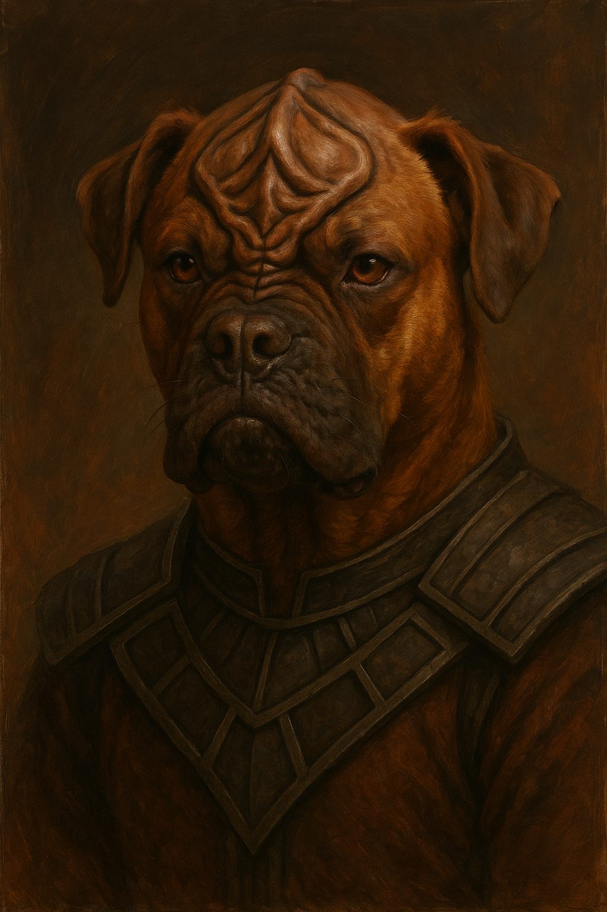
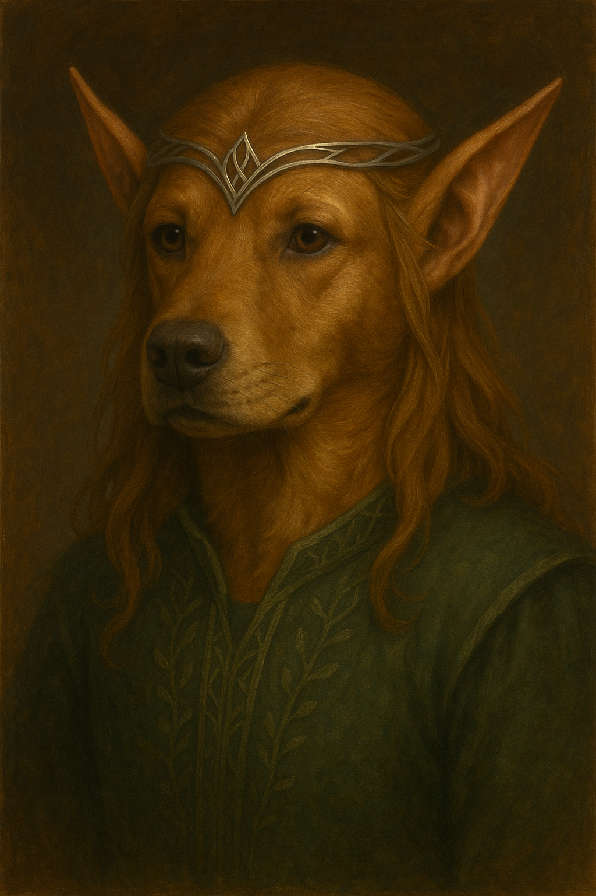
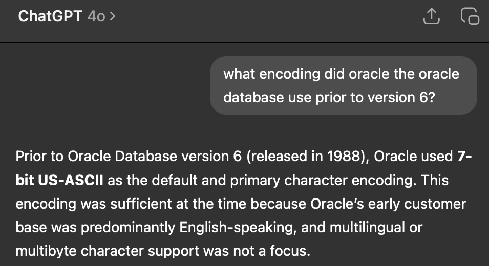
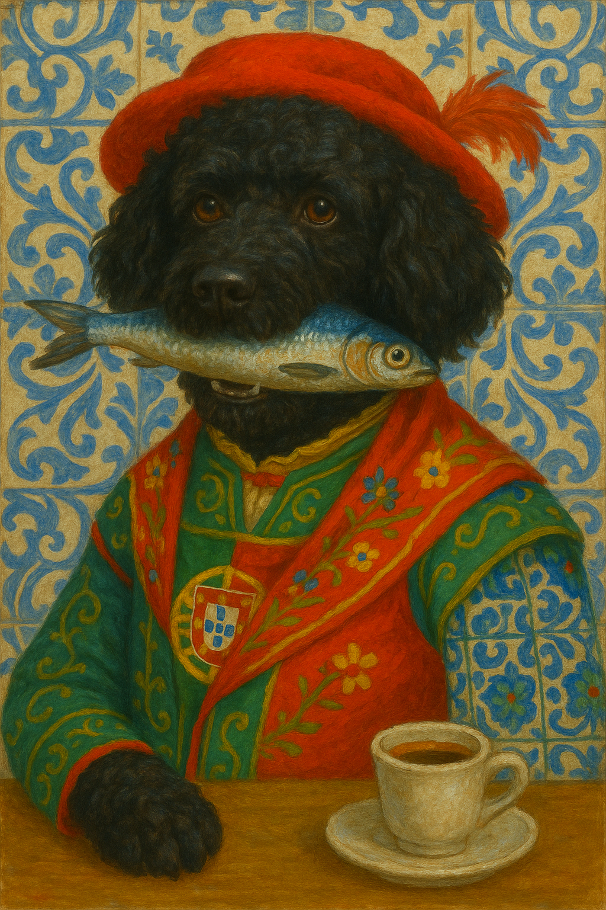
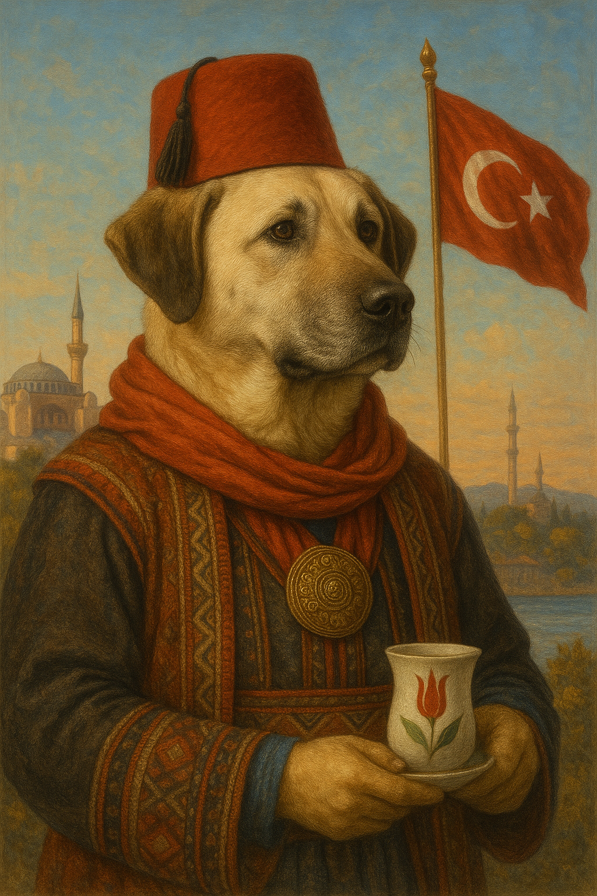
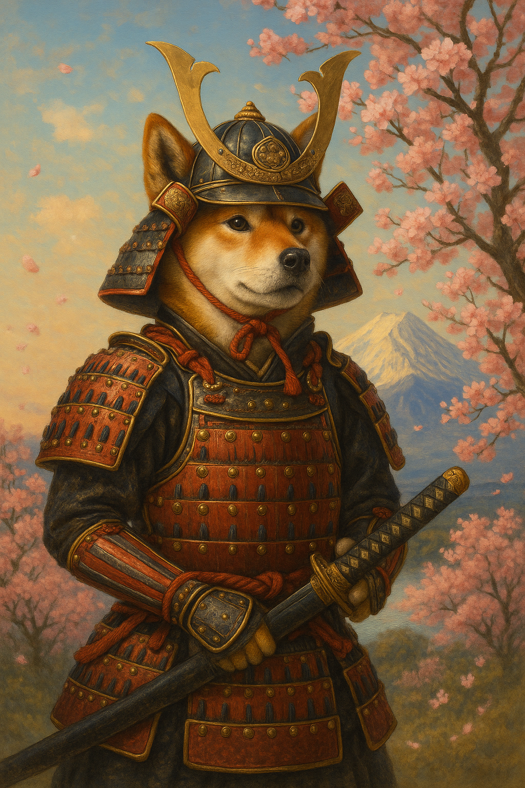
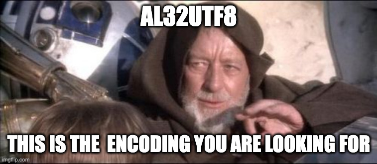

slidenumbers: true
 slidecount: true 


---


---


---


#**`pies`**

---


#`•━•  ••  •  •••`


---

#`[70 69 65 73]`

---
###`🐈 dogs.txt` 
[.column]
```
Hund
abwo
alabai
anjing
ashun
aso
cane
cão
câin
câine
câini
chien
chó
cyn
dog
emba
ghaddu
gom
hond
hondur
```
[.column]
```
hualp
huan
hund
imba
imbua
imbwa
imbwe
inu
it
jindo
kelb
khuy
klèb
koer
koira
kotta
køter
kutya
kutta
köpek
```
[.column]
```
köpeği
mbula
mbwa
mbwagh
mbwá
mbwene
mbʉ
njau
njoka
pa
perro
pes
pies
qen
qeni
sag
sagol
sobaka
suns
szczeniak
```
[.column]
```
tz’i’
ukudla
welpe
xolo
zwin
āso
āšun
šuo
אבו
כּלב
كلب
कुत्ता
ฆ่า
犬
狗
ⴽⵍⴱ
łééchąą’í
𐀠
𓃥
🐶
```

---

| Standard       |Oracle Release |
| :--:           |:--:             |
| ascii          |                 |
| iso-8859       |                 |
| win-125x       |                 |
|                | 6               |  
| gb2312         |                 |
| unicode 1      |                 |  
|                | 7               |
| unicode 2      |                 |  
|                | 8               |  
|                | 8i              |   
|                | 9i              |   
|                | 10g             |  
|                | 12c             |  


---
|    | `0` | `1` | `2` | `3` | `4` | `5` | `6` | `7` | `8` | `9` | `a` | `b` | `c` | `d` | `e` | `f` |
|:---|:---:|:---:|:---:|:---:|:---:|:---:|:---:|:---:|:---:|:---:|:---:|:---:|:---:|:---:|:---:|:---:|
|`0x`|     | `1` | `2` | `3` | `4` | `5` | `6` | `7` | `8` | `9` | `0` | `#` | `@` | `:` | `>` | `√` |
|`1x`| `␢` | `/` | `S` | `T` | `U` | `V` | `W` | `X` | `Y` | `Z` | `⧧` | `,` | `%` | `γ` | `\` | `⧻` |
|`2x`| `-` | `J` | `K` | `L` | `M` | `N` | `O` | `P` | `Q` | `R` | `!` | `#` | `*` | `]` | `;` | `Δ` |
|`3x`| `&` | `A` | `B` | `C` | `D` | `E` | `F` | `G` | `H` | `I` | `?` | `.` | `⌑` | `[` | `<` | `⯒` |


^
BCDIC-A

---
#ascii

^
1968

---

|`ascii`| `0` | `1` | `2` | `3` | `4` | `5` | `6` | `7` | `8` | `9` | `a` | `b` | `c` | `d` | `e` | `f` |
|:--:|:---:|:---:|:---:|:---:|:---:|:---:|:---:|:---:|:---:|:---:|:---:|:---:|:---:|:---:|:---:|:---:|
|**`0x`**|`<nul>`| `<soh>` | `<stx>` | `<etx>` | `<eot>` | `<enq>` | `<ack>` | `<bel>` | `<bs>` | `<tab>`|`<lf>`|`<vt>`|`<ff>`| `<cr>` | `<so>` | `<si>` |
|**`1x`**| `<dle>` | `<dc1>` | `<dc2>` | `<dc3>` | `<dc4>` | `<nak>` | `<syn>` | `<etb>` | `<can>` | `<em>` | `<sub>` | `<esc>` | `<fs>` | `<gs>` | `<rs>` | `<us>` |
|**`2x`**|  | `!` | `"` | `#` | `$` | `%` | `&` | `'` | `(` | `)` | `*` | `+` | `,` | `-` | `.` | `/` |
|**`3x`**| `0` | `1` | `2` | `3` | `4` | `5` | `6` | `7` | `8` | `9` | `:` | `;` | `<` | `=` | `>` | `?` |
|**`4x`**| `@` | `A` | `B` | `C` | `D` | `E` | `F` | `G` | `H` | `I` | `J` | `K` | `L` | `M` | `N` | `O` |
|**`5x`**| `P` | `Q` | `R` | `S` | `T` | `U` | `V` | `W` | `X` | `Y` | `Z` | `[` | `\` | `]` | `^` | `_` |
|**`6x`**| `` ` `` | `a` | `b` | `c` | `d` | `e` | `f` | `g` | `h` | `i` | `j` | `k` | `l` | `m` | `n` | `o` |
|**`7x`**| `p` | `q` | `r` | `s` | `t` | `u` | `v` | `w` | `x` | `y` | `z` | `{` | `\|` | `}` | `~` | `<del>` |


^
7 bit
8th bit checksum

---
[.code-highlight: 1-3]
[.code-highlight: all]
```
➜ encode.py -b ascii HAU,hau
✅ ascii:   "HAU"=[01001000 01000001 01010101]
✅ ascii:   "hau"=[01101000 01100001 01110101]

➜ encode.py -b ascii WOOF,woof
✅ ascii:   "WOOF"=[01010111 01001111 01001111 01000110]
✅ ascii:   "woof"=[01110111 01101111 01101111 01100110]
```

---
#Ha’DIbaH

---



---
#huan

---


---
[.code-highlight: 1-4]
[.code-highlight: all]
```
➜ encode.py ascii -d pies,dog,huan
✅ ascii:   Good pies [70 69 65 73] (4 bytes)
✅ ascii:   Good dog [64 6f 67] (3 bytes)
✅ ascii:   Good huan [68 75 61 6e] (4 bytes)
```


---
```
➜ encode.py ascii < dogs.txt
✅ ascii: 53 good dogs
✅ ascii: 237 chars encoded in 237 bytes, 1.0 bytes per char
❌ ascii: 27 bad dogs:
❌ ascii: cão  câin  câine  câini  chó  klèb  køter  köpek
❌ ascii: köpeği  mbwá  mbʉ  tz’i’  āso  āšun  šuo  אבו
❌ ascii: כּלב  كلب  कुत्ता  ฆ่า  犬  狗  ⴽⵍⴱ  łééchąą’í
❌ ascii: 𐀠  𓃥  🐶
```

^
53
1 byte per char

---


^
extensive research

---
#Oracle Pre-6

* US7ASCII

^
how to interpret?

---
```
US   7 ASCII


WE   8 ISO8859P1
WE   8 ISO8859P2

WE   8 MSWIN1252
EE   8 MSWIN1250

ZHS 16 CGB231280

AL  16 UTF16
AL  32 UTF8
```

^
Character Set-Bits-Encoding
WE Western European 
ZHS Simplified Chinese
AL All Languages

---
#iso-8859

^
set of standards
1987➜2001

---
| Standard      | Alias       | Region                   | Year |
|:--            |:--         | :--                       | --:  |
| **`iso-8859-1`**  | **`latin1`**   | **Western Europe**            | 1987 |
| **`iso-8859-2`**  | **`latin2`**   | **Central & Eastern Europe**  | 1987 |
| `iso-8859-3`  | `latin3`   | South Europe              | 1988 |
| `iso-8859-4`  | `latin4`   | North Europe              | 1988 |
| `iso-8859-5`  | `cyrillic` |                           | 1988 |
| `iso-8859-6`  | `arabic`   |                           | 1987 |
| `iso-8859-7`  | `greek`    |                           | 1987 |
| `iso-8859-8`  | `hebrew`   |                           | 1988 |
| `iso-8859-9`  | `latin5`   | Turkish                   | 1989 |
| `iso-8859-10` | `latin6`   | Nordic                    | 1992 |
| `iso-8859-11` | `thai`     |                           | 2001 |
| `iso-8859-13` | `latin7`   | Baltics                   | 1998 |
| `iso-8859-14` | `latin8`   | Celtic                    | 1998 |
| **`iso-8859-15`** | **`latin9`**   | **Western Europe (Improved)** | 1999 |
| `iso-8859-16` | `latin10`  | South-Eastern Europe      | 2001 |

^
latin2 poland
latin9 improved latin1 €

---
|`ascii`| `0` | `1` | `2` | `3` | `4` | `5` | `6` | `7` | `8` | `9` | `a` | `b` | `c` | `d` | `e` | `f` |
| :-- | :--: | :--: |:--:|:--:|:--:|:--:|:--:|:--:|:--:|:--:|:--:|:--:|:--:|:--:|:--:|:--:|
| `0x` | `<nul>` | `<soh>` | `<stx>` | `<etx>` | `<eot>` | `<enq>` | `<ack>` | `<bel>` | `<bs>` | `<tab>` | `<lf>` | `<vt>` | `<ff>` | `<cr>` | `<so>` | `<si>` |
| `1x` | `<dle>` | `<dc1>` | `<dc2>` | `<dc3>` | `<dc4>` | `<nak>` | `<syn>` | `<etb>` | `<can>` | `<em>` | `<sub>` | `<esc>` | `<fs>` | `<gs>` | `<rs>` | `<us>` |
| `2x` |  | `!` | `"` | `#` | `$` | `%` | `&` | `'` | `(` | `)` | `*` | `+` | `,` | `-` | `.` | `/` |
| `3x` | `0` | `1` | `2` | `3` | `4` | `5` | `6` | `7` | `8` | `9` | `:` | `;` | `<` | `=` | `>` | `?` |
| `4x` | `@` | `A` | `B` | `C` | `D` | `E` | `F` | `G` | `H` | `I` | `J` | `K` | `L` | `M` | `N` | `O` |
| `5x` | `P` | `Q` | `R` | `S` | `T` | `U` | `V` | `W` | `X` | `Y` | `Z` | `[` | `\` | `]` | `^` | `_` |
| `6x` | `` ` `` | `a` | `b` | `c` | `d` | `e` | `f` | `g` | `h` | `i` | `j` | `k` | `l` | `m` | `n` | `o` |
| `7x` | `p` | `q` | `r` | `s` | `t` | `u` | `v` | `w` | `x` | `y` | `z` | `{` | `\|` | `}` | `~` | `<del>` |
| `8x` |     |     |     |     |     |     |     |     |     |     |     |     |   |   |   |`⠀`   |
| `9x` |     |     |     |     |     |     |     |     |     |     |     |     |   |   |   |`⠀`   |
| `ax` |     |     |     |     |     |     |     |     |     |     |     |     |   |   |   |`⠀`   |
| `bx` |     |     |     |     |     |     |     |     |     |     |     |     |   |   |   |`⠀`   |
| `cx` |     |     |     |     |     |     |     |     |     |     |     |     |   |   |   |`⠀`   |
| `dx` |     |     |     |     |     |     |     |     |     |     |     |     |   |   |   |`⠀`   |
| `ex` |     |     |     |     |     |     |     |     |     |     |     |     |   |   |   |`⠀`   |
| `fx` |     |     |     |     |     |     |     |     |     |     |     |     |   |   |   |`⠀`|

^
blank space

---

|`latin1`| `0` | `1` | `2` | `3` | `4` | `5` | `6` | `7` | `8` | `9` | `a` | `b` | `c` | `d` | `e` | `f` |
| :-- | :--: | :--: |:--:|:--:|:--:|:--:|:--:|:--:|:--:|:--:|:--:|:--:|:--:|:--:|:--:|:--:|
| `0x` | `<nul>` | `<soh>` | `<stx>` | `<etx>` | `<eot>` | `<enq>` | `<ack>` | `<bel>` | `<bs>`  | `<tab>` | `<lf>`  | `<vt>`  | `<ff>`  | `<cr>`  | `<so>`  | `<si>`  |
| `1x` | `<dle>` | `<dc1>` | `<dc2>` | `<dc3>` | `<dc4>` | `<nak>` | `<syn>` | `<etb>` | `<can>` | `<em>`  | `<sub>` | `<esc>` | `<fs>`  | `<gs>`  | `<rs>`  | `<us>`  |
| `2x` | ` `     | `!`     | `"`     | `#`     | `$`     | `%`     | `&`     | `'`     | `(`     | `)`     | `*`     | `+`     | `,`     | `-`     | `.`     | `/`     |
| `3x` | `0`     | `1`     | `2`     | `3`     | `4`     | `5`     | `6`     | `7`     | `8`     | `9`     | `:`     | `;`     | `<`     | `=`     | `>`     | `?`     |
| `4x` | `@`     | `A`     | `B`     | `C`     | `D`     | `E`     | `F`     | `G`     | `H`     | `I`     | `J`     | `K`     | `L`     | `M`     | `N`     | `O`     |
| `5x` | `P`     | `Q`     | `R`     | `S`     | `T`     | `U`     | `V`     | `W`     | `X`     | `Y`     | `Z`     | `[`     | `\`     | `]`     | `^`     | `_`     |
| `6x` | `` ` `` | `a`     | `b`     | `c`     | `d`     | `e`     | `f`     | `g`     | `h`     | `i`     | `j`     | `k`     | `l`     | `m`     | `n`     | `o`     |
| `7x` | `p`     | `q`     | `r`     | `s`     | `t`     | `u`     | `v`     | `w`     | `x`     | `y`     | `z`     | `{`     | `|`     | `}`     | `~`     | `<del>` |
| `8x` |        |        |        |        |        |        |        |        |        |        |        |        |        |        |        |        |
| `9x` |        |        |        |        |        |        |        |        |        |        |        |        |        |        |        |        |
| `ax` | `¡`     | `¢`     | `£`     | `¤`     | `¥`     | `¦`     | `§`     | `¨`     | `©`     | `ª`     | `«`     | `¬`     | `­`     | `®`     | `¯`     | `°`     |
| `bx` | `±`     | `²`     | `³`     | `´`     | `µ`     | `¶`     | `·`     | `¸`     | `¹`     | `º`     | `»`     | `¼`     | `½`     | `¾`     | `¿`     |        |
| `cx` | `À`     | `Á`     | `Â`     | `Ã`     | `Ä`     | `Å`     | `Æ`     | `Ç`     | `È`     | `É`     | `Ê`     | `Ë`     | `Ì`     | `Í`     | `Î`     | `Ï`     |
| `dx` | `Ð`     | `Ñ`     | `Ò`     | `Ó`     | `Ô`     | `Õ`     | `Ö`     | `×`     | `Ø`     | `Ù`     | `Ú`     | `Û`     | `Ü`     | `Ý`     | `Þ`     | `ß`     |
| `ex` | `à`     | `á`     | `â`     | `ã`     | `ä`     | `å`     | `æ`     | `ç`     | `è`     | `é`     | `ê`     | `ë`     | `ì`     | `í`     | `î`     | `ï`     |
| `fx` | `ð`     | `ñ`     | `ò`     | `ó`     | `ô`     | `õ`     | `ö`     | `÷`     | `ø`     | `ù`     | `ú`     | `û`     | `ü`     | `ý`     | `þ`     | `ÿ`     |

^
filled


---
|`latin2`| `0` | `1` | `2` | `3` | `4` | `5` | `6` | `7` | `8` | `9` | `a` | `b` | `c` | `d` | `e` | `f` |
| :-- | :--: | :--: |:--:|:--:|:--:|:--:|:--:|:--:|:--:|:--:|:--:|:--:|:--:|:--:|:--:|:--:|
| `0x` | `<nul>` | `<soh>` | `<stx>` | `<etx>` | `<eot>` | `<enq>` | `<ack>` | `<bel>` | `<bs>`  | `<tab>` | `<lf>`  | `<vt>`  | `<ff>`  | `<cr>`  | `<so>`  | `<si>`  |
| `1x` | `<dle>` | `<dc1>` | `<dc2>` | `<dc3>` | `<dc4>` | `<nak>` | `<syn>` | `<etb>` | `<can>` | `<em>`  | `<sub>` | `<esc>` | `<fs>`  | `<gs>`  | `<rs>`  | `<us>`  |
| `2x` | ` `     | `!`     | `"`     | `#`     | `$`     | `%`     | `&`     | `'`     | `(`     | `)`     | `*`     | `+`     | `,`     | `-`     | `.`     | `/`     |
| `3x` | `0`     | `1`     | `2`     | `3`     | `4`     | `5`     | `6`     | `7`     | `8`     | `9`     | `:`     | `;`     | `<`     | `=`     | `>`     | `?`     |
| `4x` | `@`     | `A`     | `B`     | `C`     | `D`     | `E`     | `F`     | `G`     | `H`     | `I`     | `J`     | `K`     | `L`     | `M`     | `N`     | `O`     |
| `5x` | `P`     | `Q`     | `R`     | `S`     | `T`     | `U`     | `V`     | `W`     | `X`     | `Y`     | `Z`     | `[`     | `\`     | `]`     | `^`     | `_`     |
| `6x` | `` ` `` | `a`     | `b`     | `c`     | `d`     | `e`     | `f`     | `g`     | `h`     | `i`     | `j`     | `k`     | `l`     | `m`     | `n`     | `o`     |
| `7x` | `p`     | `q`     | `r`     | `s`     | `t`     | `u`     | `v`     | `w`     | `x`     | `y`     | `z`     | `{`     | `|`     | `}`     | `~`     | `<del>` |
| `8x` |         |         |         |         |         |         |         |         |         |         |         |         |         |         |         |         |
| `9x` |         |         |         |         |         |         |         |         |         |         |         |         |         |         |         |         |
| `ax` | ` `     | `ˇ`     | `˘`     | `Ł`     | `¤`     | `Ľ`     | `Ś`     | `Š`     | `Ş`     | `Ť`     | `Ź`     | `¡`     | `˛`     | `˙`     | `˝`     | `Ů`     |
| `bx` | `ź`     | `‘`     | `’`     | `“`     | `”`     | `•`     | `–`     | `—`     | `™`     |         |         |         |         |         |         |         |
| `cx` | `Ą`     | `˘`     | `Ď`     | `Đ`     | `Ë`     | `Ę`     | `Ě`     | `Í`     | `Î`     | `Ï`     | `˝`     | `Ł`     | `Ń`     | `Ň`     | `Ó`     | `Ô`     |
| `dx` | `Ő`     | `Œ`     | `Ŕ`     | `Ř`     | `Ŗ`     | `Ś`     | `Ş`     | `Š`     | `Ţ`     | `Ť`     | `Ź`     | `Ż`     | `Ž`     |         |         |         |
| `ex` | `ą`     | `˙`     | `ď`     | `đ`     | `ë`     | `ę`     | `ě`     | `í`     | `î`     | `ï`     | `˝`     | `ł`     | `ń`     | `ň`     | `ó`     | `ô`     |
| `fx` | `ő`     | `œ`     | `ŕ`     | `ř`     | `ŗ`     | `ś`     | `ş`     | `š`     | `ţ`     | `ť`     | `ź`     | `ż`     | `ž`     | `ÿ`     |         |         |

^
latin2 filled others

---
```
➜ encode.py latin1 -d cão,câin,köpek
✅ latin1:  Good cão [63 e3 6f] (3 bytes)
✅ latin1:  Good câin [63 e2 69 6e] (4 bytes)
✅ latin1:  Good köpek [6b f6 70 65 6b] (5 bytes)
```

^
western europe = good


---
##Which Language?
#`cão`

---


---
```
➜ encode.py latin1 < dogs.txt
✅ latin1: 62 good dogs
✅ latin1: 275 chars encoded in 275 bytes, 1.0 bytes per char
❌ latin1: 18 bad dogs:
❌ latin1: köpeği  mbʉ  tz’i’  āso  āšun  šuo  אבו  כּלב
❌ latin1: كلب  कुत्ता  ฆ่า  犬  狗  ⴽⵍⴱ  łééchąą’í  𐀠
❌ latin1: 𓃥  🐶
```

^
everything else = bad
ascii 53 
latin1 62

---
```
➜ encode.py latin2 -d šuo,köpek,câine
✅ latin2:  Good šuo [b9 75 6f] (3 bytes)
✅ latin2:  Good köpek [6b f6 70 65 6b] (5 bytes)
✅ latin2:  Good câine [63 e2 69 6e 65] (5 bytes)
```

^
lithuanian
turkish
romanian

---
```
➜ encode.py latin2 < dogs.txt
✅ latin2: 60 good dogs
✅ latin2: 266 chars encoded in 266 bytes, 1.0 bytes per char
❌ latin2: 20 bad dogs:
❌ latin2: cão  klèb  køter  köpeği  mbʉ  tz’i’  āso  āšun
❌ latin2: אבו  כּלב  كلب  कुत्ता  ฆ่า  犬  狗  ⴽⵍⴱ
❌ latin2: łééchąą’í  𐀠  𓃥  🐶
```

^
ascii  53
latin2 60

---
##Which Language?
#köpek

---



---
#gb2312 

^
Meanwhile in China
1980
Character Set
Encoding is EUC-CN

---
[.code-highlight: 1-3]
[.code-highlight: all]
```
➜ encode.py ascii,gb2312 -d dog
✅ ascii:   Good dog [64 6f 67] (3 bytes)
✅ gb2312:  Good dog [64 6f 67] (3 bytes)

➜ encode.py gb2312 -d 犬,狗
✅ gb2312:  Good 犬 [c8 ae] (2 bytes)
✅ gb2312:  Good 狗 [b9 b7] (2 bytes)
```

---
##Which Language?
#`犬`

---



---
##Which Language?
#狗

---


---
```
➜ encode.py gb2312 < dogs.txt
✅ gb2312: 60 good dogs
✅ gb2312: 258 chars encoded in 266 bytes, 1.0 bytes per char
❌ gb2312: 20 bad dogs:
❌ gb2312: cão  câin  câine  câini  køter  köpek  köpeği  mbʉ
❌ gb2312: āšun  šuo  אבו  כּלב  كلب  कुत्ता  ฆ่า  ⴽⵍⴱ
❌ gb2312: łééchąą’í  𐀠  𓃥  🐶
```
^
ascii  53

---

| Character | Encoded As      |Example|
| :--       | :--             |:--    |
| ASCII     | `[00→7f]`       |`'dog' ➜ [64 6f 67]` |
| Chinese   | `[a1→f7 a1→fe]` |`'狗'  ➜ [b9 b7]`|

---
[.code-highlight: 1]
[.code-highlight: 1-4]
[.code-highlight: 1,6-7]
```
[?? ?? ?? ?? ?? ??] (6 bytes)

➜ encode.py gb2312 doggie
✅ gb2312:  "doggie"=[64 6f 67 67 69 65]

➜ encode.py gb2312 狗狗狗
✅ gb2312:  "狗狗狗"=[b9 b7 b9 b7 b9 b7]
```

^
variable length
number bytes != number chars

---
[.code-highlight: 1-2]
[.code-highlight: all]
```
➜ encode.py gb2312 狗
✅ gb2312:  "狗"=[b9 b7]

➜ encode.py gb2312 肮发
✅ gb2312:  "肮发"=[b0 b9 b7 a2]
```

^
dog
dirtyhair

---
#Oracle 6 

* Selectable charset 
 * **WE8ISO8859P1**
 * ...

^
1988
selectable charsets
addition to ascii
latin1/Western Europe

---


---
#windows-1252

^
1990 windows 3
aka cp1252

---

|`latin1`| ` 0`   | `1`   | `2`   | `3`   | `4`   | `5`   | `6`   | `7`   | `8`   | `9`   | `A`   | `B`   | `C`   | `D`   | `E`   | `F`   |
| :-- | :--: | :--: |:--:|:--:|:--:|:--:|:--:|:--:|:--:|:--:|:--:|:--:|:--:|:--:|:--:|:--:|
| `0x` | `<nul>` | `<soh>` | `<stx>` | `<etx>` | `<eot>` | `<enq>` | `<ack>` | `<bel>` | `<bs>`  | `<tab>` | `<lf>`  | `<vt>`  | `<ff>`  | `<cr>`  | `<so>`  | `<si>`  |
| `1x` | `<dle>` | `<dc1>` | `<dc2>` | `<dc3>` | `<dc4>` | `<nak>` | `<syn>` | `<etb>` | `<can>` | `<em>`  | `<sub>` | `<esc>` | `<fs>`  | `<gs>`  | `<rs>`  | `<us>`  |
| `2x` | ` `     | `!`     | `"`     | `#`     | `$`     | `%`     | `&`     | `'`     | `(`     | `)`     | `*`     | `+`     | `,`     | `-`     | `.`     | `/`     |
| `3x` | `0`     | `1`     | `2`     | `3`     | `4`     | `5`     | `6`     | `7`     | `8`     | `9`     | `:`     | `;`     | `<`     | `=`     | `>`     | `?`     |
| `4x` | `@`     | `A`     | `B`     | `C`     | `D`     | `E`     | `F`     | `G`     | `H`     | `I`     | `J`     | `K`     | `L`     | `M`     | `N`     | `O`     |
| `5x` | `P`     | `Q`     | `R`     | `S`     | `T`     | `U`     | `V`     | `W`     | `X`     | `Y`     | `Z`     | `[`     | `\`     | `]`     | `^`     | `_`     |
| `6x` | `` ` `` | `a`     | `b`     | `c`     | `d`     | `e`     | `f`     | `g`     | `h`     | `i`     | `j`     | `k`     | `l`     | `m`     | `n`     | `o`     |
| `7x` | `p`     | `q`     | `r`     | `s`     | `t`     | `u`     | `v`     | `w`     | `x`     | `y`     | `z`     | `{`     | `|`     | `}`     | `~`     | `<del>` |
| `8x` |        |        |        |        |        |        |        |        |        |        |        |        |        |        |        |        |
| `9x` |        |        |        |        |        |        |        |        |        |        |        |        |        |        |        |        |
| `Ax` | `¡`     | `¢`     | `£`     | `¤`     | `¥`     | `¦`     | `§`     | `¨`     | `©`     | `ª`     | `«`     | `¬`     | `­`     | `®`     | `¯`     | `°`     |
| `Bx` | `±`     | `²`     | `³`     | `´`     | `µ`     | `¶`     | `·`     | `¸`     | `¹`     | `º`     | `»`     | `¼`     | `½`     | `¾`     | `¿`     |        |
| `Cx` | `À`     | `Á`     | `Â`     | `Ã`     | `Ä`     | `Å`     | `Æ`     | `Ç`     | `È`     | `É`     | `Ê`     | `Ë`     | `Ì`     | `Í`     | `Î`     | `Ï`     |
| `Dx` | `Ð`     | `Ñ`     | `Ò`     | `Ó`     | `Ô`     | `Õ`     | `Ö`     | `×`     | `Ø`     | `Ù`     | `Ú`     | `Û`     | `Ü`     | `Ý`     | `Þ`     | `ß`     |
| `Ex` | `à`     | `á`     | `â`     | `ã`     | `ä`     | `å`     | `æ`     | `ç`     | `è`     | `é`     | `ê`     | `ë`     | `ì`     | `í`     | `î`     | `ï`     |
| `Fx` | `ð`     | `ñ`     | `ò`     | `ó`     | `ô`     | `õ`     | `ö`     | `÷`     | `ø`     | `ù`     | `ú`     | `û`     | `ü`     | `ý`     | `þ`     | `ÿ`     |

---


|`win-1252`| `0`   | `1`   | `2`   | `3`   | `4`   | `5`   | `6`   | `7`   | `8`   | `9`   | `A`   | `B`   | `C`   | `D`   | `E`   | `F`   |
| :-- | :--: | :--: |:--:|:--:|:--:|:--:|:--:|:--:|:--:|:--:|:--:|:--:|:--:|:--:|:--:|:--:|
| `0x` | `<nul>` | `<soh>` | `<stx>` | `<etx>` | `<eot>` | `<enq>` | `<ack>` | `<bel>` | `<bs>`  | `<tab>` | `<lf>`  | `<vt>`  | `<ff>`  | `<cr>`  | `<so>`  | `<si>`  |
| `1x` | `<dle>` | `<dc1>` | `<dc2>` | `<dc3>` | `<dc4>` | `<nak>` | `<syn>` | `<etb>` | `<can>` | `<em>`  | `<sub>` | `<esc>` | `<fs>`  | `<gs>`  | `<rs>`  | `<us>`  |
| `2x` | ` `     | `!`     | `"`     | `#`     | `$`     | `%`     | `&`     | `'`     | `(`     | `)`     | `*`     | `+`     | `,`     | `-`     | `.`     | `/`     |
| `3x` | `0`     | `1`     | `2`     | `3`     | `4`     | `5`     | `6`     | `7`     | `8`     | `9`     | `:`     | `;`     | `<`     | `=`     | `>`     | `?`     |
| `4x` | `@`     | `A`     | `B`     | `C`     | `D`     | `E`     | `F`     | `G`     | `H`     | `I`     | `J`     | `K`     | `L`     | `M`     | `N`     | `O`     |
| `5x` | `P`     | `Q`     | `R`     | `S`     | `T`     | `U`     | `V`     | `W`     | `X`     | `Y`     | `Z`     | `[`     | `\`     | `]`     | `^`     | `_`     |
| `6x` | `` ` `` | `a`     | `b`     | `c`     | `d`     | `e`     | `f`     | `g`     | `h`     | `i`     | `j`     | `k`     | `l`     | `m`     | `n`     | `o`     |
| `7x` | `p`     | `q`     | `r`     | `s`     | `t`     | `u`     | `v`     | `w`     | `x`     | `y`     | `z`     | `{`     | `|`     | `}`     | `~`     | `<del>` |
| `8x` | `€`     |        | `‚`     | `ƒ`     | `„`     | `…`     | `†`     | `‡`     | `ˆ`     | `‰`     | `Š`     | `‹`     | `Œ`     |        | `Ž`     |        |
| `9x` |        | `‘`     | `’`     | `“`     | `”`     | `•`     | `–`     | `—`     | `˜`     | `™`     | `š`     | `›`     | `œ`     |        | `ž`     | `Ÿ`     |
| `Ax` | `¡`     | `¢`     | `£`     | `¤`     | `¥`     | `¦`     | `§`     | `¨`     | `©`     | `ª`     | `«`     | `¬`     | `­`     | `®`     | `¯`     | `°`     |
| `Bx` | `±`     | `²`     | `³`     | `´`     | `µ`     | `¶`     | `·`     | `¸`     | `¹`     | `º`     | `»`     | `¼`     | `½`     | `¾`     | `¿`     |
| `Cx` | `À`     | `Á`     | `Â`     | `Ã`     | `Ä`     | `Å`     | `Æ`     | `Ç`     | `È`     | `É`     | `Ê`     | `Ë`     | `Ì`     | `Í`     | `Î`     | `Ï`     |
| `Dx` | `Ð`     | `Ñ`     | `Ò`     | `Ó`     | `Ô`     | `Õ`     | `Ö`     | `×`     | `Ø`     | `Ù`     | `Ú`     | `Û`     | `Ü`     | `Ý`     | `Þ`     | `ß`     |
| `Ex` | `à`     | `á`     | `â`     | `ã`     | `ä`     | `å`     | `æ`     | `ç`     | `è`     | `é`     | `ê`     | `ë`     | `ì`     | `í`     | `î`     | `ï`     |
| `Fx` | `ð`     | `ñ`     | `ò`     | `ó`     | `ô`     | `õ`     | `ö`     | `÷`     | `ø`     | `ù`     | `ú`     | `û`     | `ü`     | `ý`     | `þ`     | `ÿ`     |


---
[.code-highlight: 1-5]
[.code-highlight: all]
```
➜ encode.py latin1,cp1252 -d cão,chó
✅ latin1:  Good cão [63 e3 6f] (3 bytes)
✅ cp1252:  Good cão [63 e3 6f] (3 bytes)
✅ latin1:  Good chó [63 68 f3] (3 bytes)
✅ cp1252:  Good chó [63 68 f3] (3 bytes)

➜ encode.py latin1,cp1252 -d tz’i’,šuo
❌ latin1:  Bad tz’i’
✅ cp1252:  Good tz’i’ [74 7a 92 69 92] (5 bytes)
❌ latin1:  Bad šuo
✅ cp1252:  Good šuo [9a 75 6f] (3 bytes)

```

---

```
➜ encode.py cp1252 < dogs.txt
✅ cp1252: 64 good dogs
✅ cp1252: 286 chars encoded in 286 bytes, 1.0 bytes per char
❌ cp1252: 16 bad dogs:
❌ cp1252: köpeği  mbʉ  āso  āšun  אבו  כּלב  كلب  कुत्ता
❌ cp1252: ฆ่า  犬  狗  ⴽⵍⴱ  łééchąą’í  𐀠  𓃥  🐶
```

^
ascii=53 
latin1=62
win-1252=64


---
#windows-1250
^
1995

---
|`latin2`| `0` | `1` | `2` | `3` | `4` | `5` | `6` | `7` | `8` | `9` | `a` | `b` | `c` | `d` | `e` | `f` |
| :-- | :--: | :--: |:--:|:--:|:--:|:--:|:--:|:--:|:--:|:--:|:--:|:--:|:--:|:--:|:--:|:--:|
| `0x` | `<nul>` | `<soh>` | `<stx>` | `<etx>` | `<eot>` | `<enq>` | `<ack>` | `<bel>` | `<bs>`  | `<tab>` | `<lf>`  | `<vt>`  | `<ff>`  | `<cr>`  | `<so>`  | `<si>`  |
| `1x` | `<dle>` | `<dc1>` | `<dc2>` | `<dc3>` | `<dc4>` | `<nak>` | `<syn>` | `<etb>` | `<can>` | `<em>`  | `<sub>` | `<esc>` | `<fs>`  | `<gs>`  | `<rs>`  | `<us>`  |
| `2x` | ` `     | `!`     | `"`     | `#`     | `$`     | `%`     | `&`     | `'`     | `(`     | `)`     | `*`     | `+`     | `,`     | `-`     | `.`     | `/`     |
| `3x` | `0`     | `1`     | `2`     | `3`     | `4`     | `5`     | `6`     | `7`     | `8`     | `9`     | `:`     | `;`     | `<`     | `=`     | `>`     | `?`     |
| `4x` | `@`     | `A`     | `B`     | `C`     | `D`     | `E`     | `F`     | `G`     | `H`     | `I`     | `J`     | `K`     | `L`     | `M`     | `N`     | `O`     |
| `5x` | `P`     | `Q`     | `R`     | `S`     | `T`     | `U`     | `V`     | `W`     | `X`     | `Y`     | `Z`     | `[`     | `\`     | `]`     | `^`     | `_`     |
| `6x` | `` ` `` | `a`     | `b`     | `c`     | `d`     | `e`     | `f`     | `g`     | `h`     | `i`     | `j`     | `k`     | `l`     | `m`     | `n`     | `o`     |
| `7x` | `p`     | `q`     | `r`     | `s`     | `t`     | `u`     | `v`     | `w`     | `x`     | `y`     | `z`     | `{`     | `|`     | `}`     | `~`     | `<del>` |
| `8x` |        |        |        |        |        |        |        |        |        |        |        |        |        |        |        |        |
| `9x` |        |        |        |        |        |        |        |        |        |        |        |        |        |        |        |        |
| `ax` | ` `     | `Ą`     | `˘`     | `Ł`     | `¤`     | `Ľ`     | `Ś`     | `§`     | `¨`     | `Š`     | `Ş`     | `Ť`     | `Ź`     | `­`     | `Ž`     | `Ż`     |
| `bx` | `°`     | `ą`     | `˛`     | `ł`     | `´`     | `ľ`     | `ś`     | `ˇ`     | `¸`     | `š`     | `ş`     | `ť`     | `ź`     | `˝`     | `ž`     | `ż`     |
| `cx` | `Ŕ`     | `Á`     | `Â`     | `Ă`     | `Ä`     | `Ĺ`     | `Ć`     | `Ç`     | `Č`     | `É`     | `Ę`     | `Ë`     | `Ě`     | `Í`     | `Î`     | `Ď`     |
| `dx` | `Đ`     | `Ń`     | `Ň`     | `Ó`     | `Ô`     | `Ő`     | `Ö`     | `×`     | `Ř`     | `Ů`     | `Ú`     | `Ű`     | `Ü`     | `Ý`     | `Ţ`     | `ß`     |
| `ex` | `ŕ`     | `á`     | `â`     | `ă`     | `ä`     | `ĺ`     | `ć`     | `ç`     | `č`     | `é`     | `ę`     | `ë`     | `ě`     | `í`     | `î`     | `ď`     |
| `fx` | `đ`     | `ń`     | `ň`     | `ó`     | `ô`     | `ő`     | `ö`     | `÷`     | `ř`     | `ů`     | `ú`     | `ű`     | `ü`     | `ý`     | `ţ`     | `˙`     |
---
|`win-1250`| `0`   | `1`  | `2`  | `3`  | `4`  | `5`  | `6`  | `7`  | `8`  | `9`  | `a`  | `b`  | `c`  | `d`  | `e`  | `f` |
| :--      |  :--: | :--: | :--: | :--: | :--: | :--: | :--: | :--: | :--: | :--: | :--: | :--: | :--: | :--: | :--: |:--: |
| `0x` | `<nul>` | `<soh>` | `<stx>` | `<etx>` | `<eot>` | `<enq>` | `<ack>` | `<bel>` | `<bs>` | `<tab>` | `<lf>` | `<vt>` | `<ff>` | `<cr>` | `<so>` | `<si>` |
| `1x` | `<dle>` | `<dc1>` | `<dc2>` | `<dc3>` | `<dc4>` | `<nak>` | `<syn>` | `<etb>` | `<can>` | `<em>` | `<sub>` | `<esc>` | `<fs>` | `<gs>` | `<rs>` | `<us>` |
| `2x` | ` ` | `!` | `"` | `#` | `$` | `%` | `&` | `'` | `(` | `)` | `*` | `+` | `,` | `-` | `.` | `/` |
| `3x` | `0` | `1` | `2` | `3` | `4` | `5` | `6` | `7` | `8` | `9` | `:` | `;` | `<` | `=` | `>` | `?` |
| `4x` | `@` | `A` | `B` | `C` | `D` | `E` | `F` | `G` | `H` | `I` | `J` | `K` | `L` | `M` | `N` | `O` |
| `5x` | `P` | `Q` | `R` | `S` | `T` | `U` | `V` | `W` | `X` | `Y` | `Z` | `[` | `\\` | `]` | `^` | `_` |
| `6x` | `` ` `` | `a` | `b` | `c` | `d` | `e` | `f` | `g` | `h` | `i` | `j` | `k` | `l` | `m` | `n` | `o` |
| `7x` | `p` | `q` | `r` | `s` | `t` | `u` | `v` | `w` | `x` | `y` | `z` | `{` | `|` | `}` | `~` | `<del>` |
| `8x` | `€` | `` | `‚` | `` | `„` | `…` | `†` | `‡` | `` | `‰` | `Š` | `‹` | `Ś` | `Ť` | `Ž` | `Ź` |
| `9x` | `` | `‘` | `’` | `“` | `”` | `•` | `–` | `—` | `` | `™` | `š` | `›` | `ś` | `ť` | `ž` | `ź` |
| `ax` | ` ` | `ˇ` | `˘` | `Ł` | `¤` | `Ą` | `¦` | `§` | `¨` | `©` | `Ş` | `«` | `¬` | `­` | `®` | `Ż` |
| `bx` | `°` | `±` | `˛` | `ł` | `´` | `µ` | `¶` | `·` | `¸` | `ą` | `ş` | `»` | `Ľ` | `˝` | `ľ` | `ż` |
| `cx` | `Ŕ` | `Á` | `Â` | `Ă` | `Ä` | `Ĺ` | `Ć` | `Ç` | `Č` | `É` | `Ę` | `Ë` | `Ě` | `Í` | `Î` | `Ď` |
| `dx` | `Đ` | `Ń` | `Ň` | `Ó` | `Ô` | `Ő` | `Ö` | `×` | `Ř` | `Ů` | `Ú` | `Ű` | `Ü` | `Ý` | `Ţ` | `ß` |
| `ex` | `ŕ` | `á` | `â` | `ă` | `ä` | `ĺ` | `ć` | `ç` | `č` | `é` | `ę` | `ë` | `ě` | `í` | `î` | `ď` |
| `fx` | `đ` | `ń` | `ň` | `ó` | `ô` | `ő` | `ö` | `÷` | `ř` | `ů` | `ú` | `ű` | `ü` | `ý` | `ţ` | `˙` |


---
[.code-highlight: 1-3]
[.code-highlight: 5-7]
[.code-highlight: 9-11]
```
➜ encode.py latin2,cp1250 -d köpek
✅ latin2:  Good köpek [6b f6 70 65 6b] (5 bytes)
✅ cp1250:  Good köpek [6b f6 70 65 6b] (5 bytes)

➜ encode.py latin2,cp1250 -d šuo
✅ latin2:  Good šuo [b9 75 6f] (3 bytes)
✅ cp1250:  Good šuo [9a 75 6f] (3 bytes)

➜ encode.py latin2,cp1250 -d łééchąą’í
❌ latin2:  Bad łééchąą’í
✅ cp1250:  Good łééchąą’í [b3 e9 e9 63 68 b9 b9 92 ed] (9 bytes)
```

---
```
➜ encode.py cp1250 < dogs.txt
✅ cp1250: 62 good dogs
✅ cp1250: 283 chars encoded in 283 bytes, 1.0 bytes per char
❌ cp1250: 18 bad dogs:
❌ cp1250: cão  klèb  køter  köpeği  mbʉ  āso  āšun  אבו
❌ cp1250: כּלב  كلب  कुत्ता  ฆ่า  犬  狗  ⴽⵍⴱ  𐀠
❌ cp1250: 𓃥  🐶
```

---

| Standard         | Alias        | Windows Equivalent     |
|----------------  |-------------|--------------|
| `iso-8859-1`     | `latin1`    | windows-1252 |
| `iso-8859-2`     | `latin2`    | windows-1250 |
| `iso-8859-5`     | `cyrillic`  | windows-1251 |
| `iso-8859-6`     | `arabic`    | windows-1256 |
| `iso-8859-7`     | `greek`     | windows-1253 |
| `iso-8859-8`     | `hebrew`    | windows-1255 |
| `iso-8859-9`     | `latin5`    | windows-1254 |
| `iso-8859-11`    | `thai`      | windows-874  |
| `iso-8859-13`    | `latin7`    | windows-1257 |
| `iso-8859-15`    | `latin9`    | windows-1252 |

---
#Oracle 7

* NLS framework introduced
* New Encodings
  * `WE8ISO8859P2`
  * `WE8MSWIN1252`
  * `ZHS16CGB231280`
  * `...`

^
1992
latin2 central & east europe
windows western europe
chinese

---
#Unicode 1.0
^
1991
set of standards including encodings
not an encoding

---
#Codepoint

---
#`U+0000➜U+FFFF`

--- 
| `U+`     | `0` | `1` | `2` | `3` | `4` | `5` | `6` | `7` | `8` | `9` | `a` | `b` | `c` | `d` | `e` | `f` |
| :--: | :--: | :--: |:--:|:--:|:--:|:--:|:--:|:--:|:--:|:--:|:--:|:--:|:--:|:--:|:--:|:--:|
| `000x` | `<nul>` | `<soh>` | `<stx>` | `<etx>` | `<eot>` | `<enq>` | `<ack>` | `<bel>` | `<bs>` | `<tab>` | `<lf>` | `<vt>` | `<ff>` | `<cr>` | `<so>` | `<si>` |
| `001x` | `<dle>` | `<dc1>` | `<dc2>` | `<dc3>` | `<dc4>` | `<nak>` | `<syn>` | `<etb>` | `<can>` | `<em>` | `<sub>` | `<esc>` | `<fs>` | `<gs>` | `<rs>` | `<us>` |
| `002x` |         | `!` | `"` | **`#`** | `$` | `%` | `&` | `'` | `(` | `)` | `*` | `+` | `,` | `-` | `.` | `/` |
| `003x` | `0`     | `1` | `2` | `3` | `4` | `5` | `6` | `7` | `8` | `9` | `:` | `;` | `<` | `=` | `>` | `?` |
| `004x` | `@`     | `A` | `B` | `C` | `D` | `E` | `F` | `G` | `H` | `I` | `J` | `K` | `L` | `M` | `N` | `O` |
| `005x` | `P`     | `Q` | `R` | `S` | `T` | `U` | `V` | `W` | `X` | `Y` | `Z` | **`[`** | **`\`** | **`]`** | **`^`** | **`_`** |
| `006x` | **`` ` ``** | `a` | `b` | `c` | `d` | `e` | `f` | `g` | `h` | `i` | `j` | `k` | `l` | `m` | `n` | `o` |
| `007x` | `p` | `q` | `r` | `s` | `t` | `u` | `v` | `w` | `x` | `y` | `z` | **`{`** | `¦` | | **`}`** | **`~`** | `<del>` |

^
###Unicode U+0000 to U+007f

---

| Range           | Block                  |
| :---            | :---                    |
| `U+0000➜U+007F` | ASCII (Basic Latin)     |
| `U+0080➜U+00FF` | Latin Supplement        |
| `U+0100➜U+024F` | Latin Extended          |
| `U+0250➜U+02FF` | Phonetic Symbols        |
| `U+0300➜U+05FF` | Greek, Cyrillic, Hebrew |
| `U+0600➜U+0FFF` | Arabic & Indian         |
| `U+1000➜U+17FF` | S & SE Asian            |
| `U+1800➜U+24FF` | E Asian                 |
| `U+2000➜U+27FF` | Symbols & Punctuation   |
| `U+2800➜U+28FF` | Braille & Basic Shapes  |
| `U+2E80➜U+9FFF` | Chinese                 |
| `U+AC00➜U+D7AF` | Korean                  |
| `U+D800➜U+DBFF` | High Surrogates         |
| `U+DC00➜U+DFFF` | Low Surrogates          |
| `U+E000➜U+F8FF` | Private Use             |

^
latin suppl: latin1, western europe
latin extend: rest of europe, africa
note surrogates 


---
#Unicode Encoding
#UCS-2


^
universal character set
first unicode encodings
fixed-length, 2 bytes per char
allowing direct encoding of all code 
remember ucs-2 for utf-16


---
```
dog
=  U+0064 U+006f U+0067
➜ [00 64  00 6f  00 67 ]

狗
=  U+72d7
➜ [72 d7 ]
```

---
[.code-highlight: 1-2]
[.code-highlight: all]
```
U+0064 ('d')
➜ [00 64]

U+72d7 ('狗')
➜ [72 d7]
```

---
[.code-highlight: 1-3]
[.code-highlight: 1-5]
[.code-highlight: all]
```
➜ encode.py ucs-2be,ucs-2le,ucs-2 -d dog,狗
✅ ucs-2be: Good dog [00 64 00 6f 00 67] (6 bytes)
✅ ucs-2be: Good 狗 [72 d7] (2 bytes)
✅ ucs-2le: Good dog [64 00 6f 00 67 00] (6 bytes)
✅ ucs-2le: Good 狗 [d7 72] (2 bytes)
✅ ucs-2:   Good dog [ff fe 64 00 6f 00 67 00] (8 bytes)
✅ ucs-2:   Good 狗 [ff fe d7 72] (4 bytes)
```
---
```
➜ encode.py ucs-2le < dogs.txt
✅ ucs-2le: 77 good dogs
✅ ucs-2le: 332 chars encoded in 664 bytes, 2.0 bytes per char
❌ ucs-2le: 3 bad dogs:
❌ ucs-2le: 𐀠  𓃥  🐶
```

^
all unicode 1 chars
not efficient

---
#major languages
#modern world

---
#`U+0000➜U+FFFF`


---
#all languages

^
and writing systems

---
#`U+0000➜U+10FFFF`


---


| Plane   |  Range              | Plane Name                          | Abbreviation | 
|:---     |:---                 | :---                                | :--   |
| `0`     | `U+0000➜U+FFFF`     | Basic Multilingual            |BMP    |
| `1`     | `U+10000➜U+1FFFF`   | Supplementary Multilingual  |SMP    |
| `2`     | `U+20000➜U+2FFFF`   | Supplementary Ideographic   |SIP    |
| `3`     | `U+30000➜U+3FFFF`   | Tertiary Ideographic Plane         |TIP    | 
| `4➜13`  | `U+40000➜U+DFFFF`   | Reserved                            |       |
| `14`    | `U+E0000➜U+EFFFF`   | Supplementary Special-Purpose |SSP    |
| `15`    | `U+F0000➜U+FFFFF`   | Private Use Area A                  |       |
| `16`    | `U+100000➜U+10FFFF` | Private Use Area B                  |       |


^
BMP most chars used modern languages (Unicode 1.0)
SMP ancient,emoji,music,special symbols
SIP rare chinese
TIP very rare chinese
Reserved - custom characters used in fonts, software, or private systems
Future use
SSP - Special-purpose codes for language tagging and fine-tuning character display


---
#Unicode Encoding
#UTF-8

---
[.code-highlight: 1-2]
[.code-highlight: 1-5]
[.code-highlight: 1-8]
[.code-highlight: all]
[.code-highlight: 4-5]
```
U+0000→U+007F              
[0xxxxxxx]

U+0080→U+07FF                       
[110xxxxx 10xxxxxx]

U+0800→U+FFFF                      
[1110xxxx 10xxxxxx 10xxxxxx]

U+10000→U+10FFFF
[11110xxx 10xxxxxx 10xxxxxx 10xxxxxx]
```

^
ascii: 7 bits->1 byte
eur & mid east:11 bits->2 bytes
bmp: 16 bits->3 bytes
others: 21 bits->4 bytes
Same on big-little endian

---
[.code-highlight: 1,4]
[.code-highlight: 1-2,4]
[.code-highlight: 1-4]
[.code-highlight: 1-5]
[.code-highlight: 1-6]
[.code-highlight: all]
```
U+0141 ('Ł') 
 =  00101000001
 =     00101   000001
    110xxxxx 10xxxxxx
 ➜ [11000101 10000001]
    =    [c5       81] 

➜ encode.py utf-8 Ł
utf-8:   "Ł"=[c5 81]     
```


---
[.code-highlight: 1-4]
[.code-highlight: 1-6]
[.code-highlight: 1-7]
[.code-highlight: 1-10]
[.code-highlight: all]
```
[0xxxxxxx]                            
[110xxxxx 10xxxxxx]                   
[1110xxxx 10xxxxxx 10xxxxxx]
[11110xxx 10xxxxxx 10xxxxxx 10xxxxxx]

[0xxxxxxx] ASCII
[10xxxxxx] Continuation
[110xxxxx] Lead of 2 byte sequence
[1110xxxx] Lead of 3 byte sequence
[11110xxx] Lead of 4 byte sequence

[...10100011 10100011 11000011 10100011 01010101...]
```

^
possible encoded sequences
self-synchonizing

---
[.code-highlight: 1-3]
[.code-highlight: all]
```
➜ encode.py ascii,utf8 -d pies
✅ ascii:   Good pies [70 69 65 73] (4 bytes)
✅ utf8:    Good pies [70 69 65 73] (4 bytes)

➜ encode.py utf-8 -d köpek,cão,狗,🐶
✅ utf-8:   Good köpek [6b c3 b6 70 65 6b] (6 bytes)
✅ utf-8:   Good cão [63 c3 a3 6f] (4 bytes)
✅ utf-8:   Good 狗 [e7 8b 97] (3 bytes)
✅ utf-8:   Good 🐶 [f0 9f 90 b6] (4 bytes)
```

^
ascii same
western non ascii 2 bytes
chinese 3 bytes
emoji 4 bytes

---
```
➜ encode.py utf-8 < dogs.txt
✅ utf-8: 80 good dogs
✅ utf-8: 338 chars encoded in 413 bytes, 1.2 bytes per char
✅  No bad dogs
```

^
encodes all
very efficient

---
#Unicode Encoding
#`UTF-16`

---
[.code-highlight: 1]
[.code-highlight: 1-4,6]
[.code-highlight: all]
```
'd'=U+0064, 'o'=U+006f 'g'=U+0067 '狗'=U+72d7

➜ encode.py ucs-2be,utf-16-be -d dog,狗
✅   ucs-2be: Good dog [00 64 00 6f 00 67] (6 bytes)
✅ utf-16-be: Good dog [00 64 00 6f 00 67] (6 bytes)
✅   ucs-2be: Good 狗 [72 d7] (2 bytes)
✅ utf-16-be: Good 狗 [72 d7] (2 bytes)
```

---
```
➜ encode.py utf-16 -d dog
✅ utf-16:  Good dog [ff fe 64 00 6f 00 67 00] (8 bytes)
```

---
#`U+1f436 ('🐶')`

---

| Range in BMP    | Block                  |
| :---            | :---                    |
| `U+0000➜U+007F` | ASCII (Basic Latin)     |
| `U+0080➜U+00FF` | Latin Supplement        |
| `U+0100➜U+024F` | Latin Extended          |
| `U+0250➜U+02FF` | Phonetic Symbols        |
| `U+0300➜U+05FF` | Greek, Cyrillic, Hebrew |
| `U+0600➜U+0FFF` | Arabic & Indian         |
| `U+1000➜U+17FF` | S & SE Asian            |
| `U+1800➜U+24FF` | E Asian                 |
| `U+2000➜U+27FF` | Symbols & Punctuation   |
| `U+2800➜U+28FF` | Braille & Basic Shapes  |
| `U+2E80➜U+9FFF` | Chinese                 |
| `U+AC00➜U+D7AF` | Korean                  |
| **`U+D800➜U+DBFF`** | **High Surrogates** |
| **`U+DC00➜U+DFFF`** | **Low Surrogates**  |
| `U+E000➜U+F8FF` | Private Use             |

---
```
🐶 = U+1f436 - 0x10000 = 0x0f436                       
                       = 0b00001111010000110110
                       = [0b0000111101][0b0000110110]
                       = [0x003d]     [0x0036]
                        +[0xd800]    +[0xdc00]
	                   = [0xd83d]     [0xdc36]
   = U+d83d U+dc36 
   → [d8 3d dc 36]

➜ encode.py utf-16-be -d 🐶
✅ utf-16-be: Good 🐶 [d8 3d dc 36] (4 bytes)
```

---
```
➜ encode.py utf-16be < dogs.txt
✅ utf-16be: 80 good dogs
✅ utf-16be: 338 chars encoded in 682 bytes, 2.0 bytes per char
✅  No bad dogs

➜ encode.py utf-16 < dogs.txt
✅ utf-16: 80 good dogs
✅ utf-16: 338 chars encoded in 842 bytes, 2.5 bytes per char
✅  No bad dogs
```

---
#UTF-32

---
```
➜ encode.py -d dog,🐶 utf-32be
✅ utf-32be: Good dog [00 00 00 64 00 00 00 6f 00 00 00 67] (12 bytes)
✅ utf-32be: Good 🐶 [00 01 f4 36] (4 bytes)

➜ encode.py -d dog utf-32
✅ utf-32:  Good dog [ff fe 00 00 64 00 00 00 6f 00 00 00 67 00 00 00] (16 bytes)
```

---
```
➜ encode.py utf-32be < dogs.txt
✅ utf-32be: 80 good dogs
✅ utf-32be: 338 chars encoded in 1352 bytes, 4.0 bytes per char
✅  No bad dogs
```

---

|Encoding   |Good Dogs  |Chars |Bytes    |Bytes per Char |
|:--        |--:        |--:   |--:      |--:         |
|`ascii`    |`53`       |`237`   |`237`  |`1.0`       |
|`latin1`   |`62`       |`278`   |`278`  |`1.0`       |
|`latin2`   |`60`       |`269`   |`269`  |`1.0`       |
|`win-1252` |`64`       |`286`   |`286`  |`1.0`       |
|`win-1250` |`62`       |`283`   |`283`  |`1.0`       |
|`gb2312`   |`60`       |`261`   |`269`  |`1.0`       |
|`ucs-2`    |`77`       |`332`   |`664`  |`2.0`       |
|`utf-8`    |`80`       |`338`   |`413`  |`1.2`       |
|`utf-16`   |`80`       |`338`   |`682`  |`2.0`       |
|`utf-32`   |`80`       |`338`   |`1352` |`4.0`       |

---
|Encoding         | Bytes per Character |BMP  |All Planes| Self Synchronizing |
|:--              | :--:                |:--: |:--:      |:--:                |
|`ascii`          | `1`                 | ❌  |❌         |                    |
|`latin1`         | `1`                 | ❌  |❌         |                    |
|`latin2`         | `1`                 | ❌  |❌         |                    |
|`win-1252`       | `1`                 | ❌  |❌         |                    |
|`win-1250`       | `1`                 | ❌  |❌         |                    |
|`gb2312`         | `1,2`               | ❌  |❌         |❌                  |
|`ucs-2`          | `2`                 | ✅  |❌         |                    |
|`utf-8`          | `1→4`               | ✅  |✅         |✅                  |
|`utf8 (Oracle)`  |`1→3,6`              | ✅  |✅         |                    |
|`utf-16`         | `2,4`               | ✅  |✅         |                    |
|`utf-32`         | `4`                 | ✅  |✅         |                    |


---
#Oracle 8

* New Encodings
  * `EE8MSWIN1250`  
  * `UTF8` (not `UTF-8`)
  * `...`

^
1997: 
(CESU-8)


---
#`UTF8` (not `UTF-8`) 
```
U+0000→U+007F              
[0xxxxxxx]

U+0080→U+07FF                       
[110xxxxx 10xxxxxx]

U+0800→U+FFFF                      
[1110xxxx 10xxxxxx 10xxxxxx]

U̶+̶1̶0̶0̶0̶0̶→̶U̶+̶1̶0̶F̶F̶F̶F̶
[̶1̶1̶1̶1̶0̶x̶x̶x̶ ̶1̶0̶x̶x̶x̶x̶x̶x̶ ̶1̶0̶x̶x̶x̶x̶x̶x̶ ̶1̶0̶x̶x̶x̶x̶x̶x̶]̶
```

---

#Oracle 8i

* National Character Set
* Charsets
  * `UTF8` (Changed)
  * `AL16UTF16` 


^
UCS-2
1999 
AL16UTF16 for National Characterset

---
#`UTF8` 

```
U+0000→U+007F              
[0xxxxxxx]

U+0080→U+07FF                       
[110xxxxx 10xxxxxx]

U+0800→U+FFFF                      
[1110xxxx 10xxxxxx 10xxxxxx]

U̶+̶1̶0̶0̶0̶0̶→̶U̶+̶1̶0̶F̶F̶F̶F̶
[̶1̶1̶1̶1̶0̶x̶x̶x̶ ̶1̶0̶x̶x̶x̶x̶x̶x̶ ̶1̶0̶x̶x̶x̶x̶x̶x̶ ̶1̶0̶x̶x̶x̶x̶x̶x̶]̶
```

^
Improved?

---

```
🐶 = U+1f436
   → U+d83d      U+dc36
   → [ed a0 bd   ed b0 b6]   
```

---
#National Character Set

* `AL16UTF16/UTF8`
* `NCHAR,NVARCHAR2,NCLOB`

^
alternative characterset unicode character data ... database that does not have a Unicode database character set.
 Another reason for choosing a national character set is that the properties of a different character encoding scheme may be more desirable for extensive character processing operations. 
 AL16UTF16/UTF8
An alternative character set that enables you to store Unicode character data in a database that does not have a Unicode database character set. Another reason for choosing a national character set is that the properties of a different character encoding scheme may be more desirable for extensive character processing operations. 
 Another reason for choosing a national character set is that the properties of a different character encoding scheme may be more desirable for extensive character processing operations. 
Oracle recommends using SQL CHAR, VARCHAR2, and CLOB data types in AL32UTF8 database to store Unicode character data. SQL NCHAR, NVARCHAR2, and NCLOB data types are not supported by some database features. Most notably, Oracle Text and XML DB do not support these data types. 


[.code-highlight: 1-9]

---
#Oracle 9i

* CharSets
  * `AL32UTF8`
  * `...` 
* Length Semantics (char/byte)


---



---
#Byte/Char Semantics

`NLS_LENGTH_SEMANTICS = BYTE (default)| CHAR`

^
Oracle says don't set NLS_LENGTH_SEMANTICS parameter to CHAR
Causes problems when existing installation scripts create columns with character length semantics

---
```
SQL> create table doggie(name nvarchar2(1 char));

ORA-00907: missing right parenthesis

SQL> create table doggie(name nvarchar2(1))

SQL> Table DOGGIE created.

SQL> insert into doggie values ('🐶');

SQL Error: ORA-12899: value too large for column "PDBADMIN"."DOGGIE"."NAME" (actual: 2, maximum: 1)
```

---
```
SQL> select length(n'🐶'), rawtohex(n'🐶');

   LENGTH(U'\D83D\DC36') RAWTOHEX(U'\D83D\DC36')
________________________ __________________________
                       2 D83DDC36
```

---
```
SQL> create table longdog (name varchar2(4001 byte));

ORA-00910: specified length too long for its datatype

SQL> create table longdog (name varchar2(4000 char));

Table LONGDOG created.

SQL> insert into longdog values (rpad('🐶', 4000, '🐶'));s

1 row inserted.

SQL> select length(name), lengthb(name) from longdog;

   LENGTH(NAME)    LENGTHB(NAME)
_______________ ________________
           1000             4000
```

---
#Oracle 11g 

* `AL32UTF8` recommended 

---
#Oracle 12c 

* `AL32UTF8` default  
* Database Migration Assistant for Unicode (DMU)

---

https://blogs.oracle.com/timesten/post/why-databasecharacterset-matters


---
```
SQL> select rpad(name, 8), dump(name, 16) from dogs order by name;

RPAD(NAME,8)    DUMP(NAME,16)
_______________ ______________________________________________________________________
Hund            Typ=1 Len=4: 48,75,6e,64
abwo            Typ=1 Len=4: 61,62,77,6f
alabai          Typ=1 Len=6: 61,6c,61,62,61,69
anjing          Typ=1 Len=6: 61,6e,6a,69,6e,67
ashun           Typ=1 Len=5: 61,73,68,75,6e
aso             Typ=1 Len=3: 61,73,6f
cane            Typ=1 Len=4: 63,61,6e,65
chien           Typ=1 Len=5: 63,68,69,65,6e
chó             Typ=1 Len=4: 63,68,c3,b3
cyn             Typ=1 Len=3: 63,79,6e
câin            Typ=1 Len=5: 63,c3,a2,69,6e
câine           Typ=1 Len=6: 63,c3,a2,69,6e,65
câini           Typ=1 Len=6: 63,c3,a2,69,6e,69
cão             Typ=1 Len=4: 63,c3,a3,6f
dog             Typ=1 Len=3: 64,6f,67
emba            Typ=1 Len=4: 65,6d,62,61
ghaddu          Typ=1 Len=6: 67,68,61,64,64,75
gom             Typ=1 Len=3: 67,6f,6d
hond            Typ=1 Len=4: 68,6f,6e,64
hondur          Typ=1 Len=6: 68,6f,6e,64,75,72
hualp           Typ=1 Len=5: 68,75,61,6c,70
huan            Typ=1 Len=4: 68,75,61,6e
hund            Typ=1 Len=4: 68,75,6e,64
imba            Typ=1 Len=4: 69,6d,62,61
imbua           Typ=1 Len=5: 69,6d,62,75,61
imbwa           Typ=1 Len=5: 69,6d,62,77,61
imbwe           Typ=1 Len=5: 69,6d,62,77,65
inu             Typ=1 Len=3: 69,6e,75
it              Typ=1 Len=2: 69,74
jindo           Typ=1 Len=5: 6a,69,6e,64,6f
kelb            Typ=1 Len=4: 6b,65,6c,62
khuy            Typ=1 Len=4: 6b,68,75,79
klèb            Typ=1 Len=5: 6b,6c,c3,a8,62
koer            Typ=1 Len=4: 6b,6f,65,72
koira           Typ=1 Len=5: 6b,6f,69,72,61
kotta           Typ=1 Len=5: 6b,6f,74,74,61
kutta           Typ=1 Len=5: 6b,75,74,74,61
kutya           Typ=1 Len=5: 6b,75,74,79,61
köpek           Typ=1 Len=6: 6b,c3,b6,70,65,6b
köpeği          Typ=1 Len=8: 6b,c3,b6,70,65,c4,9f,69
køter           Typ=1 Len=6: 6b,c3,b8,74,65,72
mbula           Typ=1 Len=5: 6d,62,75,6c,61
mbwa            Typ=1 Len=4: 6d,62,77,61
mbwagh          Typ=1 Len=6: 6d,62,77,61,67,68
mbwene          Typ=1 Len=6: 6d,62,77,65,6e,65
mbwá            Typ=1 Len=5: 6d,62,77,c3,a1
mbʉ             Typ=1 Len=4: 6d,62,ca,89
njau            Typ=1 Len=4: 6e,6a,61,75
njoka           Typ=1 Len=5: 6e,6a,6f,6b,61
pa              Typ=1 Len=2: 70,61
perro           Typ=1 Len=5: 70,65,72,72,6f
pes             Typ=1 Len=3: 70,65,73
pies            Typ=1 Len=4: 70,69,65,73
qen             Typ=1 Len=3: 71,65,6e
qeni            Typ=1 Len=4: 71,65,6e,69
sag             Typ=1 Len=3: 73,61,67
sagol           Typ=1 Len=5: 73,61,67,6f,6c
sobaka          Typ=1 Len=6: 73,6f,62,61,6b,61
suns            Typ=1 Len=4: 73,75,6e,73
szczenia        Typ=1 Len=9: 73,7a,63,7a,65,6e,69,61,6b
tz’i’           Typ=1 Len=9: 74,7a,e2,80,99,69,e2,80,99
ukudla          Typ=1 Len=6: 75,6b,75,64,6c,61
welpe           Typ=1 Len=5: 77,65,6c,70,65
xolo            Typ=1 Len=4: 78,6f,6c,6f
zwin            Typ=1 Len=4: 7a,77,69,6e
āso             Typ=1 Len=4: c4,81,73,6f
āšun            Typ=1 Len=6: c4,81,c5,a1,75,6e
łééchąą’        Typ=1 Len=17: c5,82,c3,a9,c3,a9,63,68,c4,85,c4,85,e2,80,99,c3,ad
šuo             Typ=1 Len=4: c5,a1,75,6f
אבו             Typ=1 Len=6: d7,90,d7,91,d7,95
כּלב            Typ=1 Len=8: d7,9b,d6,bc,d7,9c,d7,91
كلب             Typ=1 Len=6: d9,83,d9,84,d8,a8
कुत्ता          Typ=1 Len=18: e0,a4,95,e0,a5,81,e0,a4,a4,e0,a5,8d,e0,a4,a4,e0,a4,be
ฆ่า             Typ=1 Len=9: e0,b8,86,e0,b9,88,e0,b8,b2
ⴽⵍⴱ             Typ=1 Len=9: e2,b4,bd,e2,b5,8d,e2,b4,b1
犬               Typ=1 Len=3: e7,8a,ac
狗               Typ=1 Len=3: e7,8b,97
𐀠              Typ=1 Len=4: f0,90,80,a0
𓃥              Typ=1 Len=4: f0,93,83,a5
🐶              Typ=1 Len=4: f0,9f,90,b6
```


