 slidenumbers: true
 slidecount: true 
 
```
                         The Great Unknown.  All About NULL in the Oracle database.
⠀⠀⠀⠀⠀⠀⠀⠀⠀⠀⠀⠀⠀⠀⠀⠀⠀⠀⠀⠀⠀⠀⠀⠀⠀⠀⠀⠀⠀⠀⠀⠀⠀⠀⠀⠀⠀⠀⠀⠀⠀⠀⠀⠀⠀⠀⠀⠀⠀⠀⠀⠀⠀⠀⠀⠀⠀⠀⠀⠀⠀⠀⠀⠀⠀⠀⠀⠀⠀⠀⠀⠀⠀⠀⠀⠀⠀⠀⠀⠀⠀⠀⠀⠀
This is the size of the smallest text in the presentation, if you can't read this move closer!

I'm English, I'd rather drink tea than talk about myself, so let's get that out way here...

Name: Patrick Jolliffe (say it like it rhymes with shoplift. Two Ls, two Fs, one E)

Twitter: @jolliffe (mostly over it, but should respond to mentions & DMs)

(Simplified) Location History: England (the South) -> Hong Kong (Island) -> Portugal (near Lisbon)

Work Status: (More than) Semi-retired Oracle DBA (not seeking work), Symposium 42 member, ACE Ass. ♠️

Likes: Cinema (horror), video games (Monster Hunter), music (rock), manga (One Piece), dogs, Portugal.

Dislikes: Poor cinema etiquette, totalitarianist regimes, Brexit, racists, the French.

Disclaimer: No animals were harmed in the making of this presentation. Cats are animals, you say?

Revised Disclaimer: No dogs were harmed in the making of this presentation.
```

---
```
                         The Great Unknown.  All About NULL in the Oracle database.
⠀⠀⠀⠀⠀⠀⠀⠀⠀⠀⠀⠀⠀⠀⠀⠀⠀⠀⠀⠀⠀⠀⠀⠀⠀⠀⠀⠀⠀⠀⠀⠀⠀⠀⠀⠀⠀⠀⠀⠀⠀⠀⠀⠀⠀⠀⠀⠀⠀⠀⠀⠀⠀⠀⠀⠀⠀⠀⠀⠀⠀⠀⠀⠀⠀⠀⠀⠀⠀⠀⠀⠀⠀⠀⠀⠀⠀⠀⠀⠀⠀⠀⠀⠀
This is the size of the smallest text in the presentation, if you can't read this move closer!

I'm English, I'd rather drink tea than talk about myself, so let's get that out way here...

Name: Patrick Jolliffe (say it like it rhymes with shoplift. Two Ls, two Fs, one E)

Twitter: @jolliffe (mostly over it, but should respond to mentions & DMs)

(Simplified) Location History: England (the South) -> Hong Kong (Island) -> Portugal (near Lisbon)

Work Status: (More than) Semi-retired Oracle DBA (not seeking work), Symposium 42 member, ACE Ass. ♠️

Likes: Cinema (horror), video games (Monster Hunter), music (rock), manga (One Piece), dogs, Portugal.

Dislikes: Poor cinema etiquette, totalitarianist regimes, Brexit, racists, the French.

Disclaimer: No animals were harmed in the making of this presentation. Cats are animals, you say?

Revised Disclaimer: No dogs were harmed in the making of this presentation.
```

^
2 types of presentation, majority

---


^
experts in their field
others

---


^
enthusiastic amateurs
struggle topic, others might too
share journey understanding
learn, smug knowing it already

---


^Edgar F. Codd


---


[.column]
#⠀
#⠀
#**1970**

[.column]
#⠀

[.column]
#⠀

[.column]
#⠀

^1970 ibm
a relational model of data for large shared data banks

---
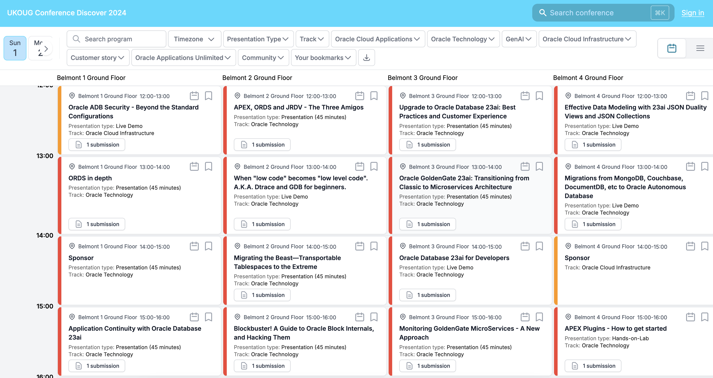

---

|`speakers`|`name`|`handle`|`style`|
|---|---|---|---|
|   |`Jonathan`|`@jloracle`| |
|   |`Patrick`|`@jolliffe`| |

|`sessions`|`speaker` |`title`                |`attendees`|
|---       |---       |---                    |---:       |
|          |`Jonathan`|`Analytical Asparagus` |`90`       |
|          |`Jonathan`|`Sourdough Schemas`    |`9`       |
|          |`Patrick` |`Dogs vs Cats`         |`0`        |
|          ||                 |           |

---

|`speakers`|`name`|`handle`|`style`|
|---|---|---|---|
|   |`Jonathan`|`@jloracle`| |
|   |`Patrick`|`@jolliffe`| |

|`sessions`|`speaker` |`title`                |`attendees`|
|---       |---       |---                    |---:       |
|          |`Jonathan`|`Analytical Asparagus` |`90`       |
|          |`Jonathan`|`Sourdough Schemas`    |`9`       |
|          |`Patrick` |`Dogs vs Cats`         |`0`        |
|          |`Patrick` |`NULL`                 |           |


---

|`speakers`|`name`|`handle`|`style`|
|---|---|---|---|
|   |`Jonathan`|`@jloracle`| |
|   |`Patrick`|`@jolliffe`| |

|`sessions`|`speaker` |`title`                | `attendees` |
|---       |---       |---                    |---:         |
|          |`Jonathan`|`Analytical Asparagus` |`90`         |
|          |`Jonathan`|`Sourdough Schemas`    |`9`          |
|          |`Patrick` |`Dogs vs Cats`         |`0`          |
|          |`Patrick` |`NULL`                 |`NULL`       |

---

|`speakers`|`name`|`handle`|`style`|
|---|---|---|---|
|   |`Jonathan`|`@jloracle`| |
|   |`Patrick`|`@jolliffe`| |

|`sessions`|`speaker` |`title`                |`attendees`|
|---       |---       |---                    |---:       |
|          |`Jonathan`|`Analytical Asparagus` |`90`       |
|          |`Jonathan`|`Sourdough Schemas`    |`9`       |
|          |`Patrick` |`Dogs vs Cats`     |`0`        |
|          |`Patrick` |`NULL`                 |`0`        |

---

|`speakers`|`name`|`handle`|`style`|
|---|---|---|---|
|   |`Jonathan`|`@jloracle`| |
|   |`Patrick`|`@jolliffe`| |


|`sessions`|`speaker` |`title`                |`attendees`|
|---       |---       |---                    |---:       |
|          |`Jonathan`|`Analytical Asparagus` |`90`       |
|          |`Jonathan`|`Sourdough Schemas`    |`9`       |
|          |`Patrick` |`Dogs vs Cats`         |`0`        |
|          |`Patrick` |`NULL`                 |`-99`        |

---


[.column]
#⠀
#⠀
#1970

[.column]
#⠀
#⠀
#**1974**

[.column]
#⠀

[.column]
#⠀

^1974
understanding relations

---


|`speakers`|`name`|`handle`|`style`|
|---|---|---|---|
|   |`Jonathan`|`@jloracle`| |
|   |`Patrick`|`@jolliffe`| |


|`sessions`|`speaker` |`title`                |`attendees`|
|---       |---       |---                    |---:       |
|          |`Jonathan`|`Analytical Asparagus` |`90`       |
|          |`Jonathan`|`Sourdough Schemas`    |`9`        |
|          |`Patrick` |`Dogs vs Cats`     |`0`        |
|          |`Patrick` |`NULL`                 |`[null]`   |


---


[.column]
#⠀
#⠀
#1970

[.column]
#⠀
#⠀
#1974

[.column]
#⠀
#⠀
#**1979**

[.column]
#⠀

^1979
oracle 2.3

---
#**special marker**
#⠀

^wikipedia
in SQL null is a special marker


---
#special marker
#**value does not exist**


^used to indicate that a data value does not exist in the database

---
#oxymoron

^figure of speech in which apparently contradictory terms appear in conjunction 

---
[.column]
# crash landing
# herbal tea
# minor miracle
# __null value__
# old technology
[.column]
# paid volunteer
# paper towel
# plastic glass
# random order
# small crowd

---
#~~Boolean Logic~~
#Three-Valued Logic

---
|Expression    |Result     |
|:---          |:---       |
| `false and null` | `false` |
| `true  or  null` | `true` |

---
|Expression        |Result |
|:---              |:---   |
| `not null`       | `null`|
| `true  and null` | `null`|
| `null  and null` | `null`|
| `false or null` | `null` |
| `null  or null` | `null` |

---


^erwin schrödinger

---
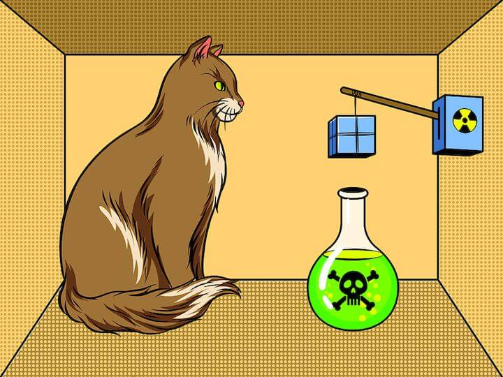

^thought experiment 
cat in sealed box
random subatomic event

---
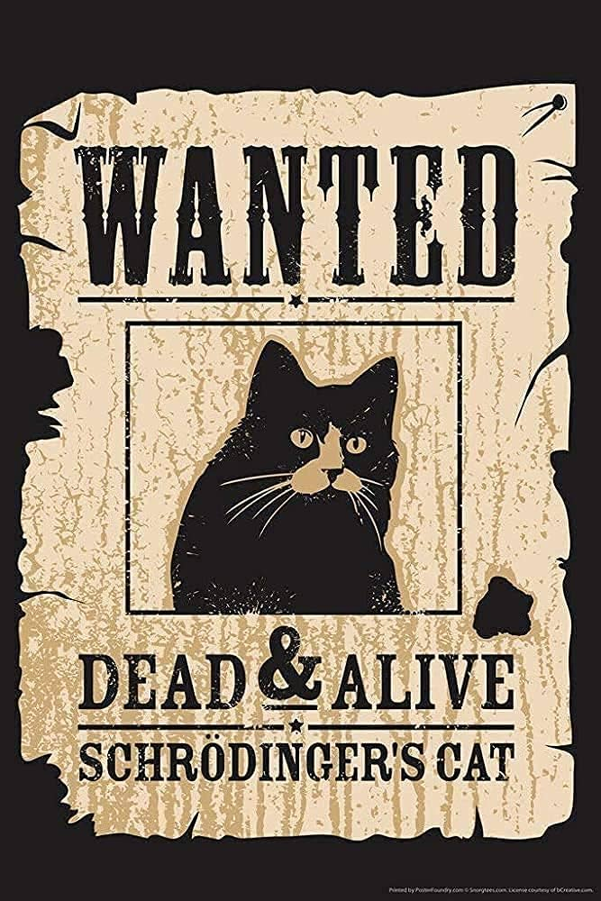

^simultaneously alive & dead

---

```
> create table boxes(id        number null,
  2*                 live_cats number null);

Table BOXES created.
⠀⠀⠀⠀⠀⠀⠀⠀⠀⠀⠀⠀⠀⠀⠀⠀⠀⠀⠀⠀⠀⠀⠀⠀⠀⠀⠀⠀⠀⠀⠀⠀⠀⠀⠀⠀⠀⠀⠀⠀⠀⠀⠀⠀⠀⠀⠀⠀⠀⠀⠀⠀⠀⠀⠀⠀⠀⠀⠀⠀⠀⠀⠀⠀⠀⠀⠀⠀⠀⠀⠀⠀⠀
```

^4 boxes

---
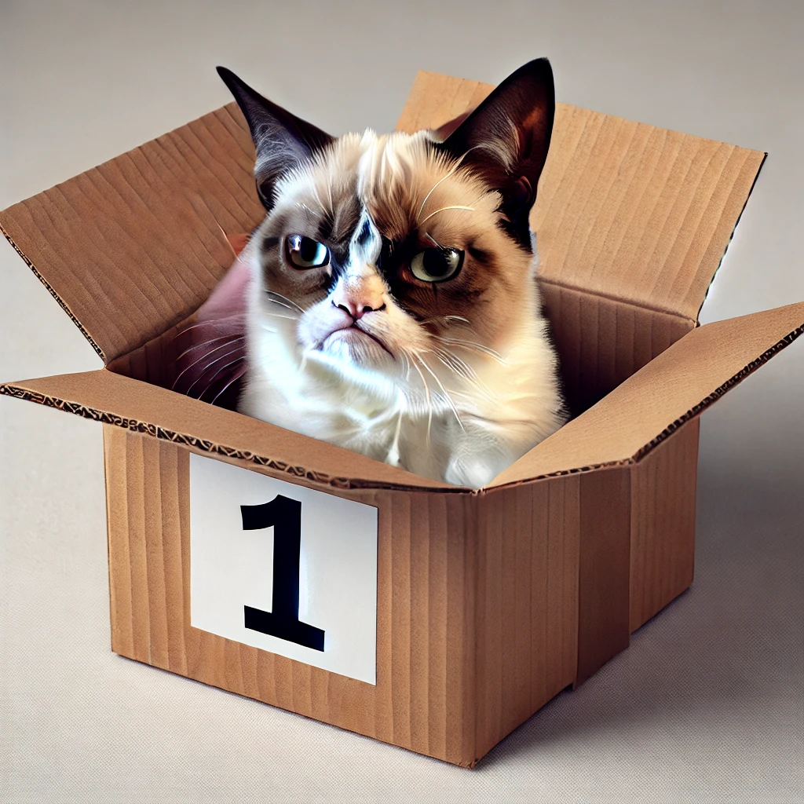 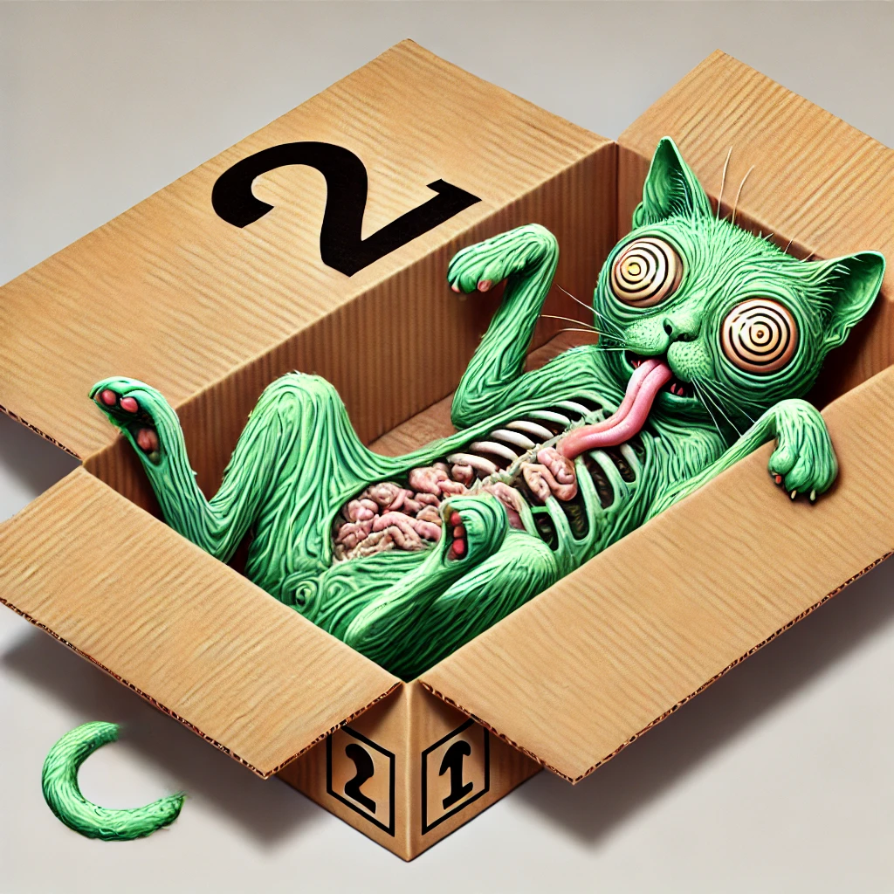

---
 

```
> insert into boxes  (id, live_cats)
  2           values ( 1,         1),
  3*                 ( 2,         0); 

2 rows inserted.
⠀⠀⠀⠀⠀⠀⠀⠀⠀⠀⠀⠀⠀⠀⠀⠀⠀⠀⠀⠀⠀⠀⠀⠀⠀⠀⠀⠀⠀⠀⠀⠀⠀⠀⠀⠀⠀⠀⠀⠀⠀⠀⠀⠀⠀⠀⠀⠀⠀⠀⠀⠀⠀⠀⠀⠀⠀⠀⠀⠀⠀⠀⠀⠀⠀⠀⠀⠀⠀⠀⠀⠀⠀
```


---
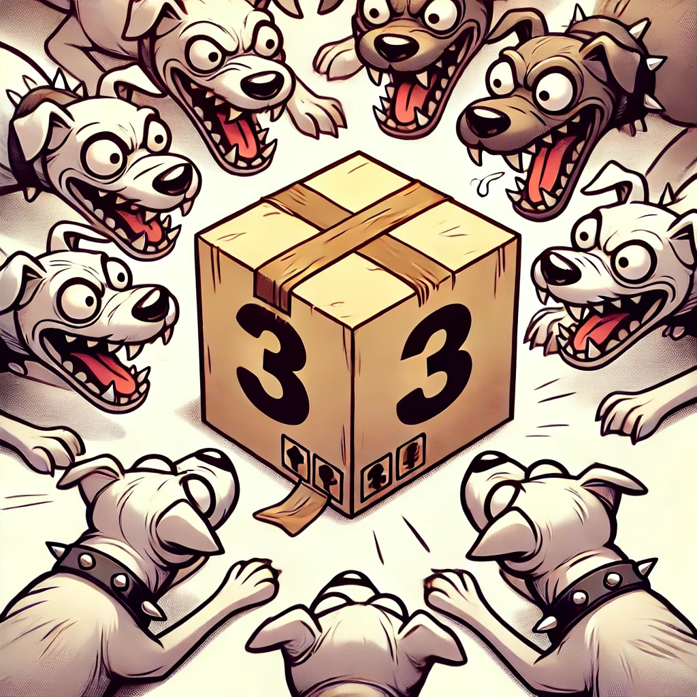 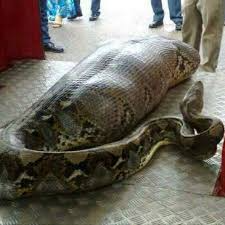

---
 

```
> insert into boxes  (  id, live_cats)
  2           values (   3,      null),
  3*                 (null,      null);

2 rows inserted.
⠀⠀⠀⠀⠀⠀⠀⠀⠀⠀⠀⠀⠀⠀⠀⠀⠀⠀⠀⠀⠀⠀⠀⠀⠀⠀⠀⠀⠀⠀⠀⠀⠀⠀⠀⠀⠀⠀⠀⠀⠀⠀⠀⠀⠀⠀⠀⠀⠀⠀⠀⠀⠀⠀⠀⠀⠀⠀⠀⠀⠀⠀⠀⠀⠀⠀⠀⠀⠀⠀⠀⠀⠀
```

---
[.code-highlight: 1-8]
[.code-highlight: 1-10]
[.code-highlight: all]
```
> select * from boxes;

   ID    LIVE_CATS 
_____ ____________ 
    1            1 
    2            0 
    3              


> set null [null]
> select * from boxes;

       ID    LIVE_CATS 
_________ ____________ 
        1            1 
        2            0 
        3       [null] 
   [null]       [null] 
⠀⠀⠀⠀⠀⠀⠀⠀⠀⠀⠀⠀⠀⠀⠀⠀⠀⠀⠀⠀⠀⠀⠀⠀⠀⠀⠀⠀⠀⠀⠀⠀⠀⠀⠀⠀⠀⠀⠀⠀⠀⠀⠀⠀⠀⠀⠀⠀⠀⠀⠀⠀⠀⠀⠀⠀⠀⠀⠀⠀⠀⠀⠀⠀⠀⠀⠀⠀⠀⠀⠀⠀⠀
```

---
 

---
[.code-highlight: 1-6]
[.code-highlight: all]
```
> select id, live_cats from boxes where (live_cats is not null);

       ID    LIVE_CATS 
_________ ____________ 
        1            1 
        2            0 

> select id, live_cats from boxes where (live_cats is null);

       ID    LIVE_CATS 
_________ ____________ 
        3       [null] 
   [null]       [null] 
⠀⠀⠀⠀⠀⠀⠀⠀⠀⠀⠀⠀⠀⠀⠀⠀⠀⠀⠀⠀⠀⠀⠀⠀⠀⠀⠀⠀⠀⠀⠀⠀⠀⠀⠀⠀⠀⠀⠀⠀⠀⠀⠀⠀⠀⠀⠀⠀⠀⠀⠀⠀⠀⠀⠀⠀⠀⠀⠀⠀⠀⠀⠀⠀⠀⠀⠀⠀⠀⠀⠀⠀⠀
```

---
```
> select * from boxes where null;

no rows selected
⠀⠀⠀⠀⠀⠀⠀⠀⠀⠀⠀⠀⠀⠀⠀⠀⠀⠀⠀⠀⠀⠀⠀⠀⠀⠀⠀⠀⠀⠀⠀⠀⠀⠀⠀⠀⠀⠀⠀⠀⠀⠀⠀⠀⠀⠀⠀⠀⠀⠀⠀⠀⠀⠀⠀⠀⠀⠀⠀⠀⠀⠀⠀⠀⠀⠀⠀⠀⠀⠀⠀⠀⠀
```

---
[.code-highlight: 10,17]
[.code-highlight: 1-10,17]
[.code-highlight: all]
```
> select id, live_cats, (live_cats = live_cats), (live_cats != live_cats) from boxes;

      ID     LIVE_CATS  (LIVE_CATS = LIVE_CATS)  (LIVE_CATS != LIVE_CATS) 
_________ ____________ ________________________ _________________________ 
        1            1                     TRUE                     FALSE 
        2            0                     TRUE                     FALSE 
        3       [null]                   [null]                    [null] 
   [null]       [null]                   [null]                    [null]

> select id, live_cats from boxes where (live_cats = live_cats);

   ID    LIVE_CATS 
_____ ____________ 
    1            1
    2            0
⠀⠀⠀⠀⠀⠀⠀⠀⠀⠀⠀⠀⠀⠀⠀⠀⠀⠀⠀⠀⠀⠀⠀⠀⠀⠀⠀⠀⠀⠀⠀⠀⠀⠀⠀⠀⠀⠀⠀⠀⠀⠀⠀⠀⠀⠀⠀⠀⠀⠀⠀⠀⠀⠀⠀⠀⠀⠀⠀⠀⠀⠀⠀⠀⠀⠀⠀⠀⠀⠀⠀⠀⠀
```

^
(null = null)  => null
(null != null) => null


---
[.code-highlight: 10]
[.code-highlight: 1-10]
[.code-highlight: 1-14] 
[.code-highlight: all]
```
> select id, live_cats, (live_cats = 0), (live_cats != 0) from boxes;

    ID  LIVE_CATS (LIVE_CATS = 0)    (LIVE_CATS != 0)
------ ---------- --------------- -------------------
     1          1           FALSE	             TRUE
     2          0            TRUE	            FALSE
     3     [null]          [null]              [null]
[null]     [null]          [null]              [null]

> select count(*) from boxes where (live_cats = 0) or (live_cats != 0);

   COUNT(*) 
___________ 
          2 

> select count(*) from boxes where (live_cats = 0) or (live_cats != 0) or (live_cats is null);

   COUNT(*) 
___________ 
          4 
⠀⠀⠀⠀⠀⠀⠀⠀⠀⠀⠀⠀⠀⠀⠀⠀⠀⠀⠀⠀⠀⠀⠀⠀⠀⠀⠀⠀⠀⠀⠀⠀⠀⠀⠀⠀⠀⠀⠀⠀⠀⠀⠀⠀⠀⠀⠀⠀⠀⠀⠀⠀⠀⠀⠀⠀⠀⠀⠀⠀⠀⠀⠀⠀⠀⠀⠀⠀⠀⠀⠀⠀⠀
```

^
(null != <anything>) => null


---
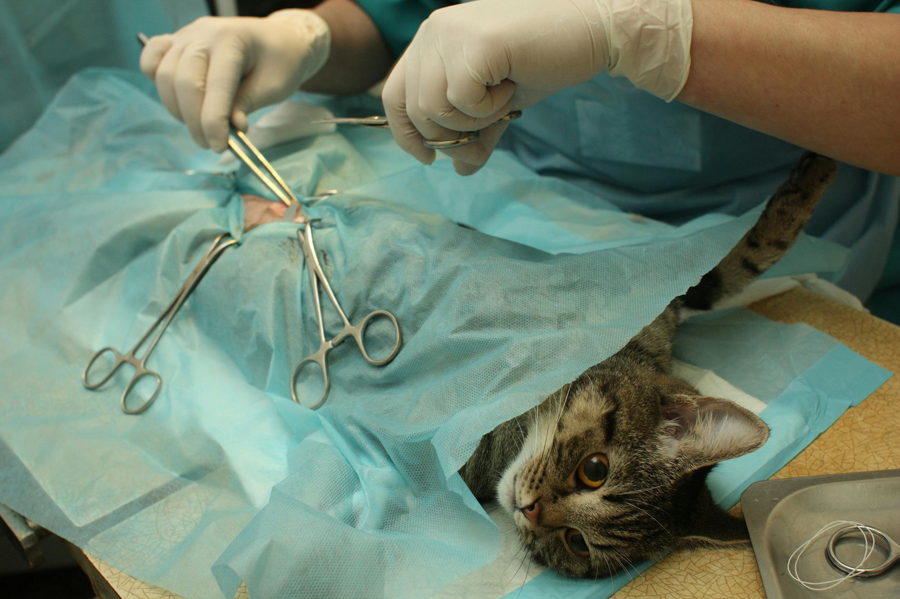 
#Operations

---
[.code-highlight: 1-5]
[.code-highlight: all]
```
> select (null*42), (null/42), (null+42), (null-42);

   (NULL*42)    (NULL/42)    (NULL+42)    (NULL-42) 
____________ ____________ ____________ ____________ 
      [null]       [null]       [null]       [null] 

> select (null*0), (null/0), (null/null), (null-null);

   (NULL*0)    (NULL/0)    (NULL/NULL)    (NULL-NULL) 
___________ ___________ ______________ ______________ 
     [null]      [null]         [null]         [null]
⠀⠀⠀⠀⠀⠀⠀⠀⠀⠀⠀⠀⠀⠀⠀⠀⠀⠀⠀⠀⠀⠀⠀⠀⠀⠀⠀⠀⠀⠀⠀⠀⠀⠀⠀⠀⠀⠀⠀⠀⠀⠀⠀⠀⠀⠀⠀⠀⠀⠀⠀⠀⠀⠀⠀⠀⠀⠀⠀⠀⠀⠀⠀⠀⠀⠀⠀⠀⠀⠀⠀⠀⠀
```

---


---
[.code-highlight: 1]
[.code-highlight: all]
```
> select 'cock' || null || 'womble';

cockwomble
⠀⠀⠀⠀⠀⠀⠀⠀⠀⠀⠀⠀⠀⠀⠀⠀⠀⠀⠀⠀⠀⠀⠀⠀⠀⠀⠀⠀⠀⠀⠀⠀⠀⠀⠀⠀⠀⠀⠀⠀⠀⠀⠀⠀⠀⠀⠀⠀⠀⠀⠀⠀⠀⠀⠀⠀⠀⠀⠀⠀⠀⠀⠀⠀⠀⠀⠀⠀⠀⠀⠀⠀⠀
```

^ An idiotic and arrogant person, usually male, with an inflated sense of their own competence

---
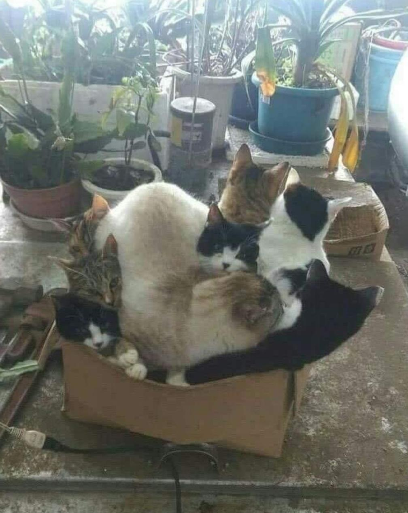


---

#Aggregate Functions

---
[.code-highlight: 1-10]
[.code-highlight: all]
```
> select id, live_cats from boxes;

       ID    LIVE_CATS 
_________ ____________ 
        1            1 
        2            0 
        3       [null] 
   [null]       [null] 

> select count(null), count(live_cats), count(*) from boxes;

COUNT(NULL) COUNT(LIVE_CATS) COUNT(*) 
___________ ________________ ________ 
          0                2        4 
⠀⠀⠀⠀⠀⠀⠀⠀⠀⠀⠀⠀⠀⠀⠀⠀⠀⠀⠀⠀⠀⠀⠀⠀⠀⠀⠀⠀⠀⠀⠀⠀⠀⠀⠀⠀⠀⠀⠀⠀⠀⠀⠀⠀⠀⠀⠀⠀⠀⠀⠀⠀⠀⠀⠀⠀⠀⠀⠀⠀⠀⠀⠀⠀⠀⠀⠀⠀⠀⠀⠀⠀⠀
```

---
```
> select live_cats from boxes;

   LIVE_CATS 
____________ 
           1 
           0 
      [null] 
      [null] 
   
> select sum(null), sum(live_cats) from boxes;

  SUM(NULL)   SUM(LIVE_CATS)    
___________   ______________  
     [null]                1
⠀⠀⠀⠀⠀⠀⠀⠀⠀⠀⠀⠀⠀⠀⠀⠀⠀⠀⠀⠀⠀⠀⠀⠀⠀⠀⠀⠀⠀⠀⠀⠀⠀⠀⠀⠀⠀⠀⠀⠀⠀⠀⠀⠀⠀⠀⠀⠀⠀⠀⠀⠀⠀⠀⠀⠀⠀⠀⠀⠀⠀⠀⠀⠀⠀⠀⠀⠀⠀⠀⠀⠀⠀
```

^
if all nulls, return null
otherwise ignores nulls

---
[.code-highlight: 1-11]
[.code-highlight: all]
```
> select live_cats from boxes;

   LIVE_CATS 
____________ 
           1 
           0 
      [null] 
      [null] 

> select avg(null), avg(live_cats) from boxes;

  AVG(NULL)   AVG(LIVE_CATS) 
___________   ______________ 
     [null]              0.5 
⠀⠀⠀⠀⠀⠀⠀⠀⠀⠀⠀⠀⠀⠀⠀⠀⠀⠀⠀⠀⠀⠀⠀⠀⠀⠀⠀⠀⠀⠀⠀⠀⠀⠀⠀⠀⠀⠀⠀⠀⠀⠀⠀⠀⠀⠀⠀⠀⠀⠀⠀⠀⠀⠀⠀⠀⠀⠀⠀⠀⠀⠀⠀⠀⠀⠀⠀⠀⠀⠀⠀⠀⠀
```    
^
average is sum/count

---


---
```
> select live_cats from boxes;

   LIVE_CATS 
____________ 
           1 
           0 
      [null] 
      [null] 

> select min(null), max(null), min(live_cats), max(live_cats) from boxes;

MIN(NULL) MAX(NULL)  MIN(LIVE_CATS) MAX(LIVE_CATS)
_________ _________ _______________ ______________ 
   [null]    [null]               0              1    
⠀⠀⠀⠀⠀⠀⠀⠀⠀⠀⠀⠀⠀⠀⠀⠀⠀⠀⠀⠀⠀⠀⠀⠀⠀⠀⠀⠀⠀⠀⠀⠀⠀⠀⠀⠀⠀⠀⠀⠀⠀⠀⠀⠀⠀⠀⠀⠀⠀⠀⠀⠀⠀⠀⠀⠀⠀⠀⠀⠀⠀⠀⠀⠀⠀⠀⠀⠀⠀⠀⠀⠀⠀
```

---
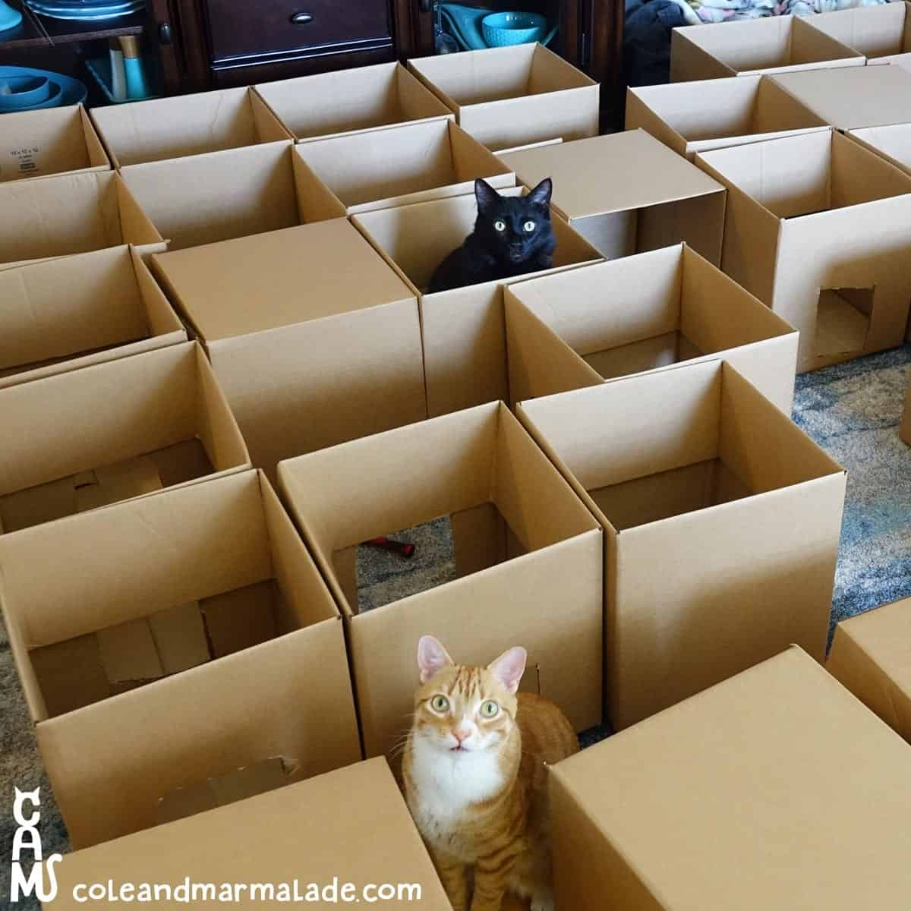
#group by & distinct

---
[.code-highlight: 1-7]
[.code-highlight: all]
```
> select live_cats, count(*) from boxes group by live_cats;

   LIVE_CATS    COUNT(*) 
____________ ___________ 
           1           1 
           0           1 
      [null]           2 

> select distinct live_cats from boxes;

   LIVE_CATS 
____________ 
           1 
           0 
      [null] 
⠀⠀⠀⠀⠀⠀⠀⠀⠀⠀⠀⠀⠀⠀⠀⠀⠀⠀⠀⠀⠀⠀⠀⠀⠀⠀⠀⠀⠀⠀⠀⠀⠀⠀⠀⠀⠀⠀⠀⠀⠀⠀⠀⠀⠀⠀⠀⠀⠀⠀⠀⠀⠀⠀⠀⠀⠀⠀⠀⠀⠀⠀⠀⠀⠀⠀⠀⠀⠀⠀⠀⠀⠀
```

---
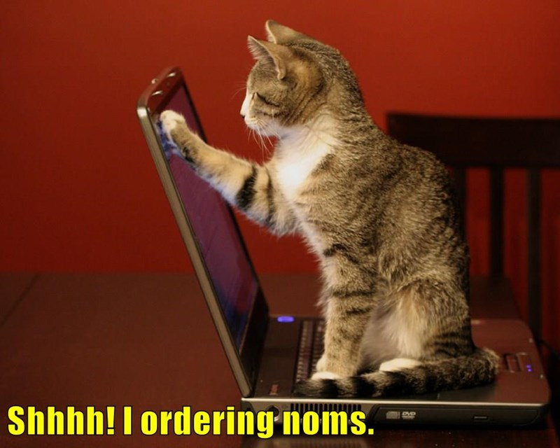


---

#ordering

---
[.code-highlight: 1-8]
[.code-highlight: all]
```
> select live_cats from boxes order by live_cats;

   LIVE_CATS 
____________ 
           0 
           1 
      [null] 
      [null] 

> select live_cats from boxes order by live_cats nulls first;

   LIVE_CATS 
____________ 
      [null] 
      [null] 
           0 
           1 
⠀⠀⠀⠀⠀⠀⠀⠀⠀⠀⠀⠀⠀⠀⠀⠀⠀⠀⠀⠀⠀⠀⠀⠀⠀⠀⠀⠀⠀⠀⠀⠀⠀⠀⠀⠀⠀⠀⠀⠀⠀⠀⠀⠀⠀⠀⠀⠀⠀⠀⠀⠀⠀⠀⠀⠀⠀⠀⠀⠀⠀⠀⠀⠀⠀⠀⠀⠀⠀⠀⠀⠀⠀
```

---
[.code-highlight: 1-8]
[.code-highlight: all]
```
> select live_cats from boxes order by live_cats desc;

   LIVE_CATS 
____________ 
      [null] 
      [null] 
           1 
           0 

> select live_cats from boxes order by live_cats desc nulls last;

   LIVE_CATS 
____________ 
           1 
           0 
      [null] 
      [null] 
⠀⠀⠀⠀⠀⠀⠀⠀⠀⠀⠀⠀⠀⠀⠀⠀⠀⠀⠀⠀⠀⠀⠀⠀⠀⠀⠀⠀⠀⠀⠀⠀⠀⠀⠀⠀⠀⠀⠀⠀⠀⠀⠀⠀⠀⠀⠀⠀⠀⠀⠀⠀⠀⠀⠀⠀⠀⠀⠀⠀⠀⠀⠀⠀⠀⠀⠀⠀⠀⠀⠀⠀⠀
```

---


---
[.code-highlight: 1-8]
[.code-highlight: all]
```
> select live_cats, nvl(live_cats, 0), coalesce(live_cats, 0) from boxes;

   LIVE_CATS    NVL(LIVE_CATS,0)    COALESCE(LIVE_CATS,0) 
____________ ___________________ ________________________ 
           1                   1                        1 
           0                   0                        0 
      [null]                   0                        0 
      [null]                   0                        0 

> select live_cats, id, coalesce(live_cats, id, 0) from boxes;

   LIVE_CATS        ID    COALESCE(LIVE_CATS,ID,0) 
____________ _________ ___________________________ 
           1         1                           1 
           0         2                           0 
      [null]         3                           3 
      [null]    [null]                           0 
⠀⠀⠀⠀⠀⠀⠀⠀⠀⠀⠀⠀⠀⠀⠀⠀⠀⠀⠀⠀⠀⠀⠀⠀⠀⠀⠀⠀⠀⠀⠀⠀⠀⠀⠀⠀⠀⠀⠀⠀⠀⠀⠀⠀⠀⠀⠀⠀⠀⠀⠀⠀⠀⠀⠀⠀⠀⠀⠀⠀⠀⠀⠀⠀⠀⠀⠀⠀⠀⠀⠀⠀⠀
```

---
[.code-highlight: 1-4]
[.code-highlight: all]
```
> select coalesce(1);

SQL Error: ORA-00938: not enough arguments for function
*Cause:    The function was referenced with too few arguments.

> select coalesce(
  2         1,     2,     3,     4,     5,     6,     7,     8,     9,    10,
  3        11,    12,    13,    14,    15,    16,    17,    18,    19,    20,
  4        21,    22,    23,    24,    25,    26,    27,    28,    29,    30,
  5        31,    32,    33,    34,    35,    36,    37,    38,    39,    40,
  6        41,    42,    43,    44,    45,    46,    47,    48,    49,    50,
...
6552    65501, 65502, 65503, 65504, 65505, 65506, 65507, 65508, 65509, 65510,
6553    65511, 65512, 65513, 65514, 65515, 65516, 65517, 65518, 65519, 65520,
6554    65521, 65522, 65523, 65524, 65525, 65526, 65527, 65528, 65529, 65530,
6555*   65531, 65532, 65533, 65534, 65535, 65536);

ERROR at line 3:
ORA-00939: too many arguments for function
⠀⠀⠀⠀⠀⠀⠀⠀⠀⠀⠀⠀⠀⠀⠀⠀⠀⠀⠀⠀⠀⠀⠀⠀⠀⠀⠀⠀⠀⠀⠀⠀⠀⠀⠀⠀⠀⠀⠀⠀⠀⠀⠀⠀⠀⠀⠀⠀⠀⠀⠀⠀⠀⠀⠀⠀⠀⠀⠀⠀⠀⠀⠀⠀⠀⠀⠀⠀⠀⠀⠀⠀
```  

---
|                |  NVL  |COALESCE |
| ---            |---:  | ---:  |        
| SQL Standard   | ❌    | ✅   |
| Number of Args | 2     | 2->65,535 |
| Oracle Version | All | >= 9i |
| Easy To Type   | ✅       | ❌    |

---
[.code-highlight: 1,10]
[.code-highlight: 1-8,10]
[.code-highlight: all]
```
> select id from boxes where id = coalesce(:id, id);
⠀⠀⠀⠀⠀⠀⠀⠀⠀⠀⠀⠀⠀⠀⠀⠀⠀⠀⠀⠀⠀⠀⠀⠀⠀⠀⠀⠀⠀⠀⠀⠀⠀⠀⠀⠀⠀⠀⠀⠀⠀⠀⠀⠀⠀⠀⠀⠀⠀⠀⠀⠀⠀⠀⠀⠀⠀⠀⠀⠀⠀⠀⠀⠀⠀⠀⠀⠀⠀⠀⠀⠀
-----------------------------------
| Id  | Operation        | Name   |
-----------------------------------
|   0 | SELECT STATEMENT |        |
|*  1 |  INDEX FULL SCAN | BOX_ID |
-----------------------------------

> select id from boxes where id = nvl(:id, id)

-----------------------------------------------
| Id  | Operation           | Name            |
-----------------------------------------------
|   0 | SELECT STATEMENT    |                 |
|   1 |  VIEW               | VW_ORE_2032B19C |
|   2 |   UNION-ALL         |                 |
|*  3 |    FILTER           |                 |
|*  4 |     INDEX RANGE SCAN| BOX_ID          |
|*  5 |    FILTER           |                 |
|*  6 |     INDEX FULL SCAN | BOX_ID          |
-----------------------------------------------
```

---

#Developers -> DBAs

^ Time Check!!!

---
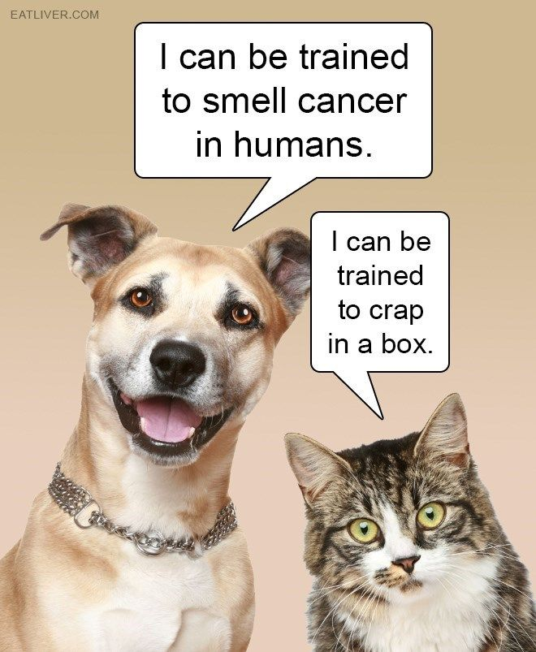

^ Time Check!!!

---

#Constraints

---
[.code-highlight: 1-4]
[.code-highlight: 1-10]
[.code-highlight: 1-17]
[.code-highlight: all] 
```
> create table pedigree_pooches(name  varchar2(16),
  2*                            breed varchar2(16) not null);

Table PEDIGREE_POOCHES created.

> select constraint_name, search_condition from user_constraints where table_name = 'PEDIGREE_POOCHES';

CONSTRAINT_NAME    SEARCH_CONDITION       
__________________ ______________________ 
SYS_C008494        "BREED" IS NOT NULL    

> select column_name, nullable from user_tab_cols where table_name = 'PEDIGREE_POOCHES';

COLUMN_NAME    NULLABLE    
______________ ___________ 
NAME           Y           
BREED          N       

> insert into pedigree_pooches (name, breed) values ('Franck', null);

SQL Error: ORA-01400: cannot insert NULL into ("PDBADMIN"."PEDIGREE_POOCHES"."BREED")
*Cause:    An attempt was made to insert NULL into previously listed objects.
*Action:   These objects cannot accept NULL values. Reservable columns cannot
           accept NULL values.
⠀⠀⠀⠀⠀⠀⠀⠀⠀⠀⠀⠀⠀⠀⠀⠀⠀⠀⠀⠀⠀⠀⠀⠀⠀⠀⠀⠀⠀⠀⠀⠀⠀⠀⠀⠀⠀⠀⠀⠀⠀⠀⠀⠀⠀⠀⠀⠀⠀⠀⠀⠀⠀⠀⠀⠀⠀⠀⠀⠀⠀⠀⠀⠀⠀⠀⠀⠀⠀⠀⠀⠀⠀
```


---
[.code-highlight: 1-5]
[.code-highlight: 1-14]
[.code-highlight: all]
```
> select count(name) from pedigree_pooches where breed = 'Spaniel';

   COUNT(NAME) 
______________ 
             6 
                                                                                                                    
------------------------------------------------------------------------------------------------------
| Id  | Operation                            | Name             | Starts | E-Rows | A-Rows | Buffers |
------------------------------------------------------------------------------------------------------
|   0 | SELECT STATEMENT                     |                  |      1 |        |      1 |      14 |
|   1 |  SORT AGGREGATE                      |                  |      1 |      1 |      1 |      14 |
|   2 |   TABLE ACCESS BY INDEX ROWID BATCHED| PEDIGREE_POOCHES |      1 |      6 |      6 |      14 |
|*  3 |    INDEX RANGE SCAN                  | POOCH_BREEDS     |      1 |      6 |      6 |       2 |
------------------------------------------------------------------------------------------------------

> select count(*) from pedigree_pooches where name is null;

   COUNT(*) 
___________ 
          0       
⠀⠀⠀⠀⠀⠀⠀⠀⠀⠀⠀⠀⠀⠀⠀⠀⠀⠀⠀⠀⠀⠀⠀⠀⠀⠀⠀⠀⠀⠀⠀⠀⠀⠀⠀⠀⠀⠀⠀⠀⠀⠀⠀⠀⠀⠀⠀⠀⠀⠀⠀⠀⠀⠀⠀⠀⠀⠀⠀⠀⠀⠀⠀⠀⠀⠀⠀⠀⠀⠀⠀⠀⠀⠀⠀⠀⠀⠀
```
---
[.code-highlight: 1-9]
[.code-highlight: 1-13]
[.code-highlight: all]
```
> select count(name) from pedigree_pooches where breed = 'Spaniel';
------------------------------------------------------------------------------------------------------
| Id  | Operation                            | Name             | Starts | E-Rows | A-Rows | Buffers |
------------------------------------------------------------------------------------------------------
|   0 | SELECT STATEMENT                     |                  |      1 |        |      1 |      14 |
|   1 |  SORT AGGREGATE                      |                  |      1 |      1 |      1 |      14 |
|   2 |   TABLE ACCESS BY INDEX ROWID BATCHED| PEDIGREE_POOCHES |      1 |      6 |      6 |      14 |
|*  3 |    INDEX RANGE SCAN                  | POOCH_BREEDS     |      1 |      6 |      6 |       2 |
------------------------------------------------------------------------------------------------------
⠀⠀⠀⠀⠀⠀⠀⠀⠀⠀⠀⠀⠀⠀⠀⠀⠀⠀⠀⠀⠀⠀⠀⠀⠀⠀⠀⠀⠀⠀⠀⠀⠀⠀⠀⠀⠀⠀⠀⠀⠀⠀⠀⠀⠀⠀⠀⠀⠀⠀⠀⠀⠀⠀⠀⠀⠀⠀⠀⠀⠀⠀⠀⠀⠀⠀⠀⠀⠀⠀⠀⠀⠀⠀⠀⠀⠀⠀
> alter table pedigree_pooches modify name not null;

Table PEDIGREE_POOCHES altered.

> select count(name) from pedigree_pooches where breed = 'Spaniel';
------------------------------------------------------------------------------------------------------    
| Id  | Operation                            | Name             | Starts | E-Rows | A-Rows | Buffers |    
------------------------------------------------------------------------------------------------------    
|   0 | SELECT STATEMENT                     |                  |      1 |        |      1 |       2 |    
|   1 |  SORT AGGREGATE                      |                  |      1 |      1 |      1 |       2 |    
|*  2 |   INDEX RANGE SCAN                   | POOCH_BREEDS     |      1 |      6 |      6 |       2 |    
------------------------------------------------------------------------------------------------------
```

---
[.code-highlight: 1-4]
[.code-highlight: 1-8]
[.code-highlight: 1-12]
[.code-highlight: 1-19]
[.code-highlight: all]
```
> create table bad_dogs(name  varchar2(16) constraint name_nn    not null,
  2*                    owner varchar2(16) check     (owner   is not null)   );

Table BAD_DOGS created.

> create table people(name varchar(16) constraint name_nn not null);

ORA-02264: name already used by an existing constraint

SQL> insert into bad_dogs(name, owner) values ('Gnasher', null);

ORA-02290: check constraint (PDBADMIN.SYS_C008491) violated

> select nullable from user_tab_cols where table_name = 'BAD_DOGS' and column_name = 'OWNER';

NULLABLE    
________
       Y           

> create table good_dogs(name varchar2(16) not null);
⠀⠀⠀⠀⠀⠀⠀⠀⠀⠀⠀⠀⠀⠀⠀⠀⠀⠀⠀⠀⠀⠀⠀⠀⠀⠀⠀⠀⠀⠀⠀⠀⠀⠀⠀⠀⠀⠀⠀⠀⠀⠀⠀⠀⠀⠀⠀⠀⠀⠀⠀⠀⠀⠀⠀⠀⠀⠀⠀⠀⠀⠀⠀⠀⠀⠀⠀⠀⠀⠀⠀⠀⠀⠀⠀⠀⠀⠀
Table GOOD_DOGS created.
```


^Don't add not null like this!

---
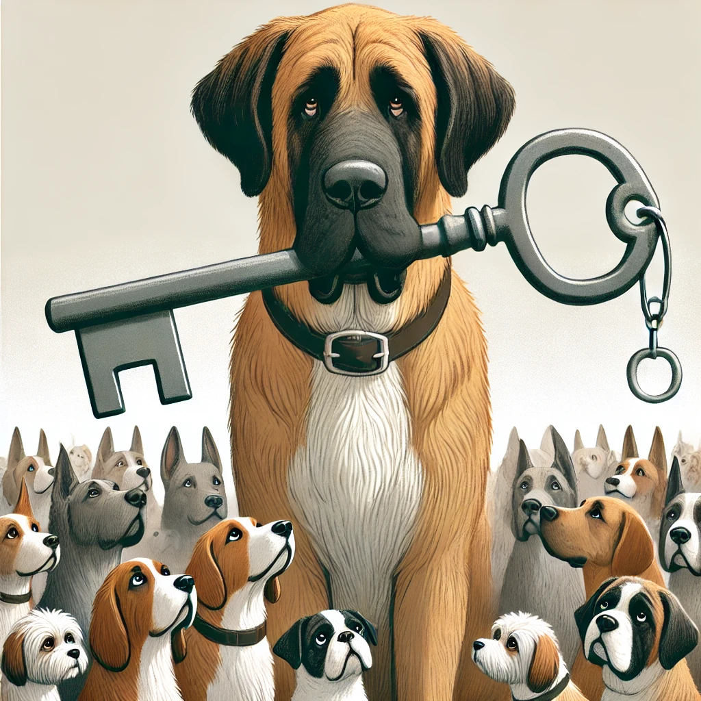

#Primary Keys

---
[.code-highlight: 1-4]
[.code-highlight: 1-10]
[.code-highlight: all]
```
> create table dogs(name  varchar2(15) primary key,
  2*                owner varchar2(15) null        );

Table DOGS created.

> select nullable from user_tab_cols where table_name = 'DOGS' and column_name = 'NAME';

NULLABLE    
___________ 
N           

> select constraint_name, constraint_type from user_constraints where table_name = 'DOGS';

CONSTRAINT_NAME    CONSTRAINT_TYPE    
__________________ __________________ 
SYS_C008513        P                  
⠀⠀⠀⠀⠀⠀⠀⠀⠀⠀⠀⠀⠀⠀⠀⠀⠀⠀⠀⠀⠀⠀⠀⠀⠀⠀⠀⠀⠀⠀⠀⠀⠀⠀⠀⠀⠀⠀⠀⠀⠀⠀⠀⠀⠀⠀⠀⠀⠀⠀⠀⠀⠀⠀⠀⠀⠀⠀⠀⠀⠀⠀⠀⠀⠀⠀⠀⠀⠀⠀⠀⠀⠀⠀⠀⠀⠀⠀⠀⠀⠀⠀⠀⠀
```

---
[.code-highlight: 1-3]
[.code-highlight: 1-9]
[.code-highlight: all]
```
> alter table dogs disable primary key;

Table DOGS altered.

> select nullable from user_tab_cols where table_name = 'DOGS' and column_name = 'NAME';

NULLABLE    
___________ 
Y           

SQL> alter table dogs modify name not null enable enable primary key;

Table DOGS altered.
⠀⠀⠀⠀⠀⠀⠀⠀⠀⠀⠀⠀⠀⠀⠀⠀⠀⠀⠀⠀⠀⠀⠀⠀⠀⠀⠀⠀⠀⠀⠀⠀⠀⠀⠀⠀⠀⠀⠀⠀⠀⠀⠀⠀⠀⠀⠀⠀⠀⠀⠀⠀⠀⠀⠀⠀⠀⠀⠀⠀⠀⠀⠀⠀⠀⠀⠀⠀⠀⠀⠀⠀⠀⠀⠀⠀⠀⠀⠀⠀⠀⠀⠀⠀
```
---
 

---
 
#Foreign Keys

---
[.code-highlight: 1-3]
[.code-highlight: 1-9]
[.code-highlight: all]
```
> create table people(name varchar2(16) not null primary key);

Table PEOPLE created.

> insert into people (name) values ('Martin'),
                                   ('Martin');

ORA-00001: unique constraint (PDBADMIN.SYS_C008427) violated on table PDBADMIN.PEOPLE columns (NAME)
ORA-03301: (ORA-00001 details) row with column values (NAME:'Martin') already exists

> alter table dogs add constraint fk_dog_owners foreign key (owner) references people(name);  

Table DOGS altered.
⠀⠀⠀⠀⠀⠀⠀⠀⠀⠀⠀⠀⠀⠀⠀⠀⠀⠀⠀⠀⠀⠀⠀⠀⠀⠀⠀⠀⠀⠀⠀⠀⠀⠀⠀⠀⠀⠀⠀⠀⠀⠀⠀⠀⠀⠀⠀⠀⠀⠀⠀⠀⠀⠀⠀⠀⠀⠀⠀⠀⠀⠀⠀⠀⠀⠀⠀⠀⠀⠀⠀⠀⠀⠀⠀⠀⠀⠀⠀⠀⠀⠀⠀⠀
```

---
 

---
 

[.code-highlight: 1-4]
[.code-highlight: 1-8]
[.code-highlight: all]
```
> insert into dogs (name,   owner    )
  2         values ('Nala', 'Manuela');

ORA-02291: integrity constraint (PDBADMIN.FK_DOG_OWNERS) violated - parent key not found

> insert into people (name) values ('Manuela');

1 row inserted.

> insert into dogs (name,   owner    )
  2         values ('Nala', 'Manuela');

1 row inserted.
⠀⠀⠀⠀⠀⠀⠀⠀⠀⠀⠀⠀⠀⠀⠀⠀⠀⠀⠀⠀⠀⠀⠀⠀⠀⠀⠀⠀⠀⠀⠀⠀⠀⠀⠀⠀⠀⠀⠀⠀⠀⠀⠀⠀⠀⠀⠀⠀⠀⠀⠀⠀⠀⠀⠀⠀⠀⠀⠀⠀⠀⠀⠀⠀⠀⠀⠀⠀⠀⠀⠀⠀⠀⠀⠀⠀⠀⠀⠀⠀⠀⠀⠀⠀
```
---

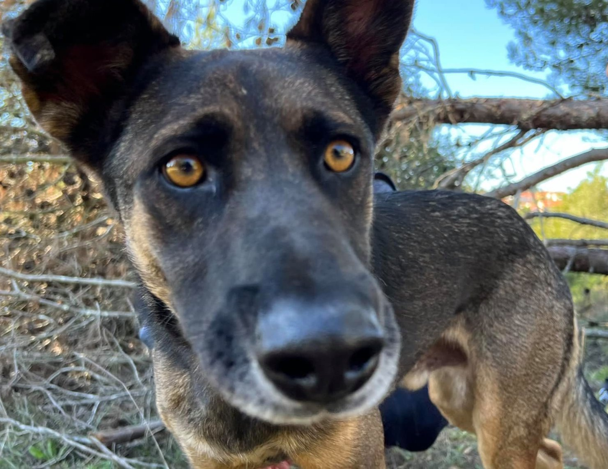 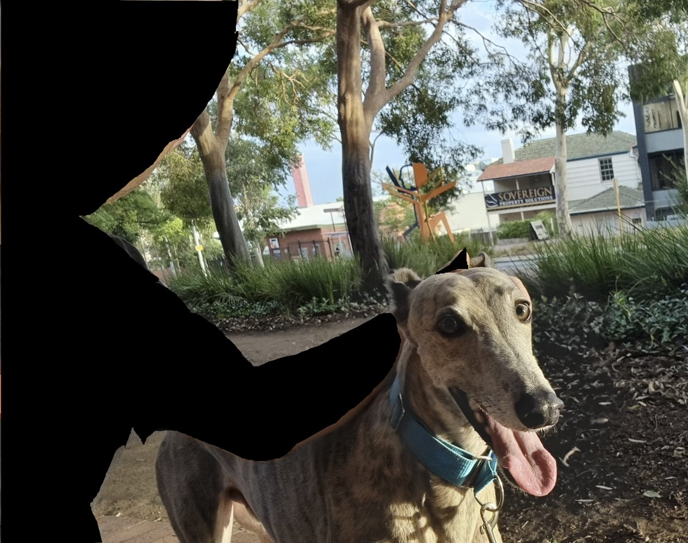 


---
  

```
> insert into dogs (name,     owner)
  2         values ('Franck', null ),
  3*               ('Bailey', null );

2 rows inserted.  
⠀⠀⠀⠀⠀⠀⠀⠀⠀⠀⠀⠀⠀⠀⠀⠀⠀⠀⠀⠀⠀⠀⠀⠀⠀⠀⠀⠀⠀⠀⠀⠀⠀⠀⠀⠀⠀⠀⠀⠀⠀⠀⠀⠀⠀⠀⠀⠀⠀⠀⠀⠀⠀⠀⠀⠀⠀⠀⠀⠀⠀⠀⠀⠀⠀⠀⠀⠀⠀⠀⠀⠀⠀  
```

---
   

[.code-highlight: 1-13]
[.code-highlight: 1-20]
[.code-highlight: 7-13]
```
> select name from people;

NAME       
__________ 
Manuela    

> select name, owner from dogs;

NAME      OWNER      
_________ __________ 
Nala      Manuela    
Franck    [null]     
Bailey    [null]     

> alter table dogs modify owner not null;

ORA-02296: cannot enable (PDBADMIN.) - null values found
*Cause:    an alter table enable constraint failed because the table
           contains values that do not satisfy the constraint.
*Action:   Obvious
⠀⠀⠀⠀⠀⠀⠀⠀⠀⠀⠀⠀⠀⠀⠀⠀⠀⠀⠀⠀⠀⠀⠀⠀⠀⠀⠀⠀⠀⠀⠀⠀⠀⠀⠀⠀⠀⠀⠀⠀⠀⠀⠀⠀⠀⠀⠀⠀⠀⠀⠀⠀⠀⠀⠀⠀⠀⠀⠀⠀⠀⠀⠀⠀⠀⠀⠀⠀⠀⠀⠀⠀⠀
```

^ FK requires row in parent table
but not for nulls
if that's not what you want
add not null constraint
Meanings of null
Franck: Missing - Inapplicable
Bailey: Missing - Applicable

---


[.column]
#⠀
#⠀
#1970

[.column]
#⠀
#⠀
#1974

[.column]
#⠀
#⠀
#1979

[.column]
#⠀
#⠀
#**1986**

^1986 published:
missing information
applicable and inapplicable 
in relational databases


---
   

```
> select name, owner from dogs;

NAME      OWNER      
_________ __________ 
Nala      Manuela    
Franck    [i-value]     
Bailey    [a-value]     
⠀⠀⠀⠀⠀⠀⠀⠀⠀⠀⠀⠀⠀⠀⠀⠀⠀⠀⠀⠀⠀⠀⠀⠀⠀⠀⠀⠀⠀⠀⠀⠀⠀⠀⠀⠀⠀⠀⠀⠀⠀⠀⠀⠀⠀⠀⠀⠀⠀⠀⠀⠀⠀⠀⠀⠀⠀⠀⠀⠀⠀⠀⠀⠀⠀⠀⠀⠀⠀⠀⠀⠀⠀
```

---
   

```
> select name, owner from dogs;

NAME      OWNER      
_________ __________ 
Nala      Manuela    
Franck    [null]     
Bailey    [null]     
⠀⠀⠀⠀⠀⠀⠀⠀⠀⠀⠀⠀⠀⠀⠀⠀⠀⠀⠀⠀⠀⠀⠀⠀⠀⠀⠀⠀⠀⠀⠀⠀⠀⠀⠀⠀⠀⠀⠀⠀⠀⠀⠀⠀⠀⠀⠀⠀⠀⠀⠀⠀⠀⠀⠀⠀⠀⠀⠀⠀⠀⠀⠀⠀⠀⠀⠀⠀⠀⠀⠀⠀⠀
```


---
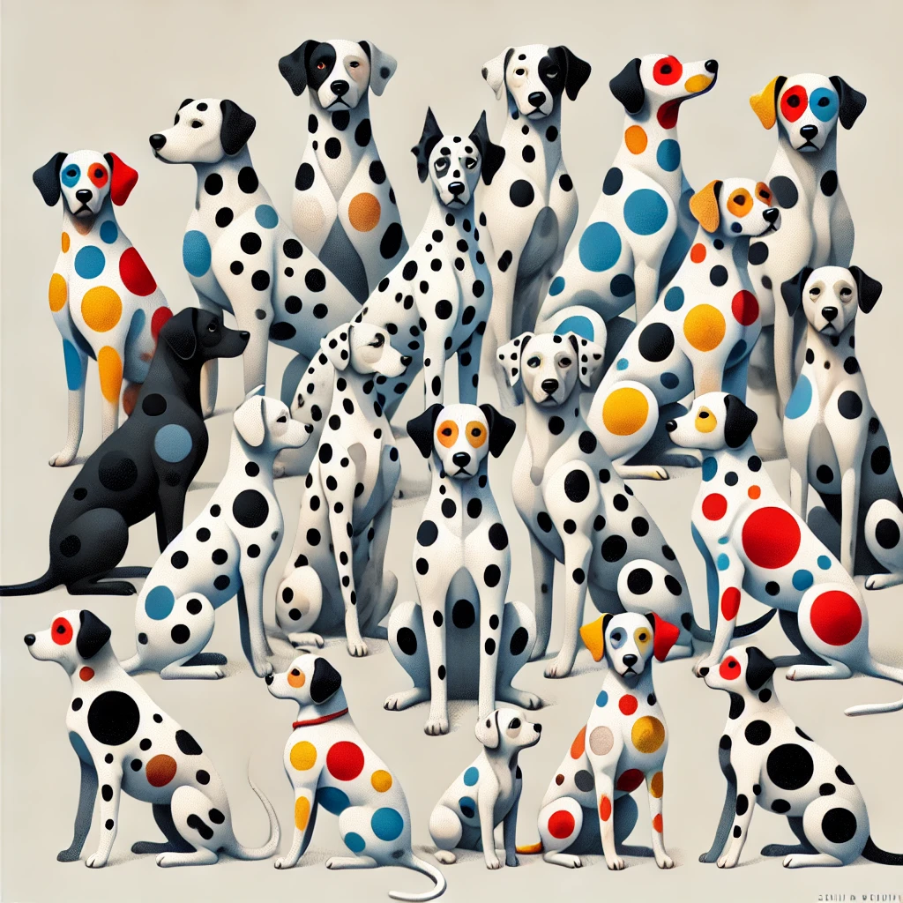
#Unique Constraints

---
[.code-highlight: 1-3]
[.code-highlight: all]

```
> alter table dogs add handle varchar2(16);

Table DOGS altered.

> alter table dogs add constraint unique_handle unique(handle);

Table DOGS altered.
⠀⠀⠀⠀⠀⠀⠀⠀⠀⠀⠀⠀⠀⠀⠀⠀⠀⠀⠀⠀⠀⠀⠀⠀⠀⠀⠀⠀⠀⠀⠀⠀⠀⠀⠀⠀⠀⠀⠀⠀⠀⠀⠀⠀⠀⠀⠀⠀⠀⠀⠀⠀⠀⠀⠀⠀⠀⠀⠀⠀⠀⠀⠀⠀⠀⠀⠀⠀⠀⠀⠀⠀⠀
```

---
  


---
  

```
> insert into dogs (name,     handle          ) 
  2         values ('Doug',   '@itsdougthepug'),
  3                ('Marnie', '@marniethedog' );

2 rows inserted.

> commit;

Commit complete.
⠀⠀⠀⠀⠀⠀⠀⠀⠀⠀⠀⠀⠀⠀⠀⠀⠀⠀⠀⠀⠀⠀⠀⠀⠀⠀⠀⠀⠀⠀⠀⠀⠀⠀⠀⠀⠀⠀⠀⠀⠀⠀⠀⠀⠀⠀⠀⠀⠀⠀⠀⠀⠀⠀⠀⠀⠀⠀⠀⠀⠀⠀⠀⠀⠀⠀⠀⠀⠀⠀⠀⠀⠀
```


---
 

[.code-highlight: 1-4]
[.code-highlight: all]
```
> update dogs set handle = '@itsdougthepug' where name = 'Franck';

ORA-00001: unique constraint (PDBADMIN.UNIQUE_HANDLE) violated on table PDBADMIN.DOGS columns (HANDLE)
ORA-03301: (ORA-00001 details) row with column values (HANDLE:'@itsdougthepug') already exists

> select name, handle from dogs order by handle;

NAME      HANDLE            
_________ _________________ 
Doug      @itsdougthepug    
Marnie    @marniethedog     
Bailey    [null]            
Nala      [null]            
Franck    [null]            
⠀⠀⠀⠀⠀⠀⠀⠀⠀⠀⠀⠀⠀⠀⠀⠀⠀⠀⠀⠀⠀⠀⠀⠀⠀⠀⠀⠀⠀⠀⠀⠀⠀⠀⠀⠀⠀⠀⠀⠀⠀⠀⠀⠀⠀⠀⠀⠀⠀⠀⠀⠀⠀⠀⠀⠀⠀⠀⠀⠀⠀⠀⠀⠀⠀⠀⠀⠀⠀⠀⠀⠀⠀
```

---

#Storage

---
```
tab 0, row ?, @0x????
tl: 24 fb: --H-FL-- lb: 0x2  cc: 3
col  0: [ 4]  44 6f 75 67
col  1: *NULL*
col  2: [14]  40 69 74 73 64 6f 75 67 74 68 65 70 75 67

tab 0, row ?, @0x????
tl: 16 fb: --H-FL-- lb: 0x1  cc: 2
col  0: [ 4]  4e 61 6c 61
col  1: [ 7]  4d 61 6e 75 65 6c 61


tab 0, row 1, @0x????
tl: 10 fb: --H-FL-- lb: 0x1  cc: 1
col  0: [ 6]  46 72 61 6e 63 6b
⠀⠀⠀⠀⠀⠀⠀⠀⠀⠀⠀⠀⠀⠀⠀⠀⠀⠀⠀⠀⠀⠀⠀⠀⠀⠀⠀⠀⠀⠀⠀⠀⠀⠀⠀⠀⠀⠀⠀⠀⠀⠀⠀⠀⠀⠀⠀⠀⠀⠀⠀⠀⠀⠀⠀⠀⠀⠀⠀⠀⠀⠀⠀⠀⠀⠀⠀⠀⠀⠀⠀⠀⠀
```

---
```
tab 0, row ?, @0x????                                                           
tl: 24 fb: --H-FL-- lb: 0x2  cc: 3                                              
col  0: [ 4]  44 6f 75 67                               <- name:   Doug           
col  1: *NULL*                                          <- owner:  [null]         
col  2: [14]  40 69 74 73 64 6f 75 67 74 68 65 70 75 67 <- handle: @itsdougthepug
--------------------------------------------------------------------------------
tab 0, row ?, @0x????                                                          
tl: 16 fb: --H-FL-- lb: 0x1  cc: 2                                             
col  0: [ 4]  4e 61 6c 61                               <- name:   Nala          
col  1: [ 7]  4d 61 6e 75 65 6c 61                      <- owner:  Manuela       
                                                           handle: [null]
--------------------------------------------------------------------------------
tab 0, row ?, @0x????                                                           
tl: 10 fb: --H-FL-- lb: 0x1  cc: 1                                              
col  0: [ 6]  46 72 61 6e 63 6b                         <- name:   Franck        
                                                           owner:  [null]        
                                                           handle: [null]        
⠀⠀⠀⠀⠀⠀⠀⠀⠀⠀⠀⠀⠀⠀⠀⠀⠀⠀⠀⠀⠀⠀⠀⠀⠀⠀⠀⠀⠀⠀⠀⠀⠀⠀⠀⠀⠀⠀⠀⠀⠀⠀⠀⠀⠀⠀⠀⠀⠀⠀⠀⠀⠀⠀⠀⠀⠀⠀⠀⠀⠀⠀⠀⠀⠀⠀⠀⠀⠀⠀⠀⠀⠀
```

---
[.code-highlight: 1-9]
[.code-highlight: 1-13]
[.code-highlight: all]

```
> select * from dogs;                               

NAME      OWNER     HANDLE                             
_________ _________ _________________                  
Nala      Manuela   [null]             16 \
Franck    [null]    [null]             10  \
Bailey    [null]    [null]             10   - 85
Doug      [null]    @itsdougthepug     24  /
Marnie    [null]    @marniethedog      25 /

> create table gods as select handle, owner, name from dogs;

Table GODS created.

> select * from gods;

HANDLE            OWNER      NAME      
_________________ __________ _________ 
[null]            Manuela    Nala      17 \
[null]            [null]     Franck    12  \
[null]            [null]     Bailey    12   - 90
@itsdougthepug    [null]     Doug      24  /
@marniethedog     [null]     Marnie    25 /
```

---
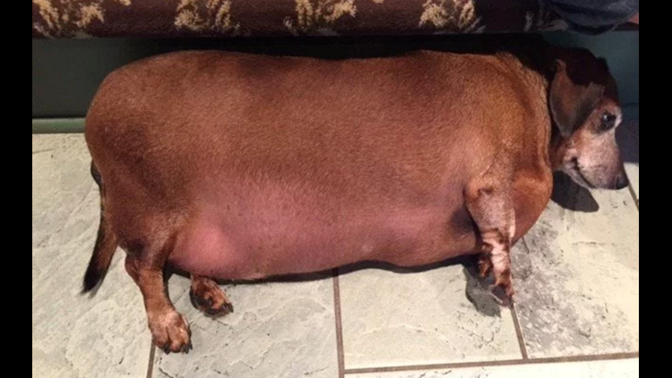
#Fat Tables

---
[.code-highlight: 1-8]
[.code-highlight: all]
```
> create table fat_dogs (
  2      snack001 varchar2(16), snack002 varchar2(16), snack003 varchar2(16),    
  3      snack004 varchar2(16), snack005 varchar2(16), snack006 varchar2(16), 
...
>52*     snack254 varchar2(16), snack255 varchar2(16), snack256 varchar2(16));

Table FAT_DOGS created.

> insert into fat_dogs(snack256) values ('Pupcorn');

1 row inserted.

> insert into fat_dogs(snack255) values ('Pawperoni');

1 row inserted.

> commit;

Commit complete
⠀⠀⠀⠀⠀⠀⠀⠀⠀⠀⠀⠀⠀⠀⠀⠀⠀⠀⠀⠀⠀⠀⠀⠀⠀⠀⠀⠀⠀⠀⠀⠀⠀⠀⠀⠀⠀⠀⠀⠀⠀⠀⠀⠀⠀⠀⠀⠀⠀⠀⠀⠀⠀⠀⠀⠀⠀⠀⠀⠀⠀⠀⠀⠀⠀⠀⠀⠀⠀⠀⠀⠀⠀
```

---
```
tab 0, row ?, @0x????
tl: 10 fb: --H-F--- lb: 0x1  cc: 1
nrid:  0x03c0089f.0
col  0: *NULL*
⠀⠀⠀⠀⠀⠀⠀⠀⠀⠀⠀⠀⠀⠀⠀⠀⠀⠀⠀⠀⠀⠀⠀⠀⠀⠀⠀⠀⠀⠀⠀⠀⠀⠀⠀⠀⠀⠀⠀⠀⠀⠀⠀⠀⠀⠀⠀⠀⠀⠀⠀⠀⠀⠀⠀⠀⠀⠀⠀⠀⠀⠀⠀⠀⠀⠀⠀⠀⠀⠀⠀⠀⠀⠀⠀⠀⠀
tab 0, row ?, @0x????
tl: 265 fb: -----L-- lb: 0x1  cc: 255
col  0: *NULL*
col  1: *NULL*
...
col 253: *NULL*
col 254: [ 7]  50 75 70 63 6f 72 6e

tab 0, row ?, @0x????
tl: 267 fb: --H-FL-- lb: 0x1  cc: 255
col  0: *NULL*
col  1: *NULL*
...
col 253: *NULL*
col 254: [ 9]  50 61 77 70 65 72 6f 6e 69
```

---
```
tab 0, row ?, @0x????                     
tl: 10 fb: --H-F--- lb: 0x1  cc: 1        
nrid:  0x03c0089f.0                       
col  0: *NULL*                            <- snack001: null
⠀⠀⠀⠀⠀⠀⠀⠀⠀⠀⠀⠀⠀⠀⠀⠀⠀⠀⠀⠀⠀⠀⠀⠀⠀⠀⠀⠀⠀⠀⠀⠀⠀⠀⠀⠀⠀⠀⠀⠀⠀⠀⠀⠀⠀⠀⠀⠀⠀⠀⠀⠀⠀⠀⠀⠀⠀⠀⠀⠀⠀⠀⠀⠀⠀⠀⠀⠀⠀⠀⠀⠀⠀⠀⠀⠀⠀
tab 0, row ?, @0x????                       
tl: 265 fb: -----L-- lb: 0x1  cc: 255     
col  0: *NULL*                            <- snack002: null
col  1: *NULL*                            <- snack003: null
...                                          ...
col 253: *NULL*                           <- snack255: null
col 254: [ 7]  50 75 70 63 6f 72 6e       <- snack256: Pupcorn
----------------------------------------------------------------
tab 0, row ?, @0x????                      
tl: 267 fb: --H-FL-- lb: 0x1  cc: 255      
col  0: *NULL*                            <- snack001: null
col  1: *NULL*                            <- snack002: null
...                                          ...
col 253: *NULL*                           <- snack254: null
col 254: [ 9]  50 61 77 70 65 72 6f 6e 69 <- snack255: Pawperoni
                                          <- snack256: null
```

---
   

---
  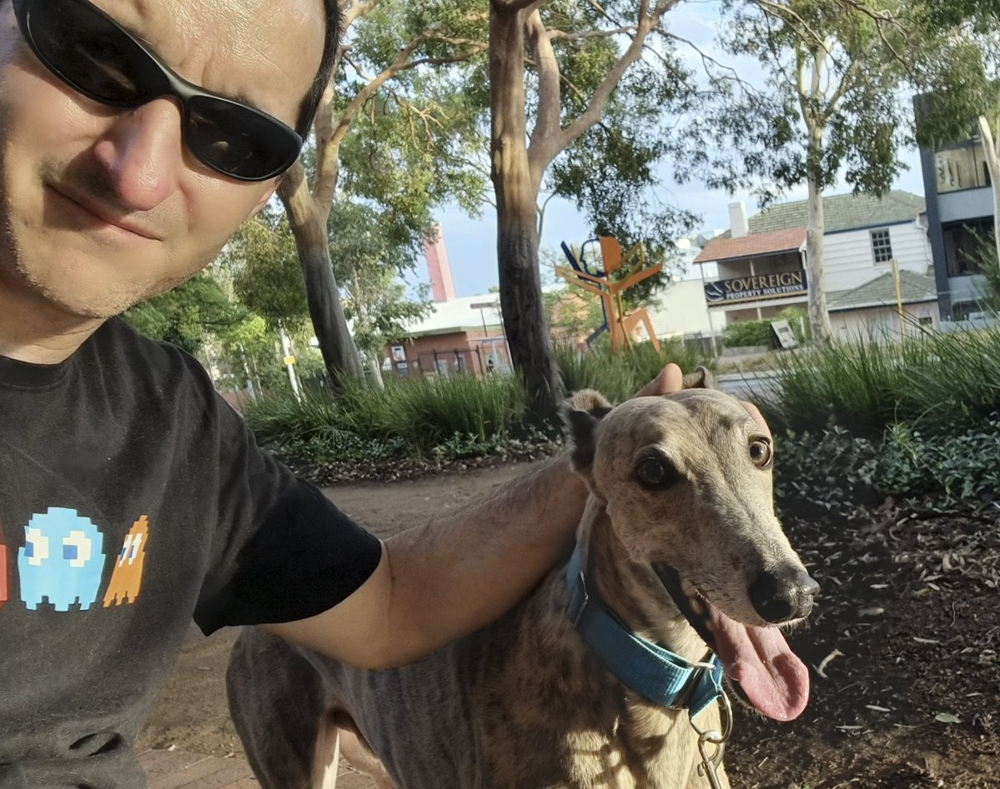 

---
   

```
> insert into people (name) values ('Patrick'),
                                   ('Connor' );

2 rows inserted.

> update dogs set owner = 'Patrick' where name = 'Franck';

1 row updated.

> update dogs set owner = 'Connor' where name = 'Bailey';

1 row updated.
⠀⠀⠀⠀⠀⠀⠀⠀⠀⠀⠀⠀⠀⠀⠀⠀⠀⠀⠀⠀⠀⠀⠀⠀⠀⠀⠀⠀⠀⠀⠀⠀⠀⠀⠀⠀⠀⠀⠀⠀⠀⠀⠀⠀⠀⠀⠀⠀⠀⠀⠀⠀⠀⠀⠀⠀⠀⠀⠀⠀⠀⠀⠀⠀⠀⠀⠀⠀⠀⠀⠀⠀⠀⠀⠀⠀⠀⠀⠀⠀⠀⠀⠀⠀
```  

---

#Statistics

---
[.code-highlight: 1-8]
[.code-highlight: 1-12]
[.code-highlight: all]
```
> select owner, count(*) from dogs group by owner order by owner;

OWNER         COUNT(*) 
__________ ___________ 
Connor               1 
Manuela              1 
Patrick              1 
[null]               2 

> exec dbms_stats.gather_table_stats(null, 'dogs');

PL/SQL procedure successfully completed.

> select num_nulls, num_distinct from user_tab_cols where table_name  = 'DOGS'
  2*                                                  and column_name = 'OWNER';

   NUM_NULLS    NUM_DISTINCT 
____________ _______________ 
           2               3            
⠀⠀⠀⠀⠀⠀⠀⠀⠀⠀⠀⠀⠀⠀⠀⠀⠀⠀⠀⠀⠀⠀⠀⠀⠀⠀⠀⠀⠀⠀⠀⠀⠀⠀⠀⠀⠀⠀⠀⠀⠀⠀⠀⠀⠀⠀⠀⠀⠀⠀⠀⠀⠀⠀⠀⠀⠀⠀⠀⠀⠀⠀⠀⠀⠀⠀⠀⠀⠀⠀⠀⠀⠀
```

^oracle knows exact num of nulls
unlike other values 
esp. when dist vals > 256
num distinct doesn't include nulls

---
[.code-highlight: 1-6]
[.code-highlight: all]
```
> select name from dogs where owner is null;

NAME      
_________ 
Doug      
Marnie    

-----------------------------------------------------------------------
| Id  | Operation         | Name | Starts | E-Rows | A-Rows | Buffers |
-----------------------------------------------------------------------
|   0 | SELECT STATEMENT  |      |      1 |        |      2 |       6 |
|*  1 |  TABLE ACCESS FULL| DOGS |      1 |      2 |      2 |       6 |
-----------------------------------------------------------------------
                                                                                        
Predicate Information (identified by operation id):                                     
---------------------------------------------------                                     
                                                                                        
   1 - filter("OWNER" IS NULL)
⠀⠀⠀⠀⠀⠀⠀⠀⠀⠀⠀⠀⠀⠀⠀⠀⠀⠀⠀⠀⠀⠀⠀⠀⠀⠀⠀⠀⠀⠀⠀⠀⠀⠀⠀⠀⠀⠀⠀⠀⠀⠀⠀⠀⠀⠀⠀⠀⠀⠀⠀⠀⠀⠀⠀⠀⠀⠀⠀⠀⠀⠀⠀⠀⠀⠀⠀⠀⠀⠀⠀⠀⠀
```

---

#Indexes

---
[.code-highlight: 1-9]
[.code-highlight: 1-13]
[.code-highlight: all]
```
> select owner, count(*) from dogs group by owner order by owner;

OWNER         COUNT(*) 
__________ ___________ 
Connor               1 
Manuela              1 
Patrick              1 
[null]               2  

> create index dogs_owner on dogs(owner);

Index DOGS_OWNER created.

> select num_rows, distinct_keys from user_indexes where index_name = 'DOGS_OWNER';

   NUM_ROWS    DISTINCT_KEYS 
___________ ________________ 
          3                3 
⠀⠀⠀⠀⠀⠀⠀⠀⠀⠀⠀⠀⠀⠀⠀⠀⠀⠀⠀⠀⠀⠀⠀⠀⠀⠀⠀⠀⠀⠀⠀⠀⠀⠀⠀⠀⠀⠀⠀⠀⠀⠀⠀⠀⠀⠀⠀⠀⠀⠀⠀⠀⠀⠀⠀⠀⠀⠀⠀⠀⠀⠀⠀⠀⠀⠀⠀⠀⠀⠀⠀⠀⠀
```

^rows in which all indexed columns are null are not indexed

---
[.code-highlight: 1-6]
[.code-highlight: all]
```
> select /*+ index_rs_asc(dogs) */ name from dogs where owner is null;

NAME      
_________ 
Doug      
Marnie    

------------------------------------------------------------------------------------    
| Id  | Operation         | Name | Starts | E-Rows | A-Rows |   A-Time   | Buffers |    
------------------------------------------------------------------------------------    
|   0 | SELECT STATEMENT  |      |      1 |        |      2 |00:00:00.01 |       6 |    
|*  1 |  TABLE ACCESS FULL| DOGS |      1 |      2 |      2 |00:00:00.01 |       6 |    
------------------------------------------------------------------------------------    
                                                                                        
Predicate Information (identified by operation id):                                     
---------------------------------------------------                                     
                                                                                        
   1 - filter("OWNER" IS NULL)         
⠀⠀⠀⠀⠀⠀⠀⠀⠀⠀⠀⠀⠀⠀⠀⠀⠀⠀⠀⠀⠀⠀⠀⠀⠀⠀⠀⠀⠀⠀⠀⠀⠀⠀⠀⠀⠀⠀⠀⠀⠀⠀⠀⠀⠀⠀⠀⠀⠀⠀⠀⠀⠀⠀⠀⠀⠀⠀⠀⠀⠀⠀⠀⠀⠀⠀⠀⠀⠀⠀⠀⠀⠀
```
^so searching for rows where owner is null cannot use index 
even though i hint it should 

---
[.code-highlight: 1-10]
[.code-highlight: 1-13]
[.code-highlight: all]
```
> select owner, name from dogs order by owner, name;

OWNER      NAME      
__________ _________ 
Connor     Bailey    
Manuela    Nala      
Patrick    Franck    
[null]     Doug      
[null]     Marnie    

> create index dogs_owner_name on dogs(owner, name);

Index DOGS_OWNER_NAME created.

> select num_rows, distinct_keys from user_indexes where index_name = 'DOGS_OWNER_NAME';

   NUM_ROWS    DISTINCT_KEYS 
___________ ________________ 
          5                5 
⠀⠀⠀⠀⠀⠀⠀⠀⠀⠀⠀⠀⠀⠀⠀⠀⠀⠀⠀⠀⠀⠀⠀⠀⠀⠀⠀⠀⠀⠀⠀⠀⠀⠀⠀⠀⠀⠀⠀⠀⠀⠀⠀⠀⠀⠀⠀⠀⠀⠀⠀⠀⠀⠀⠀⠀⠀⠀⠀⠀⠀⠀⠀⠀⠀⠀⠀⠀⠀⠀⠀⠀⠀
```
^but as long as one column is non-null it is included


---
[.code-highlight: 1-6]
[.code-highlight: all]
```
> select name from dogs where owner is null;

NAME      
_________ 
Doug      
Marnie    

---------------------------------------------------------------------------------
| Id  | Operation        | Name            | Starts | E-Rows | A-Rows | Buffers |
---------------------------------------------------------------------------------
|   0 | SELECT STATEMENT |                 |      1 |        |      2 |       1 |
|*  1 |  INDEX RANGE SCAN| DOGS_OWNER_NAME |      1 |      2 |      2 |       1 |    
---------------------------------------------------------------------------------

Predicate Information (identified by operation id):
---------------------------------------------------

   1 - access("OWNER" IS NULL)
⠀⠀⠀⠀⠀⠀⠀⠀⠀⠀⠀⠀⠀⠀⠀⠀⠀⠀⠀⠀⠀⠀⠀⠀⠀⠀⠀⠀⠀⠀⠀⠀⠀⠀⠀⠀⠀⠀⠀⠀⠀⠀⠀⠀⠀⠀⠀⠀⠀⠀⠀⠀⠀⠀⠀⠀⠀⠀⠀⠀⠀⠀⠀⠀⠀⠀⠀⠀⠀⠀⠀⠀⠀
```

---
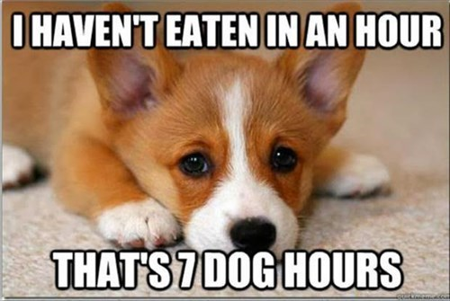

^advanced indexing

---
```
> select name, status from dogs;

NAME      STATUS    
_________ _________ 
Nala      Full      
Franck    Hungry    
Bailey    Full      
Doug      Full      
Marnie    Full     
⠀⠀⠀⠀⠀⠀⠀⠀⠀⠀⠀⠀⠀⠀⠀⠀⠀⠀⠀⠀⠀⠀⠀⠀⠀⠀⠀⠀⠀⠀⠀⠀⠀⠀⠀⠀⠀⠀⠀⠀⠀⠀⠀⠀⠀⠀⠀⠀⠀⠀⠀⠀⠀⠀⠀⠀⠀⠀⠀⠀⠀⠀⠀⠀⠀⠀⠀⠀⠀⠀⠀⠀⠀⠀⠀⠀⠀⠀⠀
```

---
[.code-highlight: 1-8]
[.code-highlight: all]
```
> alter table dogs add is_hungry number generated always as (
  2     case
  3        when status = 'Hungry' then 1
  4        else null
  5     end
  6*    ) virtual;

Table DOGS altered.

⠀⠀⠀⠀⠀⠀⠀⠀⠀⠀⠀⠀⠀⠀⠀⠀⠀⠀⠀⠀⠀⠀⠀⠀⠀⠀⠀⠀⠀⠀⠀⠀⠀⠀⠀⠀⠀⠀⠀⠀⠀⠀⠀⠀⠀⠀⠀⠀⠀⠀⠀⠀⠀⠀⠀⠀⠀⠀⠀⠀⠀⠀⠀⠀⠀⠀⠀⠀⠀⠀⠀⠀⠀⠀⠀⠀⠀⠀⠀
> select name, status, is_hungry from dogs;

NAME      STATUS       IS_HUNGRY
_________ _________ ____________
Nala      Full            [null]
Franck    Hungry               1
Bailey    Full            [null]
Doug      Full            [null]
Marnie    Full            [null]
```        

---
[.code-highlight: 1-3]
[.code-highlight: 1-9]
[.code-highlight: all]
```
> create index hungry_dogs on dogs(is_hungry);

Index HUNGRY_DOGS created.

> select index_type, num_rows, distinct_keys from user_indexes where index_name = 'HUNGRY_DOGS';

INDEX_TYPE                  NUM_ROWS    DISTINCT_KEYS 
________________________ ___________ ________________ 
FUNCTION-BASED NORMAL              1                1 

> exec dbms_stats.gather_table_stats(null, 'dogs');

PL/SQL procedure successfully completed.
⠀⠀⠀⠀⠀⠀⠀⠀⠀⠀⠀⠀⠀⠀⠀⠀⠀⠀⠀⠀⠀⠀⠀⠀⠀⠀⠀⠀⠀⠀⠀⠀⠀⠀⠀⠀⠀⠀⠀⠀⠀⠀⠀⠀⠀⠀⠀⠀⠀⠀⠀⠀⠀⠀⠀⠀⠀⠀⠀⠀⠀⠀⠀⠀⠀⠀⠀⠀⠀⠀⠀⠀⠀⠀⠀⠀⠀⠀⠀
```

^we have a very efficient index for identifying hungry dogs

---
[.code-highlight: 1-5]
[.code-highlight: all]
```
> select name from dogs where is_hungry = 1;

NAME      
_________ 
Franck    

> select * from dbms_xplan.display_cursor();

-------------------------------------------------------------------
| Id  | Operation                           | Name        | Rows  |
-------------------------------------------------------------------
|   0 | SELECT STATEMENT                    |             |       |
|   1 |  TABLE ACCESS BY INDEX ROWID BATCHED| DOGS        |     1 |
|*  2 |   INDEX RANGE SCAN                  | HUNGRY_DOGS |     1 |
-------------------------------------------------------------------
                                                                                  
Predicate Information (identified by operation id):                               
---------------------------------------------------                               
                                                                                  
   2 - access("IS_HUNGRY"=1)
⠀⠀⠀⠀⠀⠀⠀⠀⠀⠀⠀⠀⠀⠀⠀⠀⠀⠀⠀⠀⠀⠀⠀⠀⠀⠀⠀⠀⠀⠀⠀⠀⠀⠀⠀⠀⠀⠀⠀⠀⠀⠀⠀⠀⠀⠀⠀⠀⠀⠀⠀⠀⠀⠀⠀⠀⠀⠀⠀⠀⠀⠀⠀⠀⠀⠀⠀⠀⠀⠀⠀⠀⠀   
```

---
